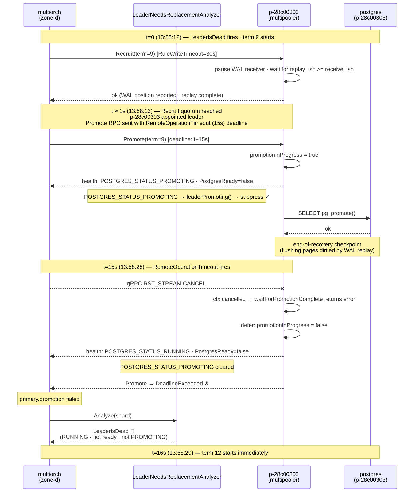
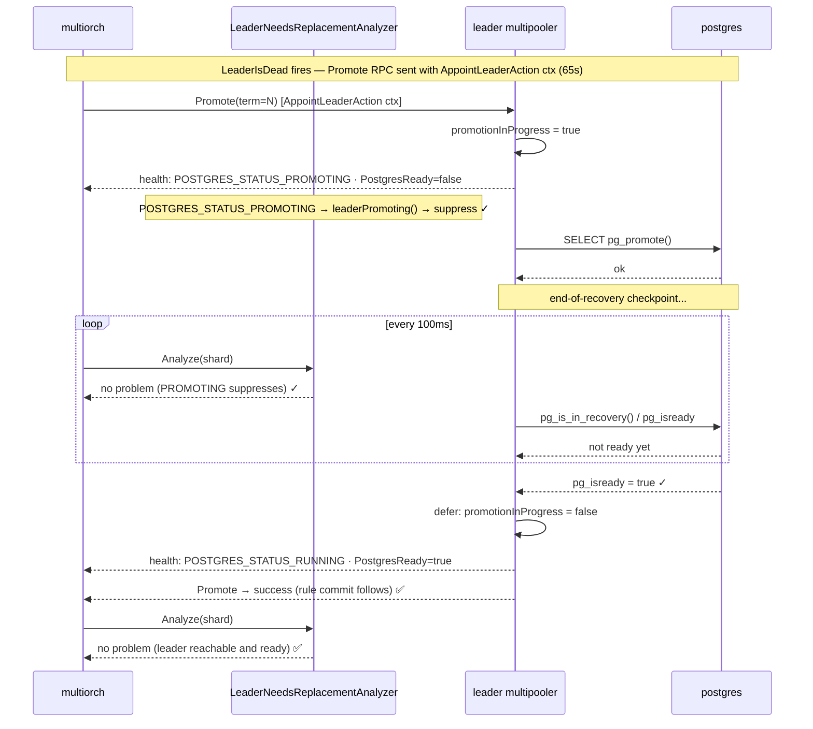

# fix(multipooler,multiorch): remove inner timeouts from Recruit and Promote RPC handlers

## Problem

The Recruit and Promote RPCs are intentionally long-running. Their callers already set appropriate deadlines — `RuleWriteTimeout` (30 s) for Recruit RPCs and the `AppointLeaderAction` timeout (65 s = 2×`RuleWriteTimeout` + 5 s) for the full Recruit + Promote cycle. Three hardcoded inner timeouts inside the handlers overrode those caller-set deadlines and caused premature failures that triggered cascade re-appointments.

**Bug 1 — `promote()` applied `RemoteOperationTimeout` (15 s) to the leader's Promote RPC.**

The leader's Promote RPC is a long-running blocking call. After `pg_promote()` fires, postgres runs an end-of-recovery checkpoint to flush all pages dirtied by WAL replay before leaving recovery mode. That checkpoint is proportional to replay volume and can take tens of seconds on a large or recently-restored node. Applying a 15 s deadline designed for fast RPCs caused gRPC to cancel the stream mid-checkpoint, propagating context cancellation into the Promote handler. Cancelling mid-promotion abandons a promotion whose timeline is already forked.

**Bug 2 — `waitForPromotionComplete` (Promote handler) had a hardcoded 30 s inner deadline.**

A 30 s inner `context.WithTimeout` on `waitForPromotionComplete` would override the caller's context. When it fired, `promotionInProgress` was cleared before `PostgresReady=true`, causing `LeaderNeedsReplacementAnalyzer` to see a dead leader and fire a new appointment — a cascade.

**Bug 3 — `waitForReplayComplete` (Recruit handler) had a hardcoded 10 s inner deadline.**

During Recruit, `waitForReplayComplete` waits for the node to confirm WAL replay is complete (`replay_lsn >= receive_lsn`) before reporting its position to the coordinator. A 10 s inner `context.WithTimeout` overrode the caller's 30 s `RuleWriteTimeout`. If replay took longer than 10 s — or if the timeout fired spuriously under I/O pressure while replay was still making progress — the Recruit RPC failed.

### Why Promote is long-running

Recruit already ensures WAL replay is complete on the winning candidate (`replay_lsn >= receive_lsn`) before the coordinator commits to a leader. Promote therefore does not wait for WAL replay. The latency comes from two subsequent steps:

1. **Post-promotion checkpoint.** `pg_promote()` triggers an end-of-recovery checkpoint that flushes all dirty pages produced by WAL replay. This checkpoint always runs as part of promotion — it is not the checkpoint triggered by standby `pg_rewind` operations. It runs synchronously before postgres leaves recovery mode and is proportional to the volume of WAL that was replayed — it can take tens of seconds on a recently-restored or large node.

2. **Rule commit.** After `waitForPromotionComplete` returns and `promotionInProgress` is cleared, the Promote handler calls `configureReplicationAfterPromotion` and then commits the new rule to the rule store. Under `AT_LEAST_2` durability that commit blocks in `SyncRepWaitForLSN` until standbys reconnect to the new primary and acknowledge the write. This is a reconnection delay, not a WAL replay delay.

### Observed in the 2026-05-29 AZ-outage (mg-scale12, zone-a pod deletion)

The cascade is visible in the zone-d multiorch log. After earlier appointments at terms 7 and 8, zone-d appointed p-28c00303 as leader at term 9. The Promote RPC carried the 15 s `RemoteOperationTimeout` deadline. Exactly 15 seconds later:

```
13:58:13  primary.promotion started  leader=p-28c00303  term=9
           ...
13:58:28  primary.promotion failed   leader=p-28c00303  term=9
          rpc error: code = DeadlineExceeded
                     desc = stream terminated by RST_STREAM with error code: CANCEL
13:58:28  recovery action failed  problem=LeaderIsDead
          failed to appoint leader: leader p-28c00303 failed to accept proposal
13:58:29  executing appoint leader action  ← term 12 starts immediately
```

`RST_STREAM with error code: CANCEL` is the gRPC wire signal for a client-side deadline cancellation. The 15 s deadline fired, cancelling the stream; this propagated as context cancellation into the multipooler's Promote handler. With `promotionInProgress` cleared, `LeaderNeedsReplacementAnalyzer` re-fired immediately, and zone-d started term 12 one second later.

The mg-scale12 cluster had just been scaled up from 3 to 12 nodes. The nine new nodes were restored from a pgbackrest backup and had been streaming WAL to catch up. p-28c00303 had received and replayed a large volume of WAL, so the post-promotion checkpoint — flushing all those dirty pages — took longer than the 15 s window.

### Cascade mechanism (before fix)



## Fix

Remove all three inner timeouts. Each function now uses the caller's context directly:

- `waitForReplayComplete` uses the Recruit RPC's context (`RuleWriteTimeout` = 30 s)
- `waitForPromotionComplete` uses the Promote RPC handler's context
- `promote()` passes the caller's context directly to the leader's Promote RPC

The `AppointLeaderAction` timeout (2×`RuleWriteTimeout` + 5 s = 65 s) remains the effective outer bound for the full Recruit + Promote cycle — this value predates this PR and is unchanged. Non-leader `SetPrimary` calls keep `RemoteOperationTimeout` (15 s) since they write a replication target and return quickly.

### Fixed behavior



### Changes

**`go/services/multipooler/internal/manager/pg_replication.go`**

- Removed the hardcoded 10 s `context.WithTimeout` from `waitForReplayComplete`. The function now uses the caller's context (Recruit RPC, bounded by `RuleWriteTimeout` = 30 s).

**`go/services/multipooler/internal/manager/manager.go`**

- Removed the hardcoded 30 s `context.WithTimeout` from `waitForPromotionComplete`. The function now uses the caller's context so `POSTGRES_STATUS_PROMOTING` is held for the full window until `PostgresReady=true`.
- Added `promotion.wal_replay` and `promotion.postgres_ready` eventlog events (Started/Success/Failed) so each phase is observable through the structured event log.

**`go/services/multiorch/consensus/rule_change.go`**

- `promote()` no longer applies `RemoteOperationTimeout` to the leader's Promote RPC. Non-leader `SetPrimary` calls keep the short deadline since they are fast and do not fork a timeline.

**`go/common/eventlog/events.go`**

- Added `PromotionWalReplay` (`promotion.wal_replay`) and `PromotionPostgresReady` (`promotion.postgres_ready`) event types.

**`go/cmd/pgctld/testutil/grpc_helpers.go`**

- Added `StatusFunc func(*pb.StatusRequest) (*pb.StatusResponse, error)` to `MockPgCtldService` to allow sequential response control in tests.

## Observability

The two new eventlog event types let operators reconstruct the pg_promote() to ready window from structured logs:

| Event type                 | Outcome   | When                                                              |
| -------------------------- | --------- | ----------------------------------------------------------------- |
| `promotion.wal_replay`     | `started` | `waitForPromotionComplete` begins polling `pg_is_in_recovery()`   |
| `promotion.wal_replay`     | `success` | `pg_is_in_recovery()` first returns `false` (checkpoint complete) |
| `promotion.wal_replay`     | `failed`  | Context cancelled or query error                                  |
| `promotion.postgres_ready` | `started` | `pg_is_in_recovery()` returned false; now polling `pg_isready`    |
| `promotion.postgres_ready` | `success` | `pg_isready` returns true                                         |
| `promotion.postgres_ready` | `failed`  | Context cancelled                                                 |

These pair with the existing `consensus.promote` Started/Success/Failed events (emitted in `rule_change.go`) to give end-to-end visibility across the Promote RPC boundary.

## Tests

| Test                                                                                               | Type | What it verifies                                                                                                            |
| -------------------------------------------------------------------------------------------------- | ---- | --------------------------------------------------------------------------------------------------------------------------- |
| `TestWaitForPromotionComplete_KeepsPollingUntilPostgresReady`                                      | Unit | Regression: `waitForPromotionComplete` keeps polling when `pg_isready` returns false, catching a reintroduced inner timeout |
| `TestWaitForPromotionComplete_ContextCancellationReturnsError`                                     | Unit | Context cancellation propagates cleanly so `promotionInProgress` is cleared                                                 |
| `TestLeaderNeedsReplacementAnalyzer_Analyze/suppresses_LeaderIsDead_while_pg_promote()_is_running` | Unit | `POSTGRES_STATUS_PROMOTING` on the leader suppresses re-appointment                                                         |
| `TestPromotionAppointsExactlyOneLeader`                                                            | E2E  | After a primary kill, `rule_history` shows exactly one promotion (cascade would show two or more)                           |
| `TestPromotingStatusClearedOnlyWhenReady`                                                          | E2E  | `POSTGRES_STATUS_PROMOTING` never clears before `PostgresReady=true`                                                        |
