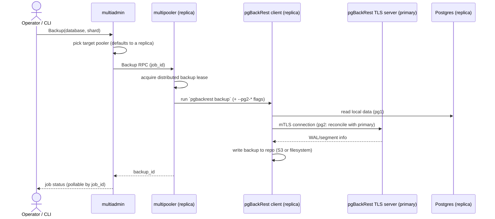

# Backups

This is how Multigres backs up and restores PostgreSQL via pgBackRest: who talks to
whom, what crosses the network, how it's authenticated and encrypted, and
where the safety rails are.

## Request path: multiadmin → multipooler → pgBackRest

`multiadmin` never touches pgBackRest itself; only multipooler (as a
pgBackRest client) and pgctld (running `pgbackrest server`, see
[TLS server setup](#tls-server-setup)) invoke the pgBackRest binary directly.
`multiadmin` is a thin, stateless API gateway: it picks which pooler should
run the backup, hands that pooler an RPC, and tracks the resulting job ID so
it can be polled later (multiadmin keeps no durable state of its own, so a
restart just means it re-asks the pooler for status by job ID).

The interesting case is backing up a **replica**: pgBackRest still needs to
talk to the shard's primary to reconcile WAL, so the replica's multipooler
also opens a connection to the primary's own pgBackRest, over TLS rather than
plain Postgres, as shown below.

The replica-to-primary hop is the only backup-time network path that crosses
pooler boundaries, and it's mutually authenticated TLS (see
[TLS server setup](#tls-server-setup)), not a bare Postgres replication
connection. Everything else (multiadmin to pooler, pooler to pgBackRest,
pgBackRest to repo) is either local IPC/CLI invocation or your configured
object-storage (e.g. S3) credentials.

## Backup and restore in cluster bootstrap

There's no "empty shard" state in Multigres: every pooler in a new shard
does run `initdb` and start Postgres locally, but that local instance is
never what ends up serving traffic. Only one pooler (decided by a
distributed lease, so it's safe if several start at once) is allowed to turn
its local instance into the shard's first backup. Every pooler, including
that winner, then wipes its own local data directory and restores from that
shared backup, so every replica (and eventually the primary) boots from one
common backup rather than N independently-initialized Postgres instances.

### The multipooler auto-restore loop

Each multipooler runs a monitor loop that watches whether its local Postgres
is running. If it isn't, and there's genuinely no data directory (not just
an empty folder, it checks for Postgres's own version marker file) but a
completed backup exists, the loop restores from the latest backup and starts
Postgres as a standby. If there's no data directory _and_ no backup yet, it
falls into the bootstrap race described above.

This loop is the **only** way a restore ever happens in Multigres: there is
no restore button or restore RPC exposed to an operator or to multiadmin. An
earlier design had one, but it was removed, since a caller-driven restore
could race the monitor's own restore the instant it noticed `PGDATA` was
gone, so restore was made purely self-healing instead.

## Configuration: two config files, and why `pg2` isn't in either

Multigres generates pgBackRest's config from templates rather than letting
an operator hand-write it, and splits it into two files with different
owners and different trust levels:

| Config                     | Owner       | Purpose                                      | Contains secrets?                                       |
| -------------------------- | ----------- | -------------------------------------------- | ------------------------------------------------------- |
| `pgbackrest.conf` (client) | multipooler | runs `backup` / `restore` / `info`           | yes: repo credentials, cipher passphrases (mode `0600`) |
| `pgbackrest-server.conf`   | pgctld      | runs the TLS server other poolers connect to | TLS key material only                                   |

Both are static per-pooler except for one thing: **`pg2-*` is never written
into a config file at all.** pgBackRest's `pg2` settings point at a second
Postgres instance, used when backing up a replica, since pgBackRest needs
to reconcile against the primary. Which host counts as "pg2" is different
for every single backup invocation (it's always "whichever pooler is
currently primary," and that changes across failovers), so baking it into a
static file would go stale. Instead, the multipooler resolves the current
primary from topology at the moment a backup starts and passes it as
`--pg2-*` **command-line flags** on that one `pgbackrest backup` invocation.

### pg1 and pg2

`pg1` and `pg2` have fixed, asymmetric meanings that are worth keeping
straight:

#### pg1 = "me" or "self"

`pg1-*` (the one line that _is_ in `pgbackrest.conf`) always means "this
pooler's own local Postgres": self-referential, whether that pooler happens
to be the primary or a replica.

#### pg2 = the primary

`pg2`, whenever it's present, always and only means the shard's current
primary, never "some other replica," and never anything resolved relative
to who's asking. So on a replica, pg1 is "me/self" and pg2 is "the primary
I need to reconcile against." On the primary, there is no pg2 at all,
because pg1 already is the primary.

#### Primary vs. replica backups

Concretely:

- Backing up the **primary**: no `pg2` flags at all, since it's a local
  backup. This is the exception rather than the default (see
  [Ongoing backups](#ongoing-backups-default-to-replicas)
  below); it's what happens during bootstrap and for any explicitly forced
  primary-side backup.
- Backing up a **replica** (the normal case): `--pg2-host-type=tls`, plus
  host/port/path and cert/key/CA flags pointing at the primary's pgBackRest
  TLS server (see below). Nothing touches Postgres's own replication port.

### TLS server setup

Every pooler also runs a `pgbackrest server` process (started and owned by
**pgctld**, since pgctld already owns the Postgres process lifecycle) that
listens for exactly this kind of cross-pooler request. It's configured for
**mutual TLS**: the server presents a cert/key and validates the client's
cert against a CA file, and the client (the requesting replica) does the
same in reverse: both sides authenticate. Cert/key/CA material is expected
to already be provisioned (e.g. mounted from a secret store); Multigres
doesn't generate certificates itself.

## Ongoing backups default to replicas

Ad hoc and scheduled backups both go through the same path: the `multigres`
CLI is just another client of the same `multiadmin` request path shown
above; there's no separate CLI-to-pooler shortcut.

Multigres actively avoids putting backup load on the primary: multiadmin's
pooler-selection logic prefers a replica, and even if a caller pointed a
backup request directly at the primary pooler, it would refuse the request
unless explicitly told to force it. This is a deliberate operational
choice, since backups are I/O and CPU work you generally don't want
competing with production writes. Forcing a primary-side backup is
supported (e.g. single-node shards with no replica yet, or during
bootstrap) but is the exception, not the default.

## Encryption

Multigres relies entirely on pgBackRest's own repository encryption
(AES-256-CBC); there is no additional Multigres-side encryption layer on
top. What Multigres owns is passphrase lifecycle: cipher passphrases are
supplied via a mounted secrets file, keyed by repository "generation" (so
rotating to a new repo/cipher doesn't invalidate old backups). Because
pgBackRest fixes a repo's cipher permanently the moment it's created,
Multigres checks up front that a usable passphrase exists before that
point, and only ever records/logs a fingerprint of the passphrase, never
the passphrase itself.

## No in-place restores

Restore is guarded so it can only run against a data directory that is
genuinely empty or absent, not stopped-but-populated, not corrupted, just
gone. Attempting to restore over an existing data directory fails outright
rather than overwriting anything. Restore is also refused on a pooler that's
currently the primary.

Combined with there being no operator-facing restore RPC (see the
auto-restore loop above), this means restore in Multigres exists for exactly
one purpose: bringing up a new (or being-rebuilt) replica from a known-good
backup. It is intentionally **not** a disaster-recovery "restore on top of
a live primary" tool, and not a point-in-time-recovery workflow against an
existing cluster.
