# Multigres Migrator: table-migration coordinator via logical replication

> **Name.** This tool/service is the **Multigres Migrator**. Its identifier form > is `migrator` — used for the binary,
> service, Docker image, proto package, > topo type, and service constant (`ServiceMigrator`).

## Overview

Multigres needs a first-class tool to **move tables from one shard to another**, and to **onboard an on-prem Postgres
database into a multigres cluster** with minimal setup for the on-prem operator. Today none of this exists: the codebase
has physical-replication/consensus primitives and a gateway-side logical-replication tunnel, but no
publication/subscription-driven table-migration mechanism and no migration workflow object.

This document proposes _Multigres Migrator_: a **shard-scoped service** that coordinates a single logical-replication
stream per migration. The migration is driven from the shard-side using a migration RPC API on the shard's current
primary multipooler. It connects to the source using a plain DSN, so it can connect to any Postgres source reachable by
a standard connection string.

Multiadmin is a thin front door that forwards the operator's commands to the owning Multigres Migrator. The workflow
runs through catch-up and a symmetric direction switch (a data-consistency barrier plus a reverse stream that flips
whichever direction is active, so re-running it is the undo).

## Background: what Postgres logical replication gives us, and the gap

The approach draws on prior research comparing Vitess VReplication with stock [Postgres logical
replication](https://www.postgresql.org/docs/current/logical-replication.html).

### What Postgres provides

Today, Postgres provides the following as part of the implementation:

- Publications with per-table row filters and column lists.
- A `COPY`-based initial snapshot via tablesync workers.
- Streaming apply keyed on replica identity (for example, the primary key).
- A replication slot tracking `confirmed_flush_lsn`.
- Lag/state visibility via `pg_stat_replication`, `pg_stat_subscription`, and `pg_subscription_rel`.

### What does VReplication offer?

Vitess VReplication contains a set of features to help with migration of data between shards. Some of the features
provided by VReplication are there because MySQL lacks features that Postgres has, but many are features that are
intended to be deployed outside the database.

Some are meant to be built on top of Postgres (resumable copy, verification, an owned apply loop); others are
deliberately **not** Postgres's job — routing, keyrange/sharding, and cross-shard coordination live in the layer above
the database (the Multigres gateway and control plane), just as they sit above MySQL in Vitess. So the list below is
what a full migration-and-sharding stack needs beyond stock logical replication, not a checklist of Postgres
shortcomings. The [gap-analysis document](./vstreamer_gap_analysis.md) classifies each item as _leverage_ (stock
Postgres), _build_ (in the Migrator), or _external_ (above the database).

1. **Resumable/chunked copy** of a large table — PG copies a table in one snapshot-pinned transaction, so a failure at
   90% restarts the whole table and the long-held snapshot pins WAL on the publisher.
2. **Consistent, lag-aware data verification** (a VDiff equivalent) — nothing built-in.
3. **Traffic routing / coordinated read→write cutover** — logical replication moves data but has no say in where the
   application sends queries. The main reason for this is that Postgres does not come with a router or gateway and the
   user is expected to handle this themselves.
4. **Reverse-replication journaling** — safe, position-recorded rollback. Postgres can stream in reverse (`CREATE
SUBSCRIPTION … copy_data=false`); the gap is the durable _journal_ of the cutover handoff LSNs on both sides that
   anchors a rollback to an exact recorded point (no gap, no re-copy) and leaves an audit trail — not the reverse stream
   itself.
5. **Keyrange/vindex routing and row-movement** across shards — PG has static `WHERE` filters only, no shard-map
   awareness.
6. **DDL/schema propagation** — DDL is not replicated; schema must be applied out-of-band, order-sensitively.
7. **Sequence/identity transfer** — sequences are not replicated, so the subscriber's identity counters stay at their
   start value, a PK-collision footgun after cutover.
8. **First-class workflow object** — a durable lifecycle record for the migration; PG exposes primitives only.
9. **Failure-resume** — resume a migration mid-phase after a coordinator crash, not just persist its state.
10. **Cross-shard observability rollup** — aggregate phase, lag, and copy progress across shards and streams.
11. **SELECT-based transformations** — re-keying and computed columns; publications filter and project only.
12. **Multi-shard fan-out/fan-in** (split/merge) with coordination.
13. **Cross-shard cutover consistency barrier** — a common drain point across all shards of a keyspace.
14. **Load-aware throttling** during copy/catch-up.

| # | Gap | Roadmap | | --- | -------------------------------- |
---------------------------------------------------------------------- | | 1 | Resumable/chunked copy | MVP uses stock
tablesync plus the `copy_data=false` seam | | 2 | Data verification (VDiff) | Roadmap (docs describe the manual checksum
users have today) | | 3 | Traffic routing / cutover | Roadmap (docs describe what is needed) | | 4 | Reverse-replication
journaling | MVP keeps a symmetric switch plus handoff journal | | 5 | Keyrange routing / row-movement | MVP allows a
static `--where` | | 6 | DDL/schema propagation | MVP uses DDL log table for transactional DDL | | 7 | Sequence/identity
transfer | **In MVP**: `setval` at every switch plus a pre-write guard | | 8 | First-class workflow object | **In MVP**
via the `Migration` object (durable lifecycle) | | 9 | Failure-resume | Roadmap: MVP persists state to topo but does not
auto-resume mid-phase | | 10 | Cross-shard observability rollup | Roadmap: MVP reports per-migration status only | | 11
| SELECT-based transformations | Roadmap | | 12 | Multi-shard fan-out/fan-in | Roadmap: MVP is 1→1 | | 13 | Cross-shard
cutover barrier | Roadmap: MVP has a single-stream quiesce+lag-zero barrier | | 14 | Load-aware throttling | Roadmap |

### Prototype

The prototype validated the single-stream happy path end-to-end:

1. copy schema (`pg_dump --schema-only`)
2. create publication
3. create subscription (initial `COPY` plus stream)
4. wait for catch-up
5. quiesce plus advance sequences plus flip direction
6. teardown

The run was validated with a no-data-loss demonstration under concurrent insert/update/delete load, verified by
full-table identity (row count plus content checksum) between source and target.

### Postgres behaviors the design accounts for

These are behaviors of Postgres logical replication that the coordinator works with internally — implementation
concerns, not settings the operator configures or requirements the migrated application must meet:

- **Autocommit is used for the control**: `CREATE`/`DROP SUBSCRIPTION` cannot run inside a transaction block. Since this
  is for the administrative connection, it does not affect the application.
- **DDL is not replicated**: the target schema must exist before subscribing. The schema is copied as part of the
  initialization using `pg_dump --schema-only`.
- **Sequences are not replicated**: after a switch the new-source identity counters are still at their start value, so
  it is necessary to call `setval` past the max before that side takes writes.
- **Subscription `CONNECTION` is target-evaluated**: the conninfo must be usable by the target's Postgres to reach the
  source, and it must remain valid across a source-primary failover.
- **A switch needs a quiesce plus lag-zero barrier** so both sides are byte-identical at a known LSN, which makes the
  reverse subscription safe with `copy_data=false`.

### Replication slots

A migration hinges on a **logical replication slot** on the source, so it is worth being precise about what a slot is
and why its state cannot be checkpointed anywhere except the Postgres server that owns it.

A logical replication slot is a small piece of durable server state that maintains two invariants against that specific
Postgres instance:

- **`restart_lsn`** — the oldest WAL the slot might still need. As long as the slot exists, the server **must not
  recycle WAL** at or after `restart_lsn`. This is what guarantees the change stream can resume without gaps.
- **`catalog_xmin`** — the oldest transaction id whose catalog rows must be retained. As long as the slot exists,
  **`VACUUM` must not remove catalog tuples** newer than `catalog_xmin`, because logical decoding needs the historical
  catalog to interpret WAL records (which column types/names were in effect at the time). This is what guarantees WAL
  from `restart_lsn` onward is still _decodable_.

Both values are established when the slot is created and both only ever move **forward** as the consumer confirms
progress. A slot is therefore a live reservation over the retained WAL and a held-back catalog horizon that exist only
inside one Postgres instance.

In contrast to MySQL, there are restrictions on what you can do with a slot:

- You can create a slot using `pg_create_logical_replication_slot()` or over the walsender protocol. The walsender form
  can additionally export a snapshot aligned exactly to the consistent point of a slot. Creation has **no LSN or xmin
  parameter**: you get the consistent point the server computes, never one you choose.
- You can advance a slot **forward only** using `pg_replication_slot_advance()` to skip changes you don't need. It
  **cannot move backward**.
- You can inspect the state of slots using `pg_replication_slots` and `pg_stat_replication_slots` views, but you cannot
  change the values of any slots.
- You can consume or peek at the contents of a slot using `pg_logical_slot_get_changes` or
  `pg_logical_slot_peek_changes` functions. You can also start streaming changes through the walsender protocol.
- You can copy a slot using `pg_copy_logical_replication_slot()`, which duplicates an existing slot position, but only
  within the same instance.
- You can drop a slot using `pg_drop_replication_slot()`, which releases the retained WAL and the catalog-xmin hold.
- You can also set up slots to be synchronized with the standbys by setting the `failover` option; the slot-sync worker
  then mirrors the slot to the physical standbys, letting it survive a promotion.

In particular, there are a few things that you cannot do:

- There is no API to construct a slot at a chosen position. You have to create the slot before any activity that you
  need to replicate.
- There is no API to read the internal state of a slot, persist it elsewhere, and later recreate the slot at that state.
  (But you can copy a slot locally.)
- `pg_replication_slot_advance` is **forward-only**, so you cannot create-then-rewind to a saved position either.

There is a good reason for this. The values in `pg_replication_slots` are not the actual state; they are just _pointers
into_ a state that exists only on the owning server, which is simultaneously retaining the WAL from `restart_lsn` and
holding back `VACUUM` at `catalog_xmin` so the events in the WAL remain decodable. If you copied those values into topo,
a control-plane database, or a file, that copy would be inert: dropping the slot releases the reservation, so by the
time you tried to use the copy the server may have recycled the WAL and vacuumed away the catalog rows the values point
at — and there is no API that accepts those values to reconstruct a slot in any case (creation always starts a fresh
consistent point). The reservation and the thing reserved are inseparable, and both live inside one Postgres instance
and its physical replicas.

As a consequence, and in contrast to VReplication, the Multigres Migrator never stashes slot positions in the control
plane and reinstates them. Source-shard failover safety rests entirely on Postgres features and a lost or dropped slot
means re-establishing the stream from scratch. This is why the design leans on failover slots plus the quiesce+lag-zero
barrier, and never on saving and restoring slot state.

## Design decisions

1. **Multigres Migrator is a shard-scoped service** — one instance per shard / storage cluster, deployed as its own
   Deployment, **not** a per-pod sidecar. It is decoupled from any single Postgres process, so a primary failover inside
   a shard does not strand a migration.
2. **Multigres Migrator drives the target through the target shard's primary multipooler**, calling new migration RPCs
   on it. Multigres Migrator resolves the current primary from topo (and watches for changes), so failover is handled by
   re-targeting the new primary — reusing multipooler's connection management, replication-connection primitive, and
   leader-election signals rather than pinning to a backend.
3. **The source is always reached by a DSN.** For a **multigres-shard source** the DSN targets that shard's **gateway**,
   which routes to the current source primary and re-pins across a source-primary failover; for an **on-prem/standalone
   Postgres** (no shard/pooler) the DSN connects directly (incl. TLS) — the "logical replication between non-multinode
   instances" path. Either way the coordinator never resolves or re-points the source primary itself, so a source
   failover needs no `ALTER SUBSCRIPTION ... CONNECTION`.
4. **multiadmin is a thin user-facing front door** that forwards operator operations to the owning (target-shard)
   Multigres Migrator; it holds no workflow state and runs no phase engine.
5. **Scope = stream + observe + a symmetric direction switch that gates serving**: quiesce → drain-to-lag-zero → journal
   handoff LSNs → `setval` sequences on the new source → tear down the current path → establish the reverse path
   (`copy_data=false`) → flip serving. The operator verbs `activate-migration` (IMPORT→EXPORT, go live) and
   `deactivate-migration` (EXPORT→IMPORT, roll back) drive one symmetric flip, so "undo" is just the opposite verb. The
   target does not serve client queries until activated (see _[Serving gate](#serving-gate)_). `pause`/`resume` and
   failure-resume are deferred (Roadmap).
6. **`copy_data` is optional** at subscription setup — create a subscription without the initial copy so data can be
   seeded by other means. Shipped with documentation on how to use it.
7. **The source connection supports the full range of Postgres connection options, including TLS/encryption** (`sslmode`
   up to `verify-full`, client certs, etc.).
8. **On-prem publication creation is optional**: Multigres Migrator creates it by default; `--source-publication` lets
   the source owner pre-create it.
9. **Migration validation checks replica identity** at create/start time: reject tables with no usable replica identity
   for `UPDATE`/`DELETE`; warn when a table uses `REPLICA IDENTITY FULL` (works, but expensive). When a row filter is
   supplied, also validate that every filter column is covered by the replica identity, since a publication replicating
   `UPDATE`/`DELETE` can only filter on replica-identity columns.
10. Excludes gateway **query/traffic routing** and **VDiff** — both shipped with documentation describing what they
    require and the manual options today.

## Migration lifecycle

Single state machine. The `MigrationWorkflow` record lives in topo (etcd), owned and reconciled by the target shard's
Multigres Migrator instance. It tracks an `active_direction` (which side is currently the publisher);
`activate-migration` / `deactivate-migration` toggle it. **The target shard's serving state follows `active_direction`:
while IMPORT (Multigres is the subscriber being populated) the shard does not serve client queries; `activate-migration`
is what turns it into a live, serving server** (see _[Serving gate](#serving-gate)_). "Source-side work" below is the
source-side SQL — executed over a DSN to the source shard's gateway (multigres source) or directly to the server
(non-multigres source).

The workflow at a glance, with each state's serving status annotated (`IMPORTING` and `EXPORTING` are the steady-state
streaming phase in the IMPORT and EXPORT directions):

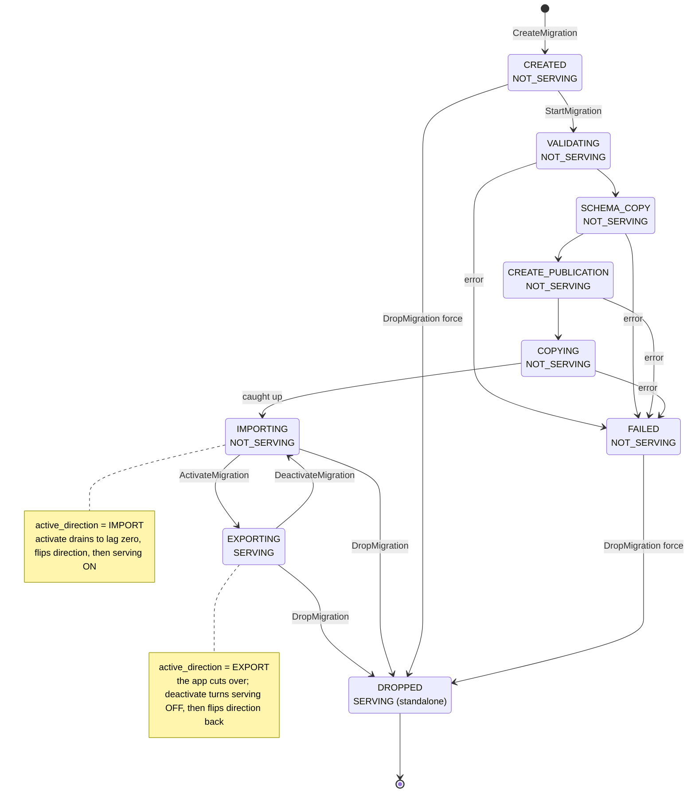

- **`CREATED`** — `create-migration` records config in topo only, no database changes. Stage/validate before touching
  either DB.
- **`VALIDATING`** — on `start-migration`: source/target reachable, tables exist, source `wal_level=logical`, and each
  table has a usable replica identity — reject a table with no PK/unique index and no explicit replica identity; warn on
  `REPLICA IDENTITY FULL`. If a row filter (`--where`) is supplied, also reject when any filter column is not covered by
  the replica identity (a publication replicating `UPDATE`/`DELETE` can only filter on replica-identity columns).
- **`SCHEMA_COPY`** — ensure target tables exist: first **drop the migrated tables on the target** (`DROP TABLE IF
EXISTS … CASCADE`) so a pre-existing table (a re-run after a partial migration, or a target that already had them)
  does not fail the apply with "relation already exists"; then `pg_dump --schema-only` of the named tables from the
  source, applied on the target (psql backslash meta-lines stripped). Skippable (`--skip-schema-copy`), which also skips
  the drop — that path keeps a target seeded out-of-band.
- **`CREATE_PUBLICATION`** — `CREATE PUBLICATION` on the source `FOR TABLE <tables>` (plus optional `WHERE`/column
  list). Skipped if publication pre-created.
- **`COPYING`** — `CREATE SUBSCRIPTION` on the target. `copy_data` optional: `true` = stock tablesync initial `COPY`;
  `false` = no copy (seeded out-of-band). If copying, poll `pg_subscription_rel.srsubstate` until all `r`.
- **`IMPORTING`** — the steady-state streaming phase in the IMPORT direction (`active_direction = IMPORT`); report lag
  from the source's `pg_stat_replication`. **The target does not serve client queries in this state** (see _[Serving
  gate](#serving-gate)_) even once caught up — going live is the explicit `activate-migration` step, not a side effect
  of catching up.
- **`IMPORTING` ⇄ `EXPORTING`** (operator: `activate-migration` / `deactivate-migration`) — the switch flips the active
  direction and, with it, serving: 1) quiesce current source; 2) drain to lag zero; 3) journal a handoff entry
  (drained-to LSN, new-source LSN, direction, timestamp); 4) `setval` new-source sequences past max; 5) drop current sub
  (drops slot) plus publication; 6) establish reverse path (`CREATE PUBLICATION` on new source, `CREATE SUBSCRIPTION`
  with `copy_data=false` on new target); 7) re-enable writes on new source; flip `active_direction`.
  `activate-migration` (`IMPORTING`→`EXPORTING`) turns serving **on** only after the drain barrier (step 2) confirms the
  target has every event; `deactivate-migration` (`EXPORTING`→`IMPORTING`) turns serving **off** first, then drains
  back.
- **`DROPPED` / `FAILED`** — `drop-migration` drops sub/pub/slot idempotently on both sides and deletes the workflow;
  journal retained for audit. The default drop performs a **quiesce+drain barrier** so no in-flight change is lost: it
  requires the migration to be caught up (`IMPORTING`/`EXPORTING`), sets the current source read-only, waits for the
  target to reach the source's LSN, advances the new writer's sequences, and only then tears down — leaving the shard
  standalone and write-safe. `--wait` first blocks until the migration catches up (bounding the read-only window), then
  runs the same barrier. `--force` skips the whole barrier (no quiesce, no drain, no sequence advance) and removes the
  workflow from any phase — the abandon path, which can leave an incompletely-copied or PK-unsafe target. A default drop
  is thus safe from either `IMPORTING` (source frozen read-only, a one-way cutover) or `EXPORTING`; only a not-caught-up
  or never-started migration needs `--wait` or `--force`.

Notes:

- **Activate/deactivate are one symmetric primitive.** Both call the same direction flip with an explicit target;
  `activate-migration` requires the current direction to be IMPORT and `deactivate-migration` requires EXPORT, so each
  is self-guarding (you cannot activate an already-live migration). `deactivate` then `activate` returns to the live
  state, and so on, appending a journal entry each time. Each flip relies on the quiesce+lag-zero barrier making both
  sides identical, so `copy_data=false` is always safe. (`active_direction` stays IMPORT/EXPORT in the record and status
  views — the monitoring vocabulary — while the operator verbs read as activate/deactivate.)
- **Why the reverse path is built at switch time, not pre-armed.** A tempting alternative is to create the subscriptions
  and publications for _both_ directions up front and just `ENABLE`/`DISABLE` them at the switch. This works for
  publications — they are stateless metadata (a table set plus optional filter), hold no slot or position, and drive no
  data until a subscription consumes them, so pre-creating both is free. It does **not** work for the reverse
  **subscription**, because a subscription owns a replication slot on its publisher and a _disabled_ subscription's slot
  still exists but never advances: it pins `restart_lsn` (the publisher must retain all WAL from that point → unbounded
  WAL growth) and holds back `catalog_xmin` (VACUUM cannot reclaim catalog tuples → catalog bloat). The reverse slot
  lives on the migration **target** — the node already absorbing the entire forward stream — so an idle reverse
  subscription would pin every byte of WAL the target produces for the whole migration. It is also the
  [created-but-never-consumed failover slot](https://www.postgresql.org/docs/current/logical-replication-failover.html)
  hazard: an unconsumed slot's frozen `catalog_xmin` makes it look temporary and it is dropped on failover, so
  pre-arming does not even survive the event it exists for. Hence the reverse slot is created at **switch time**, not
  ahead of it — but it must exist a moment _before_ serving turns on, so it captures the writes the app makes to the
  target the instant it can connect (`copy_data=false` can't backfill them). The subscription can't create the slot
  then: its connection dials the target through the gateway, which refuses it until `EXPORTING`. So `switchTo` creates
  the reverse slot explicitly on the target and `pg_replication_slot_advance`s it to the handoff LSN, and the reverse
  subscription attaches with `create_slot = false` once serving is on. The idle window is only the few seconds between
  slot creation and the subscription attaching after the `EXPORTING` commit, so the WAL-pinning cost is negligible.
  `ENABLE`/`DISABLE` is reserved for short-lived pause/resume within the _active_ direction (Roadmap), where the same "a
  long disable re-accumulates WAL" caveat applies. (Both directions _enabled at once_ — active-active via PG16+ `origin
= none` to break the loop — is a different model with concurrent-write conflict handling and is deliberately out of
  scope: the migrator keeps a single writer via the quiesce barrier.)
- MVP = one source → one target, a set of whole tables, single subscription/slot (no chunking; large-table copy uses
  stock tablesync — resumable chunked copy is a Roadmap item).
- **Reverse stream across a major version (rollback to an older source).** A common shape is onboarding an older source
  (say PG15) onto a newer Multigres target (PG17+) and keeping the reverse stream armed so the old server stays a warm
  rollback. The reverse direction then has a _newer publisher → older subscriber_, which stock logical replication
  supports: negotiation is subscriber-driven (the older subscriber only knows protocol versions up to its own, so it
  requests that and the newer publisher serves it), no new `pgoutput` message types were added between PG15 and PG17,
  and every newer wire feature (parallel-apply protocol v4, binary initial sync, `origin` filtering) is gated so an old
  subscriber never receives it. The constraints to respect: (1) creating the reverse **subscription runs on the old
  server**, so it needs a superuser DSN there when that version predates the `pg_create_subscription` role (PG16). (2)
  Use the default **text** format, not `binary` — no built-in type's binary `send` format changes across majors, but
  binary demands an exact type match, fails outright for any type the older subscriber lacks a binary `recv` for, and is
  fragile for OID-embedding composite/`record` columns; text is version-robust. (3) Sequences and DDL still do not
  replicate (see the switch's `setval` step and the DDL-replication follow-up) — on an actual failback, advance the old
  server's sequences past max first, and keep schema changes off the tested platform or apply them to both sides, or the
  old subscriber's apply worker stalls. (4) Do not leave both directions streaming at once across versions: the
  loop-breaker (`origin = none`) is PG16+, so a pre-PG16 subscriber cannot suppress echoed changes — keep a single
  active direction (the quiesce+switch model). Parallel apply and binary initial sync are simply unavailable on the old
  side (a degradation, not a failure).
- A switch makes the new target correct and write-ready and keeps the new standby (old source) current, so the next
  switch back is always safe. It does not move client writes — that is gateway routing (out of scope).

## Serving gate

A migration exists to move data **into** Multigres, so the target shard must not serve client queries until it holds a
complete, caught-up copy. Serving is therefore gated on `active_direction`:

- **IMPORT — not serving.** From `CREATED` through `IMPORTING` (the streaming phase in the IMPORT direction) the target
  is the subscriber being populated; its pooler advertises a non-serving state, so the shard is not treated as a live
  server — even after it has caught up. The hold starts as soon as a migration **exists** on the shard (`CREATED`), not
  only once it is started, so clients cannot change the database while a migration is staged against it.
- **EXPORT — serving.** `activate-migration` flips `active_direction` to EXPORT only after the drain barrier, and the
  shard goes live. Going live is the operator's explicit act; catching up alone does not start serving.

The application owns the traffic cutover: it stops writing to the source and points at Multigres once the shard is
active. Multigres does not move client traffic itself (that is gateway routing, out of scope).

**What "not serving" means at the gateway.** The gateway picks the routing primary from liveness plus routing role
(consensus/recovery), not from serving status, so a non-serving target still _is_ the routing primary. Marking it
non-serving makes the pooler hold new client work (a buffered-retry signal) and the gateway **buffers** it until
activation — it does not route elsewhere (there is nowhere else: the source is external). In the normal flow the
application is still on the source during IMPORT, so there is nothing to buffer; the gate is the safety net that stops a
stray client from reading a half-copied shard.

**Mechanism (pooler).** The effective serving state is `DRAINING` while an IMPORT migration is active on the shard and
reconciles to `SERVING` when it flips to EXPORT — the same monitor-reconciled path the divergence hold uses, driven by
`active_direction` in the migration record (so it survives a pooler restart and a target failover). `DRAINING`
(transient, monitor-reconcilable) is used rather than `DISABLED` (sticky, reserved for shutdown/demote). The gate
applies to every pooler in the target shard (primary and standbys read the replicated migration record), so a standby
will not serve reads of a half-copied shard either. `start-migration` does not wait for that monitor tick: it drives the
pooler to non-serving **synchronously** (a drain barrier) before it drops the target tables or creates the subscription,
so there is no window in which a client can write to a shard that is about to be overwritten by the initial copy; the
monitor then keeps the hold on every subsequent tick.

## Migrator operation sequences

These sequences trace the **current implementation**: the migrator coordinator, the manager (postgres monitor + serving
gate + reconcile poller), and the query pooler run as services inside a single **multipooler**, with migration state in
the replicated `multigres.migration` table and `multiadmin` forwarding the operator RPCs. There is one diagram per
operator action. On the pooler lifeline a **green** background means the pooler is serving client queries and **red**
means it is not; migrator SQL runs on the local Postgres over the admin pool, and the source is reached over its DSN.

### CreateMigration

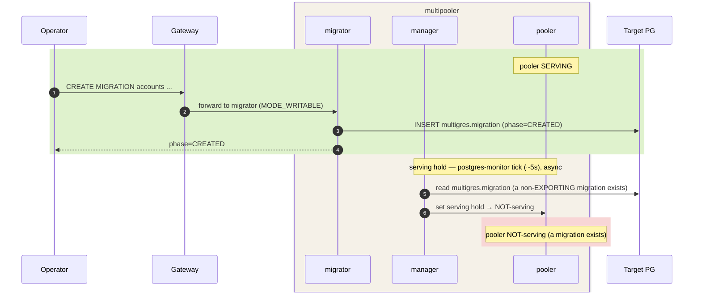

Creating a migration takes the shard **non-serving**: as soon as the `CREATED` row exists, the ~5s postgres-monitor sees
a non-EXPORTING migration and holds serving, so clients cannot change the database while a migration is staged against
it. The flip is monitor-driven (within one tick); `StartMigration` still runs a synchronous drain barrier before its
destructive setup, and if create is followed immediately by start that barrier guarantees non-serving before any table
is dropped. `CREATE MIGRATION` is also drivable via `mg` / multiadmin (the RPC front door, which works at every phase).

### StartMigration

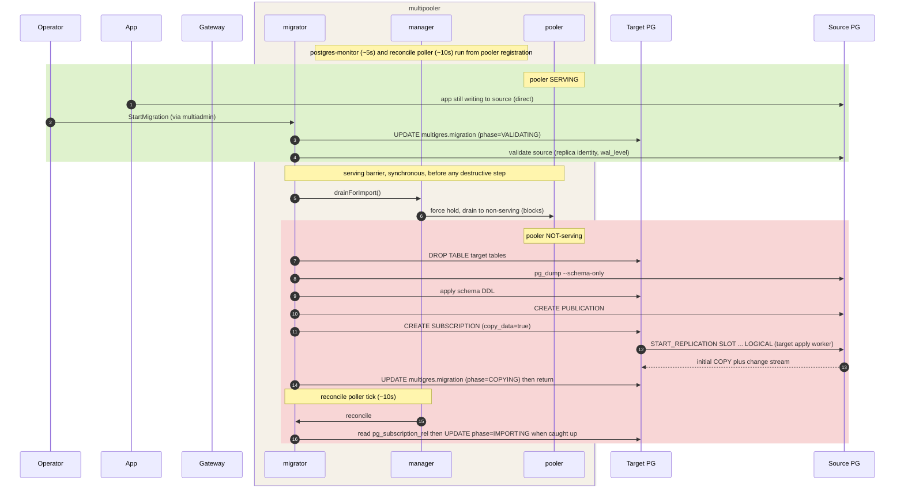

The serving flip is synchronous: `StartMigration` calls the drain barrier before `DROP TABLE` / `CREATE SUBSCRIPTION`.
The pooler is drained and non-serving before streaming begins — there is no window in which a client can write to the
target. The ~5s postgres-monitor only keeps the hold afterward; the ~10s reconcile poller advances `COPYING` →
`IMPORTING` once the copy catches up. Streaming is Postgres-to-Postgres: `CREATE SUBSCRIPTION` starts the target's apply
worker, which issues `START_REPLICATION` to the source walsender — the migrator does not carry the stream.

### ActivateMigration

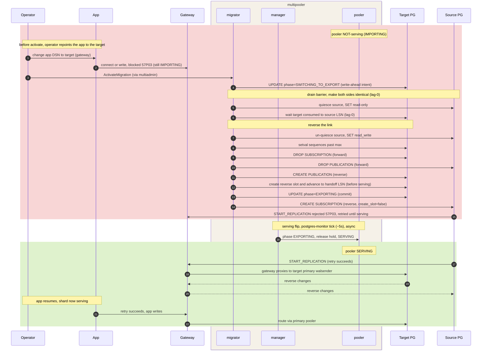

Crash-safe: `SWITCHING_TO_EXPORT` is the write-ahead intent, so a crash resumes the switch via reconcile. The drain
barrier makes both sides identical; the reverse slot is pre-created and advanced to the handoff LSN before serving turns
on, so it captures every post-switch target write and the reverse subscription attaches with `create_slot=false` —
nothing is lost. The reverse subscription's `CONNECTION` is the gateway advertise host, so the source's
`START_REPLICATION` terminates at the gateway and is rejected with `57P03` until the pooler flips to serving (the retry
window); then the gateway proxies to the target primary walsender and the reverse stream flows back through the tunnel.

#### Cutover readiness gate and gateway buffering

The cutover has a brief window — quiesce the source, drain the residual lag to zero under the read-only barrier, flip
the direction, turn serving on — during which the target pooler is not yet serving. Rather than refuse client queries
with `57P03` in that window, the gateway **buffers** them (its planned-failover buffer, `buffer-enabled`,
`buffer-window` ~10s, `buffer-max-failover-duration` ~20s) and replays them once the target serves, so an application
already pointed at the gateway sees no error and loses no write. Two mechanisms make that safe:

1. **Readiness gate before the barrier.** `ActivateMigration` takes `max_lag_bytes` and `wait_timeout_seconds`. Before
   it quiesces the source it polls the live replication lag — `pg_wal_lsn_diff(pg_current_wal_lsn(),
confirmed_flush_lsn)` on the source slot — and proceeds only once the lag is at or below `max_lag_bytes`. If the lag
   does not fall in `wait_timeout_seconds` it fails with a precondition error (`ErrNotReady` → gRPC
   `FAILED_PRECONDITION`) and leaves the migration in the IMPORT direction — no cutover, no serving change. Bounding the
   residual before the source goes read-only keeps the subsequent drain-to-zero short, so the whole cutover fits the
   buffer window.

2. **Synchronous serving flip.** The moment `applySwitch` commits `EXPORTING`, the coordinator flips this pooler to
   `SERVING` inline (`releaseForMigrationExport` → `StateManager.ReconcileMigrationHold`), rather than waiting for the
   asynchronous ~5s postgres-monitor tick. Prompt serving-on is what lets the gateway's buffer drain (it releases when
   the elected leader self-attests PRIMARY + SERVING) inside its window; a slow flip risks the buffer timing out
   (`MTB02`) and refusing the held queries. The same flip unblocks the reverse subscription, which the source can only
   attach once the target serves.

**The buffer-window / threshold relationship.** The cutover wall-clock is `T_drain + T_flip + T_serve`.
`T_flip + T_serve` are a handful of catalog operations plus the synchronous flip (a fixed budget). `T_drain` scales with
the residual lag at quiesce time, which the readiness gate bounds. So `max_lag_bytes` must be small enough that
`T_drain` plus that fixed budget stays under `buffer-window`; otherwise the buffer overflows and queries are refused
mid-cutover. The coordinator documents a recommended ceiling (`MaxActivateMaxLagBytes`, in step with the gateway buffer
window) but does **not** enforce it: whether a threshold is too large depends on the gateway buffer window, which the
coordinator cannot observe across services, and the CLI / multiadmin path bypasses the gateway entirely — so a hard
refuse would be guessing. Keeping `max_lag_bytes` at or below the recommended ceiling is the operator's responsibility.
The default (`DefaultActivateMaxLagBytes`) is well under the ceiling, so a caught-up `IMPORTING` stream (lag ~0) cuts
over immediately. A zero-error cutover also requires the gateway to have buffering enabled (`buffer-enabled`); with it
off, queries in the window fall back to the current `57P03` refuse behavior.

**SQL surface.** `ALTER MIGRATION <name> ACTIVATE WITH (max_lag_bytes = 8388608, wait_timeout = '30s')` threads the same
two parameters through the gateway; `wait_timeout` accepts a duration string or bare integer seconds. The `mg` /
multiadmin path exposes them as `--max-lag-bytes` / `--wait-timeout`.

**Observing lag.** So an operator can pick a threshold, migration status surfaces the live lag: `SHOW MIGRATION <name>`
(and `get-migration` / the API `Migration` message) reports `lag_bytes` and `lag_seconds`, measured on the current
publisher — the source in IMPORT, the target in EXPORT. `lag_bytes` is the same `pg_current_wal_lsn() -
confirmed_flush_lsn` measure the readiness gate compares against `max_lag_bytes`, and `lag_seconds` is the walsender's
`replay_lag`. Both read live on each status call (best-effort: 0 when not streaming or the publisher is unreachable).

### DeactivateMigration

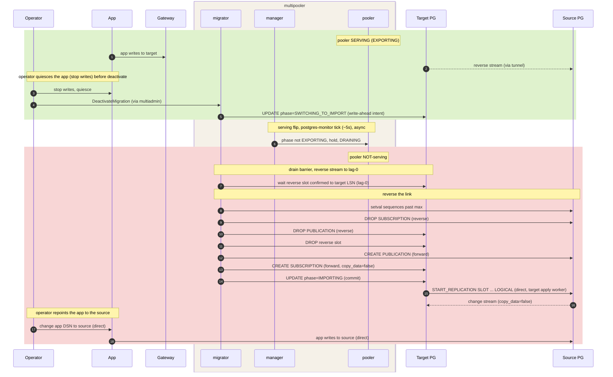

The mirror of activate. `SWITCHING_TO_IMPORT` is the write-ahead intent; the drain barrier brings the reverse stream to
lag-0, then the link is rebuilt source → target with `copy_data=false` and the target's apply worker reconnects
**directly** to the source (no gateway tunnel). The target cannot be set read-only — it would fight the pooler — so app
writes are stopped by quiescing the app first; the pooler then goes `DRAINING` via the ~5s monitor. No-data-loss on
deactivate is therefore the operator's responsibility (quiesce before deactivate), not a synchronous barrier.

### DropMigration

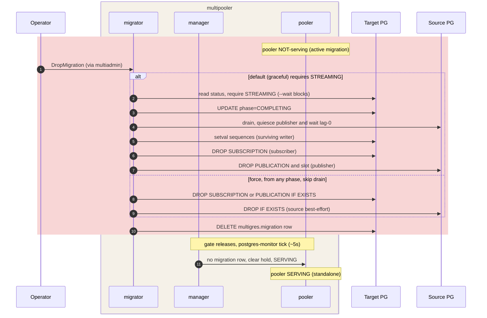

Graceful drop requires a caught-up `STREAMING` state (`--wait` blocks until then): it drains to lag-0 and advances the
surviving writer's sequences before teardown, leaving the standby consistent. `--force` skips the drain and tears down
from any phase with `DROP … IF EXISTS` (source best-effort, as it may be unreachable during an abort) to abort a stuck
migration. Either way, deleting the migration row clears the serving gate; on the next ~5s monitor tick the shard serves
standalone again. (Shown from a non-serving IMPORT; dropping an `EXPORTING` migration is already serving and stays so.)

## Source replication user

The stream connects to the source as a dedicated role, and that role needs more than the `REPLICATION` attribute. So the
initial `COPY` can read every published table and the coordinator can create the publication, the role needs, at
minimum:

- **`REPLICATION`** attribute — mandatory; a walsender / `replication=database` connection is refused without it.
- **`pg_read_all_data`** (or explicit `SELECT` on every migrated table) — so the initial `COPY` is not blocked by RLS or
  missing table grants.
- **`CREATE` on the source database** — only when the coordinator creates the publication itself (not needed with
  `--source-publication`).
- plus `wal_level = logical` on the server and a `pg_hba` / network path that accepts a replication connection over TLS.

Creating this role is a source-side setup step run on an **admin connection** (the role that administers the source),
before `CREATE_PUBLICATION`; the migration's own source DSN then authenticates as the newly provisioned role. For a
**non-multigres / on-prem source** the operator supplies an admin DSN (or pre-creates the role and passes only its
credentials via `--source-dsn`); for a **multigres-shard source** the admin DSN targets the source shard's gateway (see
_Architecture_).

**Managed Supabase sources (v2/v3).** Supabase already ships a purpose-built logical-replication consumer,
`supabase_etl_admin` (`LOGIN REPLICATION BYPASSRLS`, `pg_read_all_data`, `CREATE ON DATABASE`), so there are two
options:

- **Reuse `supabase_etl_admin` (preferred where available).** It already carries exactly the attributes above and is
  provisioned and rotated by the Supabase platform — the replication-sources endpoint runs an idempotent `DO` block as
  the customer `postgres` role to create/alter it and store its credentials. The Migrator just consumes those
  credentials; nothing to create. Caveats: it is shared with Supabase Pipelines/ETL (coordinate slot and publication
  names to avoid collisions), and older v2 projects predating the baked-in role may not have it.
- **Self-provision a dedicated role.** Connect as `postgres` and create/alter a Migrator-owned role mirroring
  `supabase_etl_admin`'s grants, which keeps the migration isolated from Pipelines. This works on **v3 / PG16+**, where
  the demoted `postgres` keeps `CREATEROLE`, `REPLICATION`, and `BYPASSRLS` and holds `pg_read_all_data` `WITH ADMIN
OPTION`, so a non-superuser can confer those attributes.

On **v2 / PG15** a non-superuser `CREATEROLE` cannot confer `REPLICATION`, so either reuse `supabase_etl_admin` or have
the role provisioned out of band (platform-side, or as a superuser); the Migrator then only consumes its credentials.

## Architecture

The source is always reached by a **DSN** — there is no source multipooler in the loop. When the **source is a multigres
shard**, the DSN points at that shard's **gateway**: both the source-side control SQL (`pg_dump`, `CREATE PUBLICATION`,
quiesce, LSN reads) and the subscription's replication stream ride the gateway's Postgres / `replication=database`
tunnel, which routes to the current primary and **re-pins across a source-primary failover**. When the **source is a
plain on-prem/standalone Postgres** — a primary goal of this project — the DSN connects **directly** to it. Either way
the migration never resolves or re-points the source primary itself: the gateway (or the fixed on-prem endpoint) is the
stable address, so a source failover needs no `ALTER SUBSCRIPTION … CONNECTION`. The target side is identical in both
cases (driven through the target primary multipooler). (Caveat: `pg_dump` needs a session pinned to one backend for a
consistent snapshot, so the gateway must not transaction-pool that session — see _Why multipooler, not multigateway_.)

**Source is a multigres shard (reached via its gateway):**

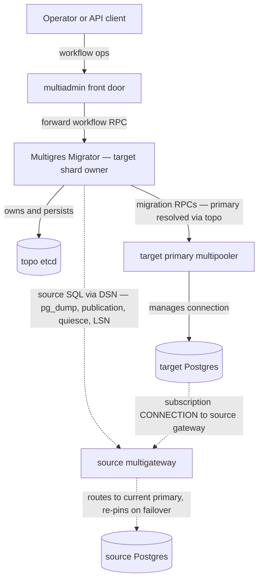

**Source is an on-prem / standalone Postgres (no pooler):** Multigres Migrator has no source multipooler to call, so it
runs the source-side SQL over a **direct DSN** to the Postgres server itself. The target subscription still connects
straight to that source Postgres. Nothing is installed on the source host.

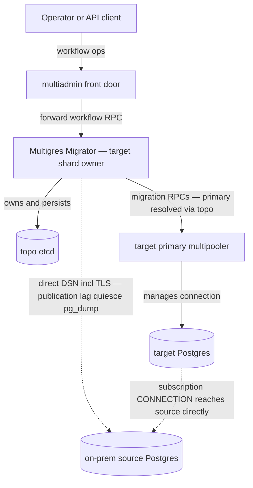

- **Multigres Migrator** is shard-scoped and owns the workflow for migrations targeting its shard. It resolves the
  **target primary multipooler** from topo (watching for failover, the way multiorch/multiadmin resolve poolers) and
  drives all target-side SQL by calling migration RPCs on it. It persists the `MigrationWorkflow` plus
  `MigrationJournal` to topo.
- **multipooler** gains a small set of migration RPCs (below). It executes them locally against its Postgres using the
  connections it already manages — an autocommit/admin connection for publication/subscription DDL and status, and
  `NewLogicalReplicationConn` where a replication-protocol session is required. Because these run on the shard's current
  primary, a failover simply means Multigres Migrator re-resolves and re-targets the new primary.
- **The source is always a DSN.** For a multigres-shard source the DSN targets that shard's **gateway**, which routes to
  the current source primary and re-pins across failover; for an on-prem/standalone Postgres the DSN connects directly.
  Either way Multigres Migrator opens a libpq connection (incl. TLS) for `CREATE PUBLICATION`, lag, quiesce,
  sequence-max, and `pg_dump`, and the target subscription's `CONNECTION` uses the same source endpoint. Everything
  target-side is unchanged.
- **multiadmin** stays a thin front door: it resolves the owning (target-shard) Multigres Migrator and forwards the
  workflow RPC.

### Deployment and call paths

The multipooler and Postgres run together in one pod. The multipooler container hosts three services on one gRPC server
— the **pooler** (query serving), the **migrator** (migration coordinator), and the **manager** (postgres monitor,
serving gate, reconcile) — and the **pgctld** container manages the Postgres process; the two containers share PGDATA
and the unix sockets under `/data/pg_sockets`.

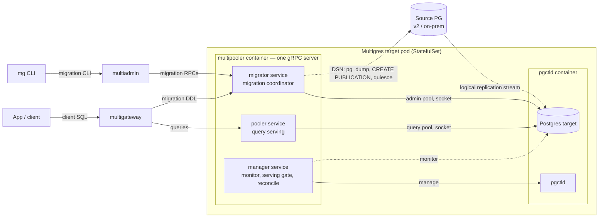

The gateway routes ordinary client SQL to the **pooler** service and migration DDL (`CREATE MIGRATION`, `ALTER MIGRATION
…`, `SHOW` / `DROP MIGRATION`) to the **migrator** service — a separate per-shard gRPC service aimed at the primary,
gated on _being primary_ rather than on serving status, so it stays reachable while the shard is non-serving. `mg`
reaches the same migrator service through multiadmin. The migrator drives the local Postgres over the admin-pool socket
and the source over its DSN (direct for on-prem/v2, or via the source shard's gateway).

**v2 source (roadmap).** To migrate a non-Kubernetes v2 source and let the gateway fail an application over to it, a
multipooler is deployed **beside the v2 Postgres** — its pooler service fronts v2 for the gateway, connecting to v2 over
a local socket and SCRAM. The call split above is what makes that placement work: the gateway can route app traffic to
the v2-side pooler while migration control still flows to the migrator co-located with the target.

### Why multipooler, not multigateway

multigateway is a **cluster-level, multi-shard client-query router** (one gateway fronts many shards: it keeps a
cluster-wide pooler cache and routes by shard key, with per-shard failover buffering). That is the right abstraction for
client queries and the wrong one for shard-targeted replication administration:

- **Replication administration needs capabilities outside routed client queries.** `CREATE`/`DROP SUBSCRIPTION` must run
  in autocommit (never inside a transaction); slot administration and the admin/superuser session live on one stable
  backend (multipooler has `NewLogicalReplicationConn` and the autocommit admin path); `pg_dump --schema-only` is a
  libpq client doing many catalog queries against one stable backend and does not funnel cleanly through gateway
  routing. This is about the _control plane_; the gateway does carry the replication _stream_ (see the note below).
- **Blast radius / hot path.** One gateway carries all client traffic for many shards; running migration DDL and bulk
  `COPY` through it loads and endangers the latency-sensitive query path. multipooler is per-shard and already owns the
  Postgres connection.
- **Reuse of existing primitives and failover.** multipooler manages connections (`connpoolmanager`, admin conn,
  `NewLogicalReplicationConn`), has the LSN/replication helpers (`pg_replication.go`), and participates in leader
  election. Multigres Migrator resolving the primary pooler in topo and calling migration RPCs gives full capability
  plus clean failover re-targeting.
- **Defined contract, not "hope it passes through."** RPCs make the supported operations explicit and testable; a
  gateway path would require verifying which replication statements survive routing/parsing and risks silently
  mishandling them.
- **Credentials and connections stay where they belong.** Putting the SQL in multipooler means Multigres Migrator needs
  only a gRPC client (mirroring multiorch→multipooler), with no Postgres wire handling and no bespoke reconnect logic
  beyond re-resolving the primary.

**The gateway does carry replication, though — it is the data-plane transport.** multigateway has a
`replication=database` tunnel (`HandleReplicationStream`) that proxies a replication stream byte-for-byte to the shard's
**current primary**, re-pinning across failover. That is orthogonal to the control plane above: the coordinator still
runs the administration (autocommit DDL, `pg_dump`, slot lifecycle) on the primary multipooler, but when **Multigres is
the publisher** (EXPORT direction), the external subscriber points its `CONNECTION` at the gateway, which tunnels to the
primary's walsender and follows failover without a `CONNECTION` change. So the reverse-subscription conninfo
(`targetConnInfo`) should advertise the **gateway** address, not a pooler's — and, because `CREATE SUBSCRIPTION`
requests a non-temporary slot, the gateway admits it only when the slot-based-replication (failover-slots) feature is
enabled.

### Failover handling

- **Mid-operation primary change.** Multigres Migrator watches topo for the shard's primary; if it changes, Multigres
  Migrator re-resolves the new primary multipooler and retries the current phase idempotently (phases are designed to be
  safe to re-run).
- **Source-shard failover.** A multigres-shard source's publication **slot** must survive failover, which depends on
  multigres **failover slots** (the existing logical-slot-failover work) — a called-out dependency. The subscription's
  `CONNECTION` and Multigres Migrator's own control DSN both point at the source shard's **gateway**, which re-pins to
  the new primary across failover — so there is no `ALTER SUBSCRIPTION ... CONNECTION` and no source-primary
  re-resolution to do. (An on-prem source has a single fixed endpoint, so the same holds trivially.)
- **Target-shard failover.** `pg_subscription` and the subscription's replication origin are catalog/WAL state within
  the target shard's HA group (physical replication), so they survive a target-primary failover; Multigres Migrator
  re-resolves the new target primary and resumes monitoring.

**Target primary fails (Multigres Migrator re-resolves and resumes):**

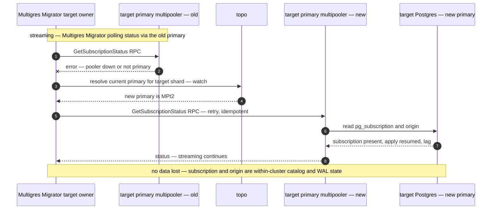

**Source primary fails (gateway re-pins; failover slot preserved):**

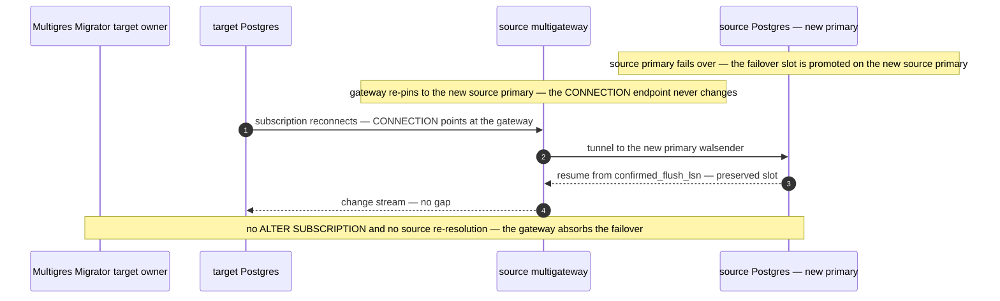

### Failover during a direction switch (crash-safe switch)

The direction switch (`activate-migration` / `deactivate-migration`) drives a non-atomic sequence — drain, then **drop
the current subscription**, drop the current publication, flip the DDL-replication roles, create the reverse
publication, and **create the reverse subscription**. A target-primary failover in the middle of that sequence must not
wedge the migration, so the switch is made crash-safe by treating the migration row as a **write-ahead intent log**.

**Directional phases record the intent.** The steady and switching phases carry the direction: `IMPORTING` / `EXPORTING`
for the caught-up steady states, and `SWITCHING_TO_IMPORT` / `SWITCHING_TO_EXPORT` for the transient roll-back /
cutover. `SetMigrationDirection` persists `SWITCHING_TO_<target>` in one committed row update **before** touching either
database; that directional phase _is_ the recorded intent, so a promoted standby knows which way the switch was heading.
(Because the phase carries direction, `active_direction` is derived from it rather than stored — one source of truth.)

**The steps are idempotent and resumable.** Every step is safe to re-run (`DROP … IF EXISTS`, existence-checked
`CREATE`), and the drain runs only while the current subscription still exists — once it has been dropped, the barrier
already held. On the promoted primary, `reconcileLocked` sees the `SWITCHING_TO_*` row and rolls the switch forward to
completion: `SWITCHING_TO_EXPORT` → `EXPORTING`, `SWITCHING_TO_IMPORT` → `IMPORTING`. Roll-forward is safe because the
drain established a byte-identical barrier before any drop.

**The EXPORT reverse slot is pre-created; the subscription attaches to it after the `EXPORTING` commit.** In the
IMPORT→EXPORT cutover the reverse subscription runs on the external source and dials the target _through the gateway_,
which serves only once the migration is `EXPORTING`. That creates a bind: the subscription can't be created during
`SWITCHING_TO_EXPORT` (the gateway rejects the connection with a transient `database is temporarily unavailable; please
retry`, SQLSTATE `57P03`/`08006`, that can't clear until the phase advances — a deadlock), but creating it _after_
serving turns on would miss the writes the app makes to the target in the window before it attaches (`copy_data=false`
can't backfill). The fix splits slot from subscription: `switchTo` pre-creates the reverse **slot** on the target — a
local operation, no gateway, so no deadlock — and `pg_replication_slot_advance`s it to the current LSN (the handoff
point, past the switch's own catalog WAL). The slot then captures every subsequent target write. `applySwitch` commits
`EXPORTING`, and only then does `retryReverseExportLink` create the **subscription** on the source with
`create_slot=false` attached to that slot, retrying the transient not-yet-serving window. Because the slot — not the
subscription — is what captures changes, and it exists before serving turns on, no write is lost regardless of when the
subscription attaches. `reconcileLocked` re-attaches idempotently if it finds a migration already `EXPORTING` with the
subscription missing (a crash between the commit and the attach). The EXPORT→IMPORT (roll-back) reverse subscription
dials the external source directly (no gateway), so it creates its own slot inline in `switchTo` before the `IMPORTING`
commit; the roll-back also drops the pre-created reverse slot on the target, which `create_slot=false` leaves behind.

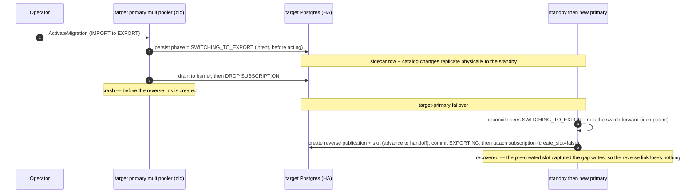

**WAL ordering makes the intent durable.** The row and the `pg_subscription` / `pg_publication` catalog live in the
**same target Postgres**, so they share one WAL: committing the intent before the catalog change guarantees that if the
promoted standby can see the drop, it can also see the intent. Source-side steps are a different WAL, but they are
re-driven idempotently, so their ordering does not matter.

**Serving follows the phase.** The serving gate keys on the phase — the shard does not serve while
`COPYING`/`IMPORTING`/`SWITCHING_TO_IMPORT`/`SWITCHING_TO_EXPORT` (the target is being populated, or the go-live has not
yet landed), and serves once every migration on it reaches `EXPORTING`.

**Enough state to recover.** Recreating a subscription on resume needs its full conninfo. The IMPORT subscription's
conninfo is the row's `source_dsn` (stored with password in the superuser-only sidecar, redacted only in projections and
logs); the EXPORT reverse subscription's conninfo is rebuilt from `targetConnInfo` (coordinator config). Both survive a
restart, so no additional credential state is required.

### Migration workflow and source addressing

The end-to-end IMPORT setup and the direction switches are shown per operator action in _[Migrator operation
sequences](#migrator-operation-sequences)_. The only architectural variable those diagrams abstract over is how the
**source** is reached, which depends on the source shape:

- **On-prem / standalone source** — the coordinator opens a **direct DSN** to the source Postgres for the read-only
  control SQL (`pg_dump`, `CREATE PUBLICATION`, quiesce, LSN reads), and the target subscription's `CONNECTION` dials
  that source directly. Nothing is deployed on the source host — the on-prem onboarding path.
- **Multigres-shard source** — the same source-side steps go over a **DSN to the source shard's gateway**, which routes
  to the current source primary and re-pins across a source failover. The target side is identical.

`activate-migration` (cutover) and `deactivate-migration` (rollback) are the symmetric direction switches — see the
_ActivateMigration_ and _DeactivateMigration_ sequences and _[Failover during a direction
switch](#failover-during-a-direction-switch-crash-safe-switch)_ for the crash-safe resume.

### Options (for `create-migration`)

- Source addressing (one of):
  - `--source-shard <database/shard>` — a multigres shard; Multigres Migrator resolves that shard's **gateway** from
    topo and builds the source DSN from it (the gateway routes to the current primary and re-pins across failover).
  - `--source-dsn <conninfo>` — a non-multigres (on-prem/standalone) Postgres; full libpq options incl. TLS
    (`sslmode`/`sslrootcert`/`sslcert`/`sslkey`).
- `--target <database/shard>`
- `--name <name>` — optional, unique per target database; addresses the migration in place of the generated id.
- `--tables <list>`, `--where <predicate>`, `--columns <list>`
- `--copy-data=true|false`
- `--source-publication <name>` (skip publication DDL; the source owner pre-created it)
- `--skip-schema-copy`
- `--sequence-margin <n>`

## Multiadmin changes

multiadmin is the operator entry point. Command names follow the verb-first kebab convention already in the tree
(`list-backups`, `expire-backups`, `verify-backups`); RPC names follow the `GetBackups`/`Backup` verb-first style.
create and start are split — create records config only; start begins moving data.

**Where migration objects are persisted:** in topo (etcd), under a per-database path, written and owned by the target
Multigres Migrator. multiadmin stores nothing — `GetMigrations` is a forward to the owning Multigres Migrator, which
reads topo.

### CLI commands

Each command forwards to the multiadmin RPC in parentheses; the trailing arrow is the phase transition it causes.

- **`create-migration`** — record config only (no DB changes); see Options for source addressing. (`CreateMigration`) →
  `CREATED`.
- **`start-migration`** — begin the migration: validate → schema copy → publication → subscription → catch-up. Lands in
  the `IMPORTING` state, **not serving**. (`StartMigration`) `CREATED` → `IMPORTING`.
- **`get-migration` / `list-migrations`** — status: phase, `active_direction`, serving, copy progress (`srsubstate`),
  lag, journal. (`GetMigrations`, single = filter by id) read-only.
- **`activate-migration`** — go live: wait until lag is within `--max-lag-bytes` (up to `--wait-timeout`), drain to lag
  zero, flip `active_direction` to EXPORT, and turn serving **on** synchronously so the gateway buffer replays queries
  held during the cutover. Requires the current direction to be IMPORT; if the lag does not fall in time it fails with a
  precondition error and stays IMPORT. (`ActivateMigration`) `IMPORTING` → `EXPORTING` (serving).
- **`deactivate-migration`** — roll back: turn serving **off**, then flip `active_direction` back to IMPORT. Requires
  the current direction to be EXPORT. (`DeactivateMigration`) `EXPORTING` → `IMPORTING`.
- **`drop-migration`** — drop sub/pub/slot both sides and delete the workflow (idempotent). Default performs a
  quiesce+drain barrier (requires caught-up; freezes the current source, drains to its LSN, advances sequences) leaving
  a standalone write-safe shard; `--wait` blocks until caught up first; `--force` skips the barrier and removes it from
  any phase. (`DropMigration`) → `DROPPED`.

Naming note: the operator verbs are intent-named — `activate-migration` / `deactivate-migration` say what happens to the
server (it starts / stops serving), rather than the mechanism (`switch-direction`). Both drive the one symmetric
direction flip underneath; the workflow record and status views keep `active_direction` as IMPORT/EXPORT for monitoring.
An alternative naming considered was `cutover-migration` / `rollback-migration` (the migration-domain-standard pair),
but "cutover" implies the tool moves client traffic, which it does not — the application performs the traffic cutover —
so activate/deactivate is preferred. The only pre-existing destructive verb in multiadmin is
`ExpireBackups`/`expire-backups` — no `Delete`/`Drop`/`Remove` precedent — so `drop-migration`/`DropMigration` sets that
convention. `pause`/`resume` are deferred to Roadmap.

### RPCs

`proto/multiadminservice.proto` (Connect plus Vanguard). Each is a thin forwarder: resolve the target shard's Multigres
Migrator (`GetMigratorsByCell` plus shard filter, reusing `go/services/multiadmin/discovery.go` and the pattern in
`server_connect.go`), forward, return the `Migration` projection.

- `CreateMigration(CreateMigrationRequest) → Migration`
- `StartMigration(StartMigrationRequest) → Migration`
- `GetMigrations(GetMigrationsRequest) → GetMigrationsResponse` — single RPC for one or many: optional id/filter returns
  that one; empty returns all (mirrors `GetBackups`).
- `ActivateMigration(ActivateMigrationRequest) → Migration` — cut over to serving (IMPORT→EXPORT). The request
  carries `max_lag_bytes` and `wait_timeout_seconds` (the readiness gate); an unmet threshold returns
  `FAILED_PRECONDITION`.
- `DeactivateMigration(DeactivateMigrationRequest) → Migration` — roll back to non-serving (EXPORT→IMPORT).
- `DropMigration(DropMigrationRequest) → Migration`
- `Migration` message = workflow record projection (id, name, source, target, tables, `copy_data`, phase,
  `active_direction`, `serving`, LSN checkpoints, per-table copy state, lag, last_error, journal). `active_direction`
  (IMPORT/EXPORT) and `serving` are the monitoring view; `ActivateMigration`/`DeactivateMigration` are the operator
  verbs that drive them.

## Multipooler changes

This approach puts the target-side logical-replication administration inside multipooler, so it is where the necessary
changes land. Multigres Migrator drives the **target** entirely through these RPCs (no Postgres wire handling of its own
target-side); the **source** it reaches over a DSN (to the source shard's gateway, or directly to an on-prem server).
The required changes:

**1. A migration RPC surface on the manager service.** Add the RPCs below to `proto/multipoolermanagerservice.proto`
(messages in `multipoolermanagerdata.proto`) and regenerate with `make proto`. They are internal control-plane RPCs
called by Multigres Migrator, not on the query-serving path and not operator-facing. The target multipooler plays both
subscriber and publisher roles across a switch (IMPORT vs EXPORT), so it implements the full set — publication as well
as subscription management.

- `ValidateSource` — check `wal_level`, table existence, and replica identity (reject a table with no usable replica
  identity, warn `FULL`). **Filter-column check:** when the migration supplies a row filter (`--where`) or column list,
  verify every referenced column is covered by the table's replica identity — because a publication that replicates
  `UPDATE`/`DELETE` may only filter on replica-identity columns (the WAL carries only those for the old row image).
  Reject at create/start time with an actionable message (e.g. "column `tenant_id` is not in the replica identity of
  `orders`; add it via `REPLICA IDENTITY USING INDEX` on a unique `(tenant_id, …)` index, or set `REPLICA IDENTITY
FULL`"), rather than letting `CREATE PUBLICATION` fail opaquely later. Projection-only column lists (no `WHERE`) do
  not need this.
- `DumpSchema` / `ApplySchema` — `pg_dump --schema-only` for named tables / apply the result locally (strip psql
  backslash meta-lines).
- `CreatePublication` / `DropPublication` — manage the publication on the local Postgres.
- `CreateSubscription` (with `copy_data`) / `DropSubscription` — manage the subscription; `DropSubscription` also
  releases the slot on the source. The subscription's `CONNECTION` points at the source shard's gateway (or the fixed
  on-prem endpoint), so there is no need to repoint it after a source-primary failover — the gateway re-pins.
- `GetSubscriptionStatus` — per-rel `srsubstate`, `received/latest_end_lsn`, caught-up.
- `GetReplicationLag` — lag from the local `pg_stat_replication`.
- `SetDatabaseReadOnly` — quiesce/un-quiesce for the switch barrier.
- `GetMaxSequenceValues` / `AdvanceSequences` — read per-sequence maxima and `setval` past max plus margin before a side
  takes writes.

**2. A manager handler implementing them.** Add `go/services/multipooler/internal/manager/rpc_migration.go` (peer of
`rpc_backup.go`) wired into the manager gRPC service registration.

**3. Connection handling.** Publication/subscription DDL must run on an **autocommit** connection (`CREATE`/`DROP
SUBSCRIPTION` cannot run inside a transaction block) — verify the admin-conn path (`connpoolmanager.GetAdminConn`)
executes non-transactionally, or add a dedicated non-transactional execution path. Reuse `NewLogicalReplicationConn` for
any walsender / `replication=database` needs, and the LSN/wait helpers in `manager/pg_replication.go` (`getPrimaryLSN`,
`checkLSNReached`, `waitForReplayComplete`) for the drain-to-lag-zero barrier. This is the single most important
correctness point.

**4. Primary-only gating.** These operations mutate replication state and must run only when the pooler is the shard
**primary** (serving `PRIMARY`). On a replica the RPC returns a not-primary error so Multigres Migrator re-resolves the
current primary and retries. Integrate with the existing serving-state / role checks rather than adding a parallel
notion.

**5. Idempotency.** Every RPC must be safe to retry, because Multigres Migrator retries after a primary failover (`DROP
... IF EXISTS`, existence pre-checks before `CREATE`, range-safe `setval`). This lets a mid-phase failover resume
cleanly.

**6. Failover-slot integration.** Publication slots created by `CreatePublication` must be **failover slots** (synced to
standbys) so a source-primary failover does not lose the slot — this uses/depends on the existing logical-slot-failover
work. Subscriptions and their replication origins are within-cluster catalog/WAL state and already survive a target
failover.

**7. Security.** The subscription `CONNECTION` is built from the source endpoint plus credentials and passed to `CREATE
SUBSCRIPTION`; conninfo and passwords are never logged.

No changes to the query-serving (gateway-facing) path of multipooler are required — the migration surface is on the
manager service only.

## Component summary (implementation)

- **Service constant**: `go/common/constants/service.go` — add `ServiceMigrator = "migrator"`.
- **Docker image**: `Dockerfile.migrator` (repo root) — minimal image for the `migrator` binary, bundling
  `pg_dump`/`pg_dumpall` for the direct-DSN schema-copy path. Wire into the release build, pin base image, inject VCS
  metadata. Deployed as a **per-shard Deployment**, not a pod sidecar.
- **Topo type**: `proto/clustermetadata.proto` — a `Migrator` message (mirror `Multiorch`);
  `go/common/topoclient/migrator.go` (`NewMigrator`, `RegisterMigrator`/`UnregisterMigrator`, CRUD, copy
  `multiorch.go`); `MigratorsPath`/`MigratorFile` plus `CellStore` methods in `store.go`.
- **Workflow state**: `MigrationWorkflow` plus `MigrationJournal` object family in topo (per-database) with CRUD in
  `topoclient`; owned/written by the target Multigres Migrator; `LockShard`/`TryLockShard` around the switch.
- **Protos**: `proto/migratordata.proto` (`MigrationWorkflow`, `MigrationJournal`, `Migration`, `Info` messages);
  `proto/migratorservice.proto` (workflow RPCs); extend `proto/multiadminservice.proto` (forwarders) and
  `proto/multipoolermanagerservice.proto` (migration RPCs).
- **Daemon**: `go/cmd/migrator/` plus `go/services/migrator/{init.go, config, reconciler, grpcserver, status}`. `Init()`
  follows the multiorch sequence (senv → topo open → toporeg.Register → ready checks → start reconciler → register gRPC
  → close). The reconciler is the phase state machine (model on `go/services/multiorch/recovery/engine`).
- **Clients**: Multigres Migrator needs a cached **multipooler gRPC client** (mirror `rpcclient.NewMultipoolerClient`)
  plus pooler discovery/watch (`GetMultipoolersByCell{DatabaseShard}`, `poolerwatch`) to resolve and follow the
  **target** shard primary; and a libpq/`pgprotocol/client` path for the **source DSN** — built directly from
  `--source-dsn`, or resolved from the source shard's gateway in topo for `--source-shard`. multiadmin needs a cached
  **Multigres Migrator gRPC client** to forward workflow RPCs.

**Reuse (do not reinvent):** multiorch lifecycle (`go/services/multiorch/init.go`, `go/common/servenv`, `toporeg`);
cached client `go/common/rpcclient/client.go`; discovery `GetMultipoolersByCell` plus `poolerwatch`; Postgres access
incl. TLS via `go/services/multipooler/internal/connpoolmanager` (`ConnectionConfig`, `ResolvePgPassword`,
`ValidatePGSSL`) plus `go/common/pgprotocol/client` (for direct DSNs); the replication-connection primitive
`NewLogicalReplicationConn` and LSN/wait helpers in `go/services/multipooler/internal/manager/pg_replication.go`;
`topoclient.Store.LockShard`; `go/common/mterrors`; type OIDs in `go/common/parser/ast/oids.go`.

## DDL replication (experimental)

An experimental extension replicates table DDL from source to target over the **same logical-replication stream as the
data**, so schema changes land on the target at the correct point relative to the rows that depend on them. It is a
proof of concept wired into the IMPORT setup/teardown; the full rationale, mechanism, and limitations are in the
[DDL-replication design note](./migrator_ddl_replication_issue.md).

**Mechanism (stock Postgres only).**

- _Capture:_ on the publisher, a `multigres.ddl_log` table plus two event triggers — `multigres.capture_ddl` on
  `ddl_command_end` for `ALTER TABLE`, and `multigres.capture_drop` on `sql_drop` for `DROP TABLE` (whose dropped
  objects `ddl_command_end` does not report) — append each executing statement (via `current_query()`) to the log. The
  INSERT commits in the same transaction as the DDL, so the log row and the schema change are atomic.
- _Stream:_ `ddl_log` is added to the migration's publication, so its rows decode and apply on the target's logical
  apply worker in commit order — the single-stream property that guarantees a DDL lands before any later data change
  that depends on it.
- _Apply:_ a matching `multigres.ddl_log` on the subscriber carries an `ENABLE ALWAYS` `AFTER INSERT` trigger
  (`multigres.apply_ddl`) that `EXECUTE`s each arriving statement inside the apply transaction, under the captured
  schema's `search_path` and exception-guarded (a statement that still fails is skipped with a warning rather than
  stalling the stream).

**Scoping, concurrency, and direction.**

- Capture is scoped to each migration's tables via a publisher-side `multigres.ddl_capture_tables` membership table:
  `capture_ddl` fans one `ddl_log` row per owning migration, tagged with `migration_id`, and each publication carries a
  row filter `WHERE migration_id = '<id>'`. The shared event triggers are refcounted, and a subscriber-side
  `multigres.ddl_apply` guard keeps a server that is both an IMPORT subscriber and an EXPORT publisher correct.
- Direction symmetry: capture runs on whichever side is the current publisher and apply on the current subscriber,
  reconfigured across an activate/deactivate switch.

**Constraints (proof of concept).**

- Creating the event triggers requires a **superuser** DSN on the publisher.
- `ALTER TABLE` (on `ddl_command_end`) and `DROP TABLE` (on `sql_drop`) are captured; `CREATE TABLE`, `CREATE INDEX`
  (incl. `CONCURRENTLY`), `DROP INDEX`, and non-table DDL are not. `DROP TABLE` captures only the tables the user
  explicitly dropped (cascades are handled by replaying the original statement). The one non-transactional statement
  carrying an allowlisted tag — `ALTER TABLE … DETACH PARTITION … CONCURRENTLY` — is excluded explicitly, since it
  cannot run inside the apply transaction.
- `CREATE TABLE` is not captured: the migration's table set is fixed at start, so a new table is out of scope and the
  listed tables already exist (from the initial schema copy). `current_query()` captures the whole submitted statement
  (a multi-statement batch replays in full).

## Alternatives considered

- **Multigres Migrator per pooler / per Postgres pod (sidecar).** Pins the migration to one Postgres process: a primary
  failover inside the shard strands the migration on a demoted/dead node and bypasses the routing plus connection
  management that multigateway/multipooler already provide. Rejected — this is the motivation for the shard-scoped
  design.
- **Multigres Migrator opens Postgres connections directly to the primary pooler's backend.** Failover-aware if
  Multigres Migrator watches topo, but Multigres Migrator then owns pg wire handling, credentials,
  autocommit/replication-connection management, and reconnect-on-failover — duplicating what multipooler already does.
  Rejected in favor of multipooler migration RPCs.
- **Target-side administration via the target's multigateway (SQL client path).** The gateway is a multi-shard,
  client-hot-path query router; the target-side _control plane_ (autocommit `CREATE SUBSCRIPTION`, slot administration)
  does not fit its routed-query model and would add load/blast radius to the query path. Rejected **for the target** —
  the target is driven through its primary multipooler instead (see _Why multipooler, not multigateway_). Note this does
  not apply to the **source**: the coordinator has no multipooler access to a source cluster, so a multigres source is
  reached over a DSN to its gateway (failover-stable routing), and the gateway's `replication=database` tunnel also
  carries the subscription's data-plane stream and, in EXPORT, the external reverse subscription.
- **Source-side Multigres Migrator agent (one per source pod).** Keeps source admin credentials local and offers a home
  for future source-local work, but has the same per-pod failover fragility and cannot be deployed at all on
  managed/on-prem sources. Rejected; non-multigres sources use a direct DSN, and source-local execution can be revisited
  later (Roadmap).

## Verification

1. **Unit** — the multipooler migration RPCs against a real Postgres: publication/subscription/slot created,
   `copy_data=false` creates no rows, `srsubstate` reaches `r`, lag reaches 0, `setval` advances sequences, teardown
   idempotent; `ValidateSource` (missing replica identity → reject, `FULL` → warn). The Multigres Migrator reconciler
   state-machine transitions (incl. `ActivateMigration` then `DeactivateMigration` flipping IMPORT→EXPORT→IMPORT, and
   the serving hold asserted for IMPORT and cleared for EXPORT) with a fake multipooler client. A multiadmin forwarder
   unit test (resolves target Multigres Migrator, forwards, holds no state).
2. **End-to-end**, modeled on the existing shard-setup and logical-replication-stream tests:
   - Shard→shard: two-shard cluster, seed source, `create-migration` then `start-migration` (source addressed by
     `--source-shard`); write load during copy; assert target equals source via full-table identity (row count plus
     `hashtextextended` content-sum — the no-data-loss invariant); `activate-migration` (assert the shard flips from
     non-serving to serving, sequences advanced, next new-source insert does not PK-collide, new writes stream to old
     source); then `deactivate-migration` and assert it flips back to non-serving (the roll-back path).
   - **Failover during migration**: kill/step-down the target (and separately the source) primary mid-copy; assert
     Multigres Migrator re-resolves the new primary and the migration continues, with the source slot preserved via
     failover slots.
   - `copy_data=false` path: pre-seed target, subscribe without copy, assert only streamed changes apply.
   - Non-multigres source (direct DSN): a standalone PG with only `wal_level=logical` plus a replication role, addressed
     by `--source-dsn`; assert Multigres Migrator creates the publication directly and the target catches up. Also test
     `--source-publication` pre-created, and a TLS DSN (`sslmode=verify-full`).
3. **Manual smoke** via a local cluster and the multiadmin client.

## Deliverables: documentation (ship with the feature)

- **Operator guide**: create/start/status/switch/drop lifecycle; replica-identity requirement plus `FULL` warning;
  source addressing (`--source-shard` vs `--source-dsn`) and encrypted-source connection options.
- **On-prem onboarding guide**: minimal source setup (`wal_level=logical`, replication role, network reachability, TLS);
  direct-DSN vs `--source-publication`.
- **`copy_data=false` seeding guide**: seed the target out-of-band (backup/restore) and attach with no initial copy,
  incl. the alignment caveat (safe only when the seed matches the slot start).
- **Cutover limitations note**: replication direction flips, but client query routing does not (what an operator must do
  manually / what gateway routing will require); VDiff-style verification is not built in (the manual checksum available
  today).

## Roadmap

### Delivery steps (connection topology)

Delivered in this order; each builds on the previous.

1. **Multigres Migrator co-located with the target.** We always deploy Multigres Migrator together with the target. The
   source is reached by a **DSN** and the target through its **primary multipooler** — this establishes the deployment
   shape and the `SourceConn` (DSN) / target-conn (multipooler RPC) abstraction that steps 2 and 3 use.
2. **Direct DSN to the source server, multipooler as the target.** Multigres Migrator connects directly (by DSN) to a
   plain source Postgres and uses the target's multipooler for the target side. This is the on-prem / standalone
   onboarding case and supports **v2 migrations**.
3. **Multigres-shard source via its gateway.** Generalize `--source-shard` to resolve the source shard's gateway from
   topo and build the source DSN from it, so a multigres shard can be a source too (in addition to the direct DSN from
   step 2). Because the source is still just a DSN — now pointing at a gateway that re-pins across failover — this
   reuses the step-2 machinery rather than adding a separate source path; the target is still via multipooler.

### Feature follow-ups (roughly in priority order)

- **DDL/schema propagation (fast-follow, nearest item):** keep schema in sync across shards without manual drift;
  ordering rules so replication never errors mid-migration.
- **Failure-resilient workflow:** survive a coordinator crash — persist workflow state durably and auto-resume on
  Multigres Migrator restart. (MVP persists to topo but does not auto-resume mid-phase.)
- **Pause/resume:** `pause-migration`/`resume-migration` via `ALTER SUBSCRIPTION DISABLE/ENABLE` (plus multipooler RPC
  and a `PAUSED` phase).
- **VDiff-style data verification** (consistent, lag-aware) — MVP ships only a checksum spot-check.
- **Gateway query/traffic routing and cross-shard cutover atomicity** (shard-map flip) — MVP flips replication direction
  only, not client writes.
- **Resumable/chunked copy** (export-snapshot plus slot-per-chunk) — MVP uses stock tablesync; `copy_data=false` leaves
  the seam.
- **Keyrange filters, fan-out/fan-in** (split/merge) — MVP is 1→1 whole-table.
- **Cross-shard observability rollup** — aggregate status/lag across many shards/streams into one workflow view.
- **Source-local execution** — a source-side agent (or offloaded work) for chunked copy / snapshot export / throttling,
  revisited if those features need to run next to the source.
- **SELECT-based transformations; load-aware throttling.**

## Related documents

- [Vitess VStreamer/VReplication vs Postgres: feature gap analysis](./vstreamer_gap_analysis.md) — a feature-by-feature
  comparison (sourced from the Vitess codebase) of what Postgres already provides that Multigres Migrator can
  **leverage** vs. what would have to be **built** into a `vstreamer`/`vplayer`-equivalent component, with the phased
  build ordering (B0–B5) for that Strategy-O program. Was originally Appendix A of this document.
