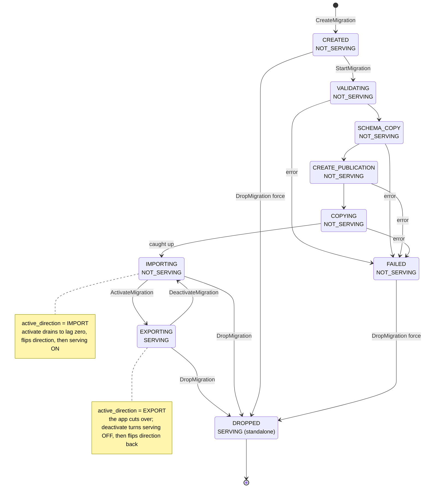
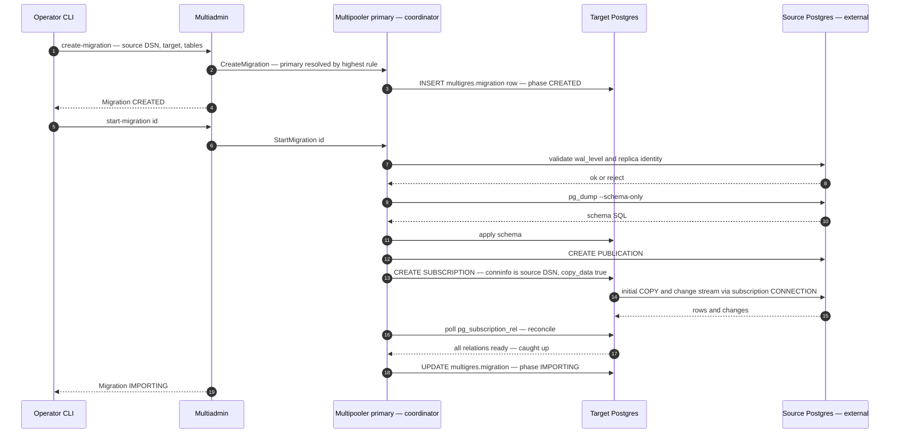
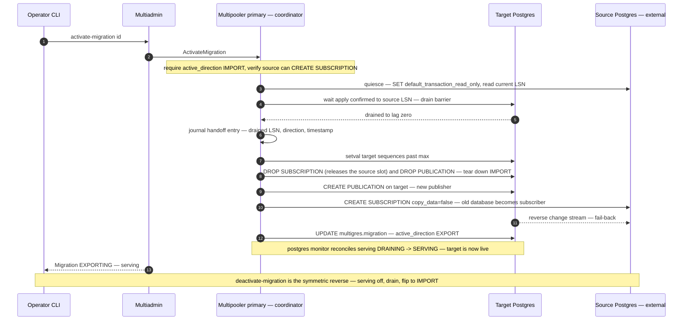
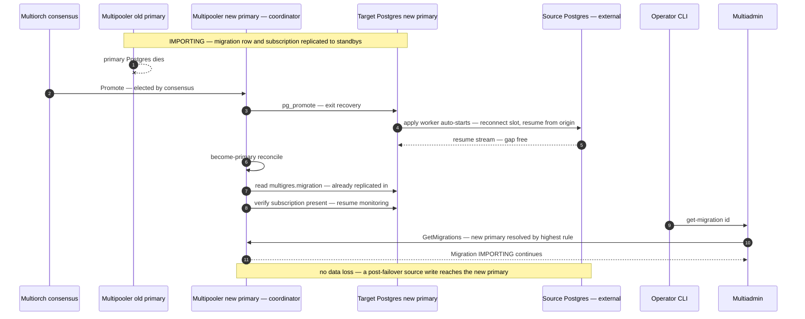

# Table migration into Multigres via logical replication (step 1)

> The **Multigres Migrator** (`migrator`). All descriptions below are relative to upstream `main`, which today has no
> table-migration functionality. It is not a separate component in the pod in the current implementation, but rather a
> separate functionality in Multipooler.

## Narrative

Add a first-class way to migrate tables from an external PostgreSQL server into a Multigres shard, using stock
PostgreSQL logical replication. Minimal configuration for on-prem, v2, and v3, users. The operator hands Multigres a
source DSN and drives a **migration** object through the Multiadmin interface (CLI + RPCs). Multigres copies the schema
and data, then keeps logical replication reading (steady-state streaming) — but the target shard does **not** serve
client queries while it is still importing, even once caught up. The operator then **activates** the migration
(`activate-migration`): Multigres drains to lag zero, becomes the serving primary, and reverses the stream so the old
database follows Multigres for fail-back; `deactivate-migration` rolls that back to non-serving. A clean teardown
(`drop-migration`, drain to zero) leaves Multigres standalone. Nothing is deployed on the source; it is reached by a
direct DSN with SCRAM/MD5, TLS, or other credentials.

The migration coordinator lives inside Multipooler and its state lives in a replicated sidecar table, so the migration
and its subscription share one failover fate: if the shard primary fails, a promoted standby already carries both and
the migration continues without operator intervention or data loss.

## Goals and non-goals

### Goals

- Migrate an external PostgreSQL server (on-prem, v2, v3) into a Multigres shard, credential-driven, nothing deployed on
  the source.
- Support SCRAM/MD5 and TLS source authentication.
- A migration object in the Multiadmin interface: create, start, update, get/list, activate/deactivate, drop.
- Steady-state streaming after the initial copy (target non-serving while importing), an activate/deactivate cutover that
  gates serving on `active_direction`, and a safe teardown (drain-to-zero by default, with wait/force).
- **Serving gate**: the target shard does not serve client queries until the migration is activated (switched to
  EXPORT); the pooler holds serving — as `DRAINING`, reconciled by the monitor from `active_direction` — until then, so
  a client never reads a half-copied shard. The application performs the actual traffic cutover once Multigres is serving.
- Target-primary failover resilience: the migration is picked up on the newly promoted primary with no data loss, and the
  serving gate is re-derived on the promoted primary (it survives failover).

### Non-goals (this step)

- Ongoing DDL propagation. Only a one-shot schema copy at start. Might be added if an easy solution is found.
- Gateway traffic routing / client read-then-write cutover — the application performs the traffic cutover. (The pooler
  does gate its own _serving eligibility_ on migration direction — see Goals — but it never moves client traffic.)
- Chunked/resumable initial copy, VDiff, transforms, throttling (the owned-apply-loop program).
- Multi-shard fan-out/fan-in and cross-shard coordination.
- **`source-publication` option — a continuation, done afterwards.** v1 always creates the publication itself; letting
  the operator point at a pre-created source publication is a follow-up. (`copy-data` and `skip-schema-copy` are
  supported in this step: the operator can subscribe without the initial copy, or skip the `pg_dump --schema-only` when
  the target schema already exists.)

## Architecture

The data path is Postgres to Postgres: the target's Postgres subscribes directly to the source and pulls the copy and
change stream itself. The coordinator is not a data-plane component — it only drives the workflow and reports status.
That makes co-locating it with the target Postgres cheap and robust.

### Location of the pieces and why

#### Migration coordinator

The migration coordinator is inside Multipooler, as a new package. Migration administration needs capabilities outside
the routed query path: `CREATE`/`DROP SUBSCRIPTION` must run in autocommit as a superuser, and `pg_dump` is a libpq
client against one stable backend. Multipooler already owns the Postgres admin/superuser connection and participates in
leader election, so it is the natural host. It is active only on the shard primary.

It is structured as a separate package to give clear control of visibility and to allow the logic to be extracted into a
dedicated migrator binary that is agnostic to the source and target, enabling migrations between, for example, v2 and v3
servers.

#### Table `multigres.migration`

This is the migration state and is created alongside the other shard metadata. Because it is ordinary WAL-logged data,
it is physically replicated to standbys exactly like `pg_subscription`. On promotion the new primary already has both
the migration row and the subscription, so the two can never diverge. The sidecar schema is superuser-owned, so customer
roles cannot read the row (it holds the source DSN).

#### Source access

The source is reached over a direct DSN using a standard libpq driver (pgx), so MD5 and SCRAM sources both work; nothing
is deployed on the source. The target side runs through Multipooler's admin/superuser pool.

#### Multiadmin front door

Multiadmin is the thin operator entry point. It resolves the shard's current primary Multipooler (highest consensus
rule) and forwards the migration RPC there; it holds no migration state.

#### CLI

The `multigres` CLI exposes the lifecycle: `create-migration`, `start-migration`, `update-migration`,
`get-migration`/`list-migrations`, `activate-migration`, `deactivate-migration`, and `drop-migration`.

### Workflow states

The migration lifecycle, with each state's serving status annotated (`IMPORTING`/`EXPORTING` are the steady-state
streaming phase in the IMPORT/EXPORT directions; the target serves client queries only while `EXPORTING`):

### Migration setup flow

The initial setup of the migration flow requires a publisher on the source and a subscriber at the target.

### Cutover flow (activate)

`activate-migration` cuts the target over to serving: quiesce the source, drain to a barrier, reverse the stream, and
flip the target from non-serving to serving. `deactivate-migration` is the symmetric reverse.

### Failover flow

### Required source permissions

The role in the source DSN needs different privileges by direction and by whether Multigres Migrator creates the
publication. `wal_level=logical` is required on the source server in all cases. **Superuser is not required for IMPORT**
(only certain EXPORT cases need it).

- **IMPORT (v1 always creates the publication):** `LOGIN` + `REPLICATION`; ownership of the migrated tables and `CREATE`
  on the database (both required by `CREATE PUBLICATION ... FOR TABLE`, neither requiring superuser); `SELECT` on the
  tables (the initial `COPY` runs as this role); and read access for `pg_dump --schema-only`. Tables owned by a role
  other than the DSN role can't be published by v1 (using a pre-created publication is a follow-up — see non-goals).
- **EXPORT (source becomes the subscriber):** authority to run `CREATE`/`DROP SUBSCRIPTION` — superuser, or on
  PostgreSQL 16+ membership in `pg_create_subscription` plus `CREATE` on the database; write privileges on the migrated
  tables (replication apply); and network reachability from the source to the target Postgres.

**Supabase v2/v3 sources.** Both generations run the same compute image, where the `postgres` role is **NOSUPERUSER**
but has **`REPLICATION`**, **`pg_read_all_data`** (covers `SELECT` and `pg_dump --schema-only`), **`CREATE` on the
database**, and owns the tables a user created over it. So **IMPORT works with the plain `postgres` DSN, no superuser**
— the only caveats are (a) every migrated table must be owned by the DSN role, since v1 always creates the publication
itself and `CREATE PUBLICATION ... FOR TABLE` requires ownership (Supabase's `postgres` owns the tables a user created
over it; supporting a pre-created publication for other-owned tables is a follow-up), and (b) the platform `pg_hba` must
permit a replication-mode connection for the role (otherwise use a sanctioned replication role such as
`supabase_replication_admin` / `supabase_etl_admin`). For **EXPORT**, Supabase grants `postgres`
`pg_create_subscription` **only on PostgreSQL 16+**, so EXPORT to a Supabase source works on PG16+ and requires
`supabase_admin` (superuser) on PG14/15.

`ValidateSource` runs read-only at **create** time: it checks `wal_level`, replica identity, and reads the source's
PostgreSQL version and subscribe-capability — warning if EXPORT will be unavailable. A later `activate-migration` (which
switches to EXPORT) is rejected up front if the source cannot create subscriptions. Remaining privilege failures surface
at the corresponding step (`CREATE PUBLICATION`, `pg_dump`).

## Implementation details

### Multipooler changes

- **New package `go/services/multipooler/internal/migration`** — the coordinator (phase state machine over the sidecar
  table), a target endpoint (admin-pool SQL: apply schema, create/drop publication and subscription, subscription
  status, ALTER SUBSCRIPTION CONNECTION, current LSN, wait-slot-confirmed, advance sequences), a source endpoint (pgx
  over the DSN: validate, `pg_dump`, create/drop publication and subscription, set-read-only, current LSN,
  wait-slot-confirmed, advance sequences), a store (CRUD over `multigres.migration`), and shared barrier helpers.
- **Sidecar table** — `multigres.migration` added to `createSidecarSchema` (idempotent `CREATE TABLE IF NOT EXISTS`, so
  already-bootstrapped shards pick it up on first use).
- **Manager integration** — the manager lazily builds the coordinator from its admin query service, exposes a
  primary-gated accessor (`checkPrimaryGuardrails` + ensure-schema), and runs a reconcile poller that advances in-flight
  migrations. The poller is launched immediately when the service layer opts in (`StartMigrationCoordinator`) and
  relaunched by `openLocked` on each re-open — it must not rely on `openLocked` alone, because opt-in happens via the
  delayed gRPC registration that runs after the initial `openLocked` (see _Validation and deployment findings_). On a
  standby every tick is a no-op; on a newly promoted primary it picks the migration up within one interval.
- **New Multigres Migrator gRPC service** (`grpcmigrationservice`) served by Multipooler and enabled by default in the
  service map — Create/Start/Update/Get/Activate/Deactivate/Drop, each primary-gated, delegating to the coordinator,
  mapping projections to proto. Projections are redacted and never carry the source DSN.
- **Serving gate** — the target must not serve client queries while importing. The manager derives a serving hold from
  `active_direction` (held while IMPORT, released on EXPORT) and threads it into the existing serving-state
  reconciliation (`state_manager.go`): the effective status is forced to `DRAINING` while held and reconciles to
  `SERVING` on activate, on the monitor's ~5s tick — the same mechanism the divergence hold uses. Because it is derived
  from the replicated migration record, it survives a pooler restart and a target-primary failover, and applies to
  standbys too. `Activate`/`Deactivate` update the hold so the flip is picked up promptly.
- **Flows**: IMPORT (validate to `IMPORTING`, non-serving), UpdateMigration (field-masked; source-connection change via
  `ALTER SUBSCRIPTION CONNECTION` with a same-source-database guardrail), Activate/Deactivate (the symmetric
  quiesce/drain/advance-sequences/reverse flip via `SetMigrationDirection(target)`, plus the serving flip: on drains
  before serving, off serves-off before draining back; `Activate` requires IMPORT, `Deactivate` requires EXPORT),
  DropMigration (default requires caught-up and runs a quiesce+drain barrier — freeze the current source, drain to its
  LSN, advance the surviving writer's sequences, then tear down, leaving a standalone write-safe shard; `--wait` blocks
  until caught up first; `--force` skips the barrier and removes it from any phase).

### Multiadmin changes

- **Forwarders** for the migration RPCs (gRPC + Connect) — Create/Start/Update/Get/Activate/Deactivate/Drop — each
  resolving the shard's current primary Multipooler by highest consensus rule and dialing its Multigres Migrator service.
  Multiadmin holds no migration state.
- **CLI** subcommands under `multigres` for the full lifecycle.

## Limitations

- **No ongoing DDL propagation.** Only a one-shot `pg_dump --schema-only` at start (skippable). Schema changes on the
  source during a migration are not replicated and can wedge apply — freeze schema for the duration.
- **Non-resumable initial copy.** Stock tablesync copies each table in one transaction; a failure mid-copy re-copies
  that table.
- **EXPORT reverse path is minimal.** The reverse subscription uses the target superuser and `sslmode=disable`, and
  requires the source to reach the target Postgres directly (reverse reachability). A TLS reverse path, a dedicated
  role, and a configurable advertise host are follow-ups. EXPORT also needs a superuser DSN on the source.
- **Quiesce is best-effort.** The source quiesce flips `default_transaction_read_only` (new transactions only; in-flight
  writes are not fenced); the target/EXPORT publisher is not GUC-flipped (the operator stops application writes). Safe
  cutover assumes application writes are stopped.
- **Single-shard.** Multiadmin resolves the one shard primary; multi-shard targeting of a migration by id is a
  follow-up.
- **Failover pickup is timer-paced.** The reconcile poller picks a migration up on a promoted primary within one
  interval, not instantly.
- **No client-traffic cutover.** Direction flips replication only; steering application traffic is external.

## Follow-ups

- Ongoing DDL propagation (event-trigger capture on the source, replay by the coordinator).
- EXPORT hardening: TLS reverse path, a dedicated replication role, and a configurable target advertise address.
- Multi-shard targeting and cross-shard coordination.
- Owned logical-decoding apply loop (Strategy O): chunked/resumable copy, VDiff, in-flight transforms, throttling,
  quiesce-free cutover.
- Immediate become-primary reconcile trigger (promotion hook / pooler watch) instead of timer-paced pickup.
- Secrets-manager credential option (beyond DSN-in-row).
- Operator/on-prem onboarding docs.

## Testing

End-to-end against real PostgreSQL (`go/test/endtoend/migrator`): import happy path with streaming and clean drop (with
sequence advance), drop force-vs-default guardrails, target-failover-during-migration (kill the primary, promote a
standby, assert the migration continues with no data loss), and the activate/deactivate switch (import to export to
import — asserting the shard flips non-serving↔serving with the direction). Plus unit coverage of the sidecar-schema
creation, the serving-gate reconciliation (held for IMPORT, cleared for EXPORT), and the manager/rpcclient wiring.

## Deployment and image requirements

The migration coordinator runs inside Multipooler, so these are requirements on the **multipooler/coordinator image**
(`multigres/multigres`), not the data-plane (`pgctld`) image.

- **`pg_dump` — required.** The `SCHEMA_COPY` phase shells out to `pg_dump --schema-only` from the coordinator against
  the source DSN (`internal/migration/source.go`, `DumpSchema`), so the image must ship `pg_dump` from the Debian
  `postgresql-client` package. Use a client major version at least the source's — a newer `pg_dump` can dump an older
  server, not the reverse — and since Multigres targets PG17+, `postgresql-client-17`. The image already installs
  `postgresql-client-17` and verifies `pg_dump --version` at build.
- **No other Postgres CLI tools are needed.** Everything else runs over libpq, not a subprocess: the source-side
  publication/subscription/status/sequence/LSN work goes through pgx, and the target applies the dumped schema over its
  admin SQL connection (the few `psql`-only backslash meta-commands `pg_dump` emits are stripped in-process). `psql`,
  `pg_dumpall`, and `pg_restore` are not required by migrations.
- **`pgbackrest`** already in the image belongs to the separate backup/restore feature, not to migrations.

Deployment note (Supabase): the Supabase data-plane image `postgres/Dockerfile-multigres` is already migration-ready and
needs no change for step 1 — its `pgctld` config template sets `wal_level = logical` with templated
`max_wal_senders`/`max_replication_slots`, and its pre-init SQL creates a `postgres SUPERUSER` (so `CREATE SUBSCRIPTION`
works). That image builds only `pgctld` (the data plane); the multipooler/coordinator — and therefore the `pg_dump`
requirement above — comes from the separate `multigres/multigres` image, not the supabase postgres image.

## Validation

Validated end-to-end on local kind (`demo/k8s`, StatefulSet, no operator) against a freestanding `postgres:17` source
driven through the Multiadmin API (runbook: `demo/migration-demo.md`), 2026-09-03: initial copy → streaming, a
target-primary kill mid-migration (multiorch re-elected a new primary; the subscription auto-resumed there and the
coordinator picked the migration up), and an application cutover (`drop-migration --wait` quiesced the source, the app
then failed over to the gateway) — with a balance-`SUM` invariant preserved throughout (no data loss).

Build hygiene: `make images` tags `:latest` and the demo manifests use `imagePullPolicy: IfNotPresent`, so a stale local
`:latest` is silently reused; rebuild (or version the tags) when validating a new build.
