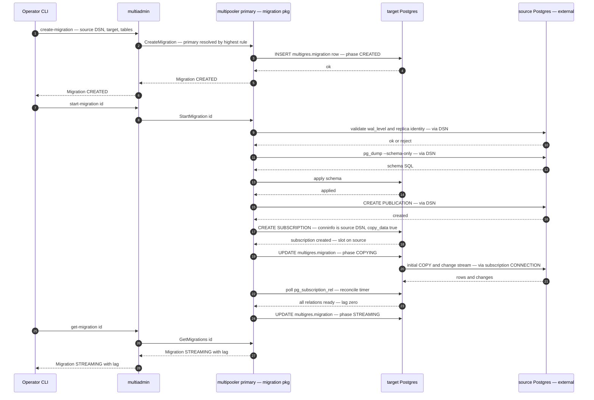
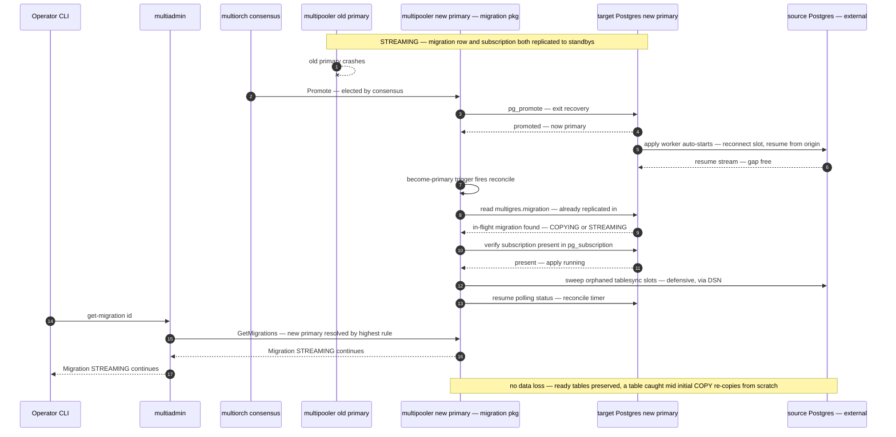

# Multigres Migrator step 1 — implementation plan: credential-driven migration into Multigres

> The **Multigres Migrator** (`migrator`). This plan covers **delivery step 2** of the design doc's roadmap (direct-DSN
> source → Multigres shard), hardened for production and target-primary failover. The migration coordinator lives
> **inside multipooler** as a logically separate package, and migration state lives **in a replicated Postgres table on
> the target** — so the migration and its subscription share one failover fate.

## Goal

The goals for the first stage is to support migration from an external (source) server to a (target) Multigres cluster.

- Support migration from on-prem, v2, and v3 servers.
- There shall be nothing to deploy on the source.
- It shall support SCRAM and TLS authentication credentials.
- It shall be driven entirely from the target side (create publications on the source, etc.)
- Primary failure on the Multigres side should be honored and not result in data loss.
- Migration should continue to feed changes from the source to the target. This is to support external mechanisms to
  deal with application fail-over to the migrated database.
- Optiomal support for DDL while migration is running.
- Full CRUD for working with migrations, potentially several at the same time.

### Non-goals for the first delivery

- Support for resumable initial file copy.
- Support for optimized initial file copy.

## High level idea

### No remote deployments

The migration runs entirely on **stock PostgreSQL logical replication**. The subscription is created on the **target
shard's primary**, and if that primary fails, the migration is **picked up on the newly promoted primary** without
operator intervention and without data loss. This allow is to perform migration of all kinds of users and require no
specific software to be deployed on the source server.

We need credentials to access the server, but nothing else.

#### Migration objects as Multiadmin artefact

The operator interacts with a first-class **migration object** through the multiadmin interface. Creating the object
sets the source DSN; starting it copies the data and then **keeps logical replication reading** (steady-state
STREAMING). From there the operator can **switch the replication direction** (make the old database a follower of
Multigres, for fail-back safety) or **cut the ties** to the old database (stop reading, detach, leave Multigres
standalone) — the normal way an import finishes.

#### Support for current customers and on-prem

All three source types (on-prem, v2, v3) are the same case: a plain PostgreSQL server reached by a **direct DSN** with
user-supplied credentials. Nothing is deployed on the source.

## Architecture: coordinator inside multipooler

The data path is Postgres→Postgres: the target's Postgres subscribes directly to the source and pulls the copy and
change stream itself. The coordinator is therefore not a data-plane component — it only drives the workflow (validate,
schema, publication, subscription, catch-up, switch, complete) and reports status. That makes co-locating it with the
target Postgres both cheap and robust.

- **Home:** a new, logically separate package `go/services/multipooler/internal/migration` (peer of `manager`,
  `replication`, `heartbeat`). It is invoked by a small migration gRPC service on multipooler and by an internal
  become-primary hook; it does its SQL through multipooler's existing admin/superuser connection and, for the source
  side, over the operator-supplied DSN. It does **not** sit on the query-serving path.
- **State:** a table in the **existing multigres sidecar schema**, `multigres.migration`, alongside the other shard
  metadata (`multigres.heartbeat`, the consensus rule tables, `tablegroup`/`shard`), created in `createSidecarSchema`
  (`go/services/multipooler/internal/manager/pg_multischema.go`). This is deliberately the _same location and mechanism_
  as the rest of the shard's bookkeeping, which buys three things for free: (a) **failover durability** — the sidecar
  tables are created once on the bootstrapping primary before the first backup, so standbys inherit them via restore and
  post-failover primaries already have them (the code comment says exactly this); (b) it is WAL-logged and physically
  replicated, so on promotion the new primary already has both the migration row and the subscription and the two can
  never diverge; (c) **security** — the schema is owned by the true superuser with only `USAGE` to `PUBLIC`, so customer
  roles cannot read or alter migration rows. One row per migration. This is the reason for co-location: **one source of
  truth, carried by the same replication that carries the subscription, protected like the rest of the shard metadata.**
- **Active only on the primary.** The coordinator acts only when its multipooler is the shard primary; on a standby it
  is dormant. multipooler already knows when it becomes primary (the promotion / SetPrimary transition), so no external
  watch is needed to discover a failover.
- **Front door unchanged in spirit:** multiadmin remains the thin operator entry point. It resolves the shard's
  **current primary** multipooler (highest consensus rule, the multiadmin `backup.go` pattern) and forwards the
  migration RPC there. It holds no state.

Because the coordinator is co-located with the target Postgres, the low-level per-statement RPCs the earlier prototype
used (ApplySchema, CreateSubscription, …) collapse into **local calls** — the coordinator runs that SQL directly on its
own Postgres. Only the operator-facing migration-object RPCs cross the wire (multiadmin → primary multipooler).

## Scope

### In scope

- The **migration object** in the multiadmin interface (CLI + RPCs), with the source DSN set at create time.
- Coordinator as a separate multipooler package with state in the replicated `multigres.migration` table.
- Direct-DSN source (operator credentials); target is the Multigres shard's primary Postgres.
- Happy path: validate → schema copy → publication → subscription (initial copy) → catch-up → steady-state STREAMING
  (logical replication keeps reading).
- **Set direction** (declarative `set-migration-direction IMPORT|EXPORT`), **teardown** (one `drop-migration` verb:
  safe-default drain / `--wait` / `--force`), and **update** (`update-migration`, field-masked — source connection,
  `sequence_margin`, and `tables` while `CREATED`).
- **Failover resilience for the target primary**: replicated state, a become-primary-triggered reconcile loop,
  primary-resolution by highest rule, primary-gated operations, idempotent phases, and an orphaned-sync-slot sweep.
- Credential handling: the full source DSN (password included) is provided at create and stored in the migration row
  (sidecar schema, superuser-only); no external secret store.
- Tests: unit, e2e happy path, **target-failover-during-migration**, set-direction, drop; local-kind validation, then
  dev-EKS against a real project.

### Out of scope (deferred, per design roadmap)

- Owned apply loop / Strategy O (chunked resumable copy, VDiff, transforms, throttling, exact-stop cutover).
- Source-shard (multigres→multigres) migrations and any source-side agent.
- Gateway traffic routing / read-then-write cutover of client queries (set-direction flips **replication**, not
  application traffic — the operator steers app traffic externally).
- **Ongoing DDL propagation — deferred to a follow-up.** v1 does a one-time initial schema copy only
  (`pg_dump --schema-only` at `start`) so the target tables exist for the subscription. It does **not** propagate schema
  changes made on the source during the migration; that (event-trigger capture + coordinator replay) is a separate later
  version.
- **`copy-data` / `skip-schema-copy` / `source-publication` options — a continuation, done afterwards.** v1 always
  performs the initial data copy, always copies the schema, and always creates the publication itself. Streaming without
  the initial copy, skipping the schema copy (target schema pre-exists), and pointing at a pre-created source
  publication are follow-ups (they also lower the source privileges required — a pre-created publication removes the
  table-ownership requirement).
- **`FOR TABLES IN SCHEMA` auto-inclusion — future work.** v1 accepts `*` and `schema.*` in `--tables`, but expands them
  at create to a concrete `CREATE PUBLICATION ... FOR TABLE` list — a **static snapshot** of the tables owned at that
  moment, so tables added to the schema later are **not** picked up. PostgreSQL's native
  `CREATE PUBLICATION ... FOR TABLES IN SCHEMA` (PG15+) _does_ auto-include new tables, but requires **superuser** (not
  available for a Supabase `postgres` DSN). A future version can use `FOR TABLES IN SCHEMA` where the DSN is superuser
  (or a schema-owner path exists) to get auto-inclusion; combined with DDL propagation this would keep a whole schema in
  sync.
- Multi-instance/HA of the coordinator beyond multipooler's own leadership (decision 3: it is active only on the shard
  primary).

## Migration object and multiadmin interface

The operator's whole interaction is with one object — a **migration**. multiadmin resolves the shard's primary
multipooler and forwards; the coordinator on that primary owns the object and persists it in `multigres.migration`.

### The `Migration` object (redacted projection returned to the operator)

- `id` — server-assigned.
- `source` — redacted `host[:port]/db` only; **never** the user/password.
- `target_database`, `target_shard`.
- `tables[]`.
- `phase` — see the phase machine below.
- `active_direction` — `IMPORT` (old DB → Multigres) or `EXPORT` (Multigres → old DB).
- `publication_name`, `subscription_name` — the currently active pair.
- `total_relations`, `ready_relations`, `caught_up`, `lag` — copy/stream progress.
- `journal[]` — one entry per direction switch (direction, drained-to LSN, new-source LSN, timestamp) for audit.
- `last_error`, `created_at`, `updated_at`, `streaming_since`.

The **source DSN with credentials is set at create time** and stored in the migration row (sidecar schema,
superuser-only — same protection as `pg_subscription`; see §Credentials); it is never returned in any projection.

### multiadmin CLI commands

Verb-first kebab, matching the tree's existing multiadmin verbs. Each forwards to the RPC in parentheses; the trailing
arrow is the phase transition it drives.

| Command                             | Purpose                                                                                           | RPC → phase                                         |
| ----------------------------------- | ------------------------------------------------------------------------------------------------- | --------------------------------------------------- |
| `create-migration`                  | Record the object and set the source DSN; no DB changes beyond writing the migration row.         | `CreateMigration` → `CREATED`                       |
| `start-migration`                   | Validate → schema → publication → subscription → catch-up, then keep streaming.                   | `StartMigration` → `STREAMING`                      |
| `update-migration`                  | Change mutable fields (field-masked) while still `CREATED`.                                       | `UpdateMigration` (no phase change)                 |
| `get-migration` / `list-migrations` | Status: phase, direction, copy progress, lag, journal.                                            | `GetMigrations` (read-only)                         |
| `set-migration-direction`           | Set `active_direction` to `IMPORT` or `EXPORT` (declarative, idempotent).                         | `SetMigrationDirection` → `SWITCHING` → `STREAMING` |
| `drop-migration`                    | Tear down the link (sub + pub + slot, both sides) and remove the object; drains first by default. | `DropMigration` → `COMPLETING` → removed            |

Key flags:

- `create-migration`: `--source-dsn` (may include a password; pass via file/stdin to keep it out of argv),
  `--target <db/shard>`, `--tables` (names, or `*` / `schema.*` for all owned tables or a schema's owned tables),
  `--sequence-margin`, and TLS options (`--sslmode`/`--sslrootcert`/…).
- `start-migration`, `get-migration`: `<id>`.
- `update-migration`: `<id>` plus any of `--source-dsn` / `--sequence-margin` / … (DSN via file/stdin).
- `set-migration-direction`: `<id> --direction IMPORT|EXPORT`.
- `drop-migration`: `<id>`; `--wait[=timeout]` blocks until the migration is completable then drains (for scripts);
  `--force` skips the drain and tears down from any phase (mutually exclusive with `--wait`). The default drain requires
  a caught-up `STREAMING` state (clean cutover, leaves Multigres standalone) and fails fast otherwise.

### RPCs

Two layers. The **operator-facing migration RPCs** are served by multipooler (new migration gRPC service, delegating to
`internal/migration`) and forwarded by multiadmin to the shard primary; they are primary-gated. multiadmin exposes
matching forwarders in `proto/multiadminservice.proto` (Connect + Vanguard).

- `CreateMigration(CreateMigrationRequest) → Migration` — request carries `source_dsn` (may include the password),
  `target_database`, `target_shard`, `tables[]`, `sequence_margin`, TLS options.
- `StartMigration(StartMigrationRequest{id}) → Migration`.
- `UpdateMigration(UpdateMigrationRequest{id, update_mask, …fields}) → Migration` — field-masked; only the named fields
  change. Allowed: source connection (host/port/user/password/TLS), `sequence_margin`, and creation options while
  `CREATED`. Rejects immutable fields and a source-DB identity change while streaming (see _Updating a migration_).
- `GetMigrations(GetMigrationsRequest{id?}) → GetMigrationsResponse` — single RPC for one (id set) or all (id empty),
  mirroring `GetBackups`.
- `SetMigrationDirection(SetMigrationDirectionRequest{id, direction}) → Migration` — `direction` is `IMPORT` or
  `EXPORT`; the current direction is a no-op, the other triggers the barrier + flip.
- `DropMigration(DropMigrationRequest{id, wait, wait_timeout, force}) → Migration` — default drains then removes; `wait`
  blocks until completable; `force` skips the drain. `wait` and `force` are mutually exclusive.

The prototype's low-level RPCs (ApplySchema/CreateSubscription/GetSubscriptionStatus/DropSubscription) are **not** part
of this surface — the co-located coordinator runs that SQL locally rather than calling itself over gRPC.

### Phase machine

```text
CREATED ── start ─▶ VALIDATING ─▶ SCHEMA_COPY ─▶ CREATE_PUBLICATION ─▶ COPYING ─▶ STREAMING (active_direction=IMPORT)
                                                                                     │
                                        set-direction     ┌────────────────────────┤
                                                          ▼                         │
                                              SWITCHING ─▶ STREAMING (EXPORT) ───────┘ (switch again flips back)

drop (default, from STREAMING) ─▶ COMPLETING ─▶ removed   (drain to zero, tear down link, target standalone)
drop --wait ─▶ block until STREAMING ─▶ COMPLETING ─▶ removed
drop --force (any phase) ─▶ removed   (skip drain)        any error ─▶ FAILED
```

`STREAMING` is the steady state in either direction — logical replication keeps reading until the operator changes
direction or tears the migration down. `set-migration-direction` is **declarative**: you name the target direction
(`IMPORT` or `EXPORT`); setting the current direction is a no-op, and setting the other performs the flip and appends a
journal entry (to undo, set it back). Being declarative rather than a blind flip means a CLI mistake can't accidentally
reverse a migration — the operator states the intended end state. Each flip relies on a **quiesce + lag-zero barrier**
(set the current source read-only, wait `confirmed_flush_lsn ≥` the captured LSN, `setval` sequences on the new source)
so the flipped-direction subscription is safe with `copy_data=false`.

**Tearing down: `drop-migration` with a safe default.** There is one teardown verb. **Default** requires a caught-up
`STREAMING` state and does the clean finish — quiesce → drain to lag-zero → drop sub/pub/slot both sides → remove the
object, leaving Multigres standalone with a no-data-loss guarantee. If the migration is not caught up, the default
**fails fast** with guidance rather than blocking or pretending it finished. **`--wait[=timeout]`** blocks until the
migration reaches a completable state and then does the same clean finish (for scripts); it waits for the copy to finish
and lag to fall under normal operation and quiesces only for the final drain, so it does not freeze the source for the
whole copy; from `CREATED` it errors (nothing started). **`--force`** skips the drain and tears down from any phase
(including `FAILED`), making no completeness guarantee; mutually exclusive with `--wait`. The object is removed either
way; the journal records whether the teardown was a clean drain or forced. Exit codes are script-friendly: default
non-zero when not caught up, `--wait` zero on success / non-zero on timeout, `--force` zero after teardown. (Neither
variant drops the copied tables; a `--purge` for partial data is a later addition.)

**`EXPORT`-to-external requirements (called out).** Switching to `EXPORT` makes the external old database a
_subscriber_, which needs more than the `IMPORT` case: the source DSN's role must be able to run `CREATE SUBSCRIPTION`
(superuser, autocommit) on the old database, the old database must have **network reachability to the Multigres target's
Postgres**, and application writes on the current source must be quiesced during the barrier (the operator coordinates
the write-stop as part of cutover). `IMPORT` alone only needs the source to be a publisher (REPLICATION role + a
publication). If a source cannot subscribe, `drop-migration` (default drain, one-way) still finishes the import cleanly.

**Updating a migration.** `update-migration` changes mutable fields (field-masked, only what you pass). The main case is
the **source connection** — password rotation, a source endpoint change / source failover, or TLS/cert changes. Before
the subscription exists it is a row rewrite; after, it maps to `ALTER SUBSCRIPTION … CONNECTION` (the apply worker
restarts with the new conninfo) for `IMPORT`, or the equivalent on the external subscriber for `EXPORT`. The guardrail:
you may change host/port/user/password/sslmode/certs but **not the identity of the source database** while streaming
(the slot and origin are tied to that source), so a `dbname`/cluster change is rejected — repointing at a failover of
the _same_ cluster is the supported case. `sequence_margin` is updatable anytime (used at the next switch); `tables` is
mutable only while `CREATED`. Adding/removing tables on a running migration (publication alter + `REFRESH PUBLICATION`)
is a deferred follow-up.

## Creating a migration

`create-migration` writes only the migration row; `start-migration` drives the phases to STREAMING. The coordinator does
source-side SQL over the DSN and target-side SQL on its local Postgres; the target Postgres pulls the copy and stream
directly from the source.



## Failover handling

The migration row and the subscription are both replicated to the shard's standbys. When the target primary fails,
PostgreSQL promotes a standby and **auto-resumes the subscription apply** (the launcher starts the apply worker; it
reconnects to the source slot and resumes from the WAL-logged replication origin, gap-free). The coordinator does not
restart the subscription — it re-reads the migration row on becoming primary and resumes coordination and monitoring.



### What a crash does to the initial copy

Initial copy is per-table (`pg_subscription_rel.srsubstate`: `i`→`d`→`f`→`s`→`r`). A crash (same-node restart or
promotion):

- Tables already `r` are preserved.
- The table mid-`COPY` rolls back its uncommitted copy and **re-copies from scratch** — the non-resumable-copy
  limitation (Strategy S). No data loss or duplication.
- The permanent subscription slot and origin on the source persist, so streaming resumes where it left off.
- The dead worker's **temporary tablesync slots** on the source are dropped when their walsender sessions end; on PG14+
  their names are deterministic so restart reuses/drops them cleanly. A partition where the old primary lingers can
  leave orphans until `wal_sender_timeout` — hence the defensive sweep in the MSC.

## Reconcile trigger

The coordinator is a reconcile loop (compare the migration row's target phase against what Postgres reports, then act).
Because it is co-located, its triggers are local:

- **Become-primary transition (primary trigger).** When this multipooler becomes the shard primary, run a reconcile
  immediately: load in-flight rows from `multigres.migration`, verify each subscription, resume monitoring, sweep
  orphans. This is what "picks up" a migration on the newly promoted primary — no topo watch needed, because promotion
  is a local event.
- **Periodic timer (safety net).** A modest interval (5–15s) catches copy progress advancing, lag drift, a subscription
  that tripped `disable_on_error`, and stalls that no event announced.
- **Operator RPCs.** `start`/`switch`/`complete`/`drop` change desired state and kick a reconcile directly instead of
  waiting for the timer.

The external-service model would have needed a `poolerwatch` push to discover failovers; co-location removes that
dependency (decision 2 below).

## Credentials

**Model: provide-at-create, stored in the migration row.** The operator provides the **full source DSN, password
included, at `create-migration`**, and it is stored in the `multigres.migration` row. This is the same posture
PostgreSQL itself takes — the password lands in `pg_subscription.subconninfo` regardless — so Multigres Migrator keeps
its copy in the **sidecar schema**, which is true-superuser-owned with only `USAGE` to `PUBLIC`: the same protection
class as `subconninfo` (customer roles cannot read it), and WAL-logged/replicated so it survives failover and restart
alongside the subscription.

Consequences and conveniences:

- **One durable source of the DSN.** Every source-connecting operation — validate, `pg_dump`, publication,
  `CREATE SUBSCRIPTION`, the drain on `drop`, `switch`, `update`, and `EXPORT`-direction source ops — reads the DSN from
  the row. This removes the edge case where, after switching to `EXPORT`, the source login credential was no longer
  recoverable from the local `pg_subscription`: the row always has it. No `pg_subscription` readback is needed for
  credentials.
- **No external secret store, no kube client.** No Kubernetes Secret, no RBAC, nothing to provision — which suits the
  single-instance, dev-EKS-first plan.
- **Redaction preserved.** Projections show only host/db; the DSN/password is never returned by any RPC and never
  logged.
- **Input hygiene.** The DSN can be passed via file/stdin rather than a literal `--source-dsn` argv, to keep the
  password out of the process list and shell history; it is stored in the row either way.
- **Plaintext-at-rest is accepted** ("this is how Postgres works"). The password sits plaintext in the sidecar row and
  in `pg_subscription`, both superuser-only — inherent to stock logical replication with password auth. Where that is
  unacceptable, use **client-certificate auth**: the DSN then carries `sslcert`/`sslkey` (no password) and the secret
  material is the key file staged on the target Postgres host.

### How Postgres stores the credential

`CREATE SUBSCRIPTION` saves the connection string **in plaintext, verbatim** — no hashing, no encryption. The whole
conninfo, `password=…` included, is written as-is into the catalog column `pg_subscription.subconninfo` (`text`). The
protection is **access control, not encryption**, and it is deliberate:

- `pg_subscription` is a **shared, cluster-wide catalog** (one copy per cluster, like `pg_authid`/`pg_database`).
- Access to the `subconninfo` column is **revoked from non-superusers** precisely because it can hold plain-text
  passwords — normal users see that a subscription exists but cannot read its conninfo. multipooler's admin pool is a
  true superuser, which is what makes the readback possible.

Consequences:

- **It is WAL-logged and replicated.** Shared catalogs ride physical replication and are included in base backups, so
  the promoted standby and any restored node already have `subconninfo` — the durability the failover story depends on.
- **The password lives in plaintext in the target cluster's catalog**, readable by any superuser on the target and
  present in its on-disk catalog files and backups. This is inherent to stock logical replication with password auth;
  nothing Multigres Migrator does changes it.
- **Avoiding plaintext-in-catalog:** use **client-certificate auth** instead of a password — the DSN carries
  `sslcert`/`sslkey`, so `subconninfo` stores only the file _paths_ and the secret material is the key file staged on
  the target Postgres host (protected by file permissions), never a password in the catalog. This reuses the same
  cert-staging the `verify-full` path already requires.

## Source connectivity and auth

- **Driver:** source-side admin SQL (validate, publication, and — for `EXPORT` — the source subscription) uses a
  standard PostgreSQL client driver over libpq, the same path `pg_dump` uses — **not** the multigres `pgprotocol`
  client, which rejects MD5. On-prem/v2/v3 sources may use MD5 or SCRAM; both must work.
- **TLS:** full libpq range on the source DSN (`sslmode` up to `verify-full`, `sslrootcert`/`sslcert`/`sslkey`).
- **Reachability:** the **target Postgres** holds the subscription connection to the source, and the **primary
  multipooler** connects to the source for validate/`pg_dump`/publication — both need egress to the source. Reverse
  additionally needs the source to reach the target Postgres.
- **Source prerequisites:** `wal_level=logical`, and a usable replica identity per table (`ValidateSource` rejects
  missing, warns on FULL; when a row filter is supplied every filter column must be covered by the replica identity).
- **Source role permissions (by direction and publication mode). Superuser is not required for IMPORT.**
  - **IMPORT (v1 always creates the publication):** `LOGIN` + `REPLICATION`; ownership of the migrated tables and
    `CREATE` on the database (required by `CREATE PUBLICATION ... FOR TABLE`, neither needs superuser); `SELECT` on the
    tables (initial `COPY`); read access for `pg_dump --schema-only`. Tables owned by another role can't be published by
    v1 — a pre-created publication (`--source-publication`) is a follow-up that removes the ownership requirement.
  - **EXPORT (source is the subscriber):** authority to run `CREATE`/`DROP SUBSCRIPTION` — superuser, or on PostgreSQL
    16+ `pg_create_subscription` membership plus `CREATE` on the database; write privileges on the tables; and
    source-to-target Postgres reachability.
- **Supabase v2/v3 sources (same compute image for both):** the `postgres` role is **NOSUPERUSER** but has
  `REPLICATION`, `pg_read_all_data` (covers `SELECT` + `pg_dump`), `CREATE` on the database, and owns user-created
  tables — so **IMPORT works with the plain `postgres` DSN, no superuser**. Caveats: every migrated table must be owned
  by the DSN role (v1 always creates the publication itself; other-owned tables await the `--source-publication`
  follow-up); and `pg_hba` must permit a replication connection for the role (else use
  `supabase_replication_admin`/`supabase_etl_admin`). EXPORT to a Supabase source works **only on PG16+** (`postgres` is
  granted `pg_create_subscription` there); PG14/15 needs `supabase_admin`. `ValidateSource` reads the source version +
  subscribe-capability at create and warns/rejects EXPORT accordingly.
- **No schema changes during the migration (v1).** Because v1 does not propagate DDL, the operator must not alter the
  schema of migrated tables on the source while the migration is active — an incompatible change
  (dropped/renamed/retyped column) can wedge the apply worker. Freeze schema for the duration; ongoing DDL is a
  follow-up version.

### How the source DSN reaches CREATE SUBSCRIPTION

`CREATE SUBSCRIPTION` is utility DDL: the connection string is a **literal in the statement text**, not a bind
parameter, and there is no side channel to hand Postgres the DSN. The coordinator therefore assembles, on its local
admin/superuser autocommit connection (the statement cannot run in a transaction):

```sql
CREATE SUBSCRIPTION <subname> CONNECTION '<conninfo>' PUBLICATION <pubname> WITH (copy_data = true)
```

quoting `<subname>`/`<pubname>` with `ast.QuoteIdentifier` and the conninfo with `ast.QuoteStringLiteral` (as the
prototype's `adminExec` path already does). Correctness and security hinge on:

- **Two layers of quoting.** The conninfo is itself a libpq string (`key=value`, values with spaces/quotes/backslashes
  wrapped in single quotes with `\` escaping — passwords commonly need this), and then that whole string is embedded as
  a SQL string literal (inner single quotes doubled). Getting only one layer right yields either a broken statement or
  an injection vector, so both are mandatory.
- **Target-evaluated, not coordinator-evaluated.** The _target_ Postgres opens this connection, so the host must be
  resolvable/reachable **from the target Postgres pod**, and any TLS file paths (`sslrootcert`/`sslcert`/`sslkey` for
  `verify-full`) must exist **on the target Postgres host** — a provisioning gotcha; `sslmode=require` sidesteps file
  staging for a first pass.
- **Never logged.** The statement text carries the password, so it is logged only redacted (host/db). The coordinator
  gets the conninfo from the migration row (its durable copy); after creation Postgres also holds it in
  `pg_subscription.subconninfo` (superuser-only) — a second copy, not the coordinator's source of truth.

End to end: operator → CLI (password from file/stdin, not argv) → multiadmin RPC (mTLS) → primary multipooler →
coordinator builds the doubly-quoted `CREATE SUBSCRIPTION … CONNECTION '…'` and runs it on the local superuser
connection → Postgres persists the conninfo in `pg_subscription`.

## From the prototype: reused vs. changed

The prototype (external `go/services/migrator` service + `go/cmd/migrator`, in-memory state, self-RPCs, provisioner
global service) is refactored into the multipooler-hosted model:

- **Reused:** the `Migration`/phase proto shapes; the migration SQL logic in
  `go/services/multipooler/internal/manager/rpc_migration.go` (moves into `internal/migration`); the multiadmin
  forwarding pattern and CLI in `go/cmd/multigres/command/migration/`; the e2e test scaffolding (standalone source,
  shardsetup).
- **Changed / retired:** the standalone Multigres Migrator service, binary, topo registration, and provisioner
  global-service wiring are retired; state moves from the in-memory map to `multigres.migration`; low-level RPCs become
  local calls; primary resolution moves to multiadmin (highest rule).

## Work breakdown

Ordered; each item names the primary files.

1. **`internal/migration` package scaffolding.** New package `go/services/multipooler/internal/migration` with the
   coordinator type, constructed by multipooler and given the admin-connection accessor + logger; wired into multipooler
   init. Move the migration SQL from `internal/manager/rpc_migration.go` into it (local calls, not RPCs).
2. **Metadata table in the sidecar schema.** Add `multigres.migration` to `createSidecarSchema`
   (`internal/manager/pg_multischema.go`) next to `heartbeat`/rule tables so new shards get it at bootstrap (inherited
   by standbys via restore); plus an idempotent `CREATE TABLE IF NOT EXISTS` the coordinator runs on first use, to cover
   already-bootstrapped shards (the dev-EKS cluster). One row per migration, `journal` as JSONB, the full source DSN
   (password included — sidecar schema is superuser-only, same protection as `pg_subscription`). Read/write helpers via
   the admin pool. Files: `internal/manager/pg_multischema.go`, `internal/migration/`.
3. **Migration gRPC service on multipooler.** New `proto/multipoolermigrationservice.proto`
   (Create/Start/Update/Get/Switch/Drop + `Migration`); handler delegates to `internal/migration`; **primary-gated** via
   `checkPrimaryGuardrails` + rule/term check. Files: `proto/*`, `go/services/multipooler/grpc*`.
4. **Reconcile loop + triggers.** Phase-driving reconciler with the become-primary hook (subscribe to the
   promotion/serving-state transition), periodic timer, and RPC-driven kicks; idempotent phase driver
   (`CREATE PUBLICATION IF NOT EXISTS`, detect-existing subscription, safe re-drive). Files: `internal/migration/`,
   multipooler init, reuse the serving-state/promotion signal.
5. **Source driver + auth fix.** libpq/pgx for source admin SQL so MD5 works; accept URI DSNs and values with spaces.
   Files: `internal/migration/`.
6. **multiadmin forwarders + CLI.** Resolve the shard primary by highest rule (`commonconsensus.CompareRuleNumbers`,
   `backup.go` pattern) and forward all RPCs; add `update-migration`, `set-migration-direction`, and `drop-migration`
   (with `--wait`/`--force`) commands. Files: `go/services/multiadmin/`, `go/cmd/multigres/command/migration/`.
7. **UpdateMigration flow.** Field-masked update: source connection (row rewrite pre-subscription;
   `ALTER SUBSCRIPTION … CONNECTION` after, with the same-source-DB guardrail), `sequence_margin` anytime, creation
   options while `CREATED`. Password from file/stdin. Files: `internal/migration/`, protos, CLI.
8. **Barrier ops.** Quiesce (`SetDatabaseReadOnly`), drain-to-LSN wait (reuse `manager/pg_replication.go`),
   `GetMaxSequenceValues`/`AdvanceSequences` — as local coordinator methods, idempotent. Files: `internal/migration/`.
9. **Set-direction flow.** Declarative: no-op if already in the requested direction; otherwise quiesce → drain → journal
   → `setval` → drop current sub/pub → establish the requested direction (publication on new source, subscription with
   `copy_data=false` on new target; for `IMPORT`→`EXPORT` the subscriber is the external source, run over the DSN) →
   re-enable writes → set `active_direction`. Files: `internal/migration/`, protos, CLI.
10. **Drop-migration flow + orphan sweep.** Default (from `STREAMING`): quiesce → drain to zero → drop sub/pub/slot both
    sides → remove object; fail fast if not caught up. `--wait[=timeout]`: block until completable, then the same
    (quiesce only at the end). `--force`: skip drain, tear down from any phase. Record clean-vs-forced in the journal.
    Plus the defensive orphaned-tablesync-slot sweep on the source. Files: `internal/migration/`, protos, CLI.
11. **Credentials.** Store the full source DSN (password included) in the migration row (sidecar schema,
    superuser-only); redact in projections; never log; support DSN input via file/stdin to keep it out of argv. No
    Secret store, no kube client. Files: `internal/migration/`.
12. **Retire the standalone service.** Remove `go/services/migrator`, `go/cmd/migrator`, and its provisioner
    global-service wiring; migrate its e2e tests onto the multipooler path.
13. **Docs.** Operator/on-prem onboarding guide: prerequisites, reachability, credentials, update/switch/drop semantics
    (`--wait`/`--force`), `EXPORT`-to-external requirements, failover behavior.

## Testing

1. **Unit** — coordinator against a real Postgres (publication/subscription/slot created; `srsubstate`→`r`; teardown
   idempotent; primary-gate rejects on a standby); metadata-table read/write round-trips; primary resolution picks
   highest rule; reconcile transitions with a fake Postgres.
2. **e2e happy path** — standalone source (`wal_level=logical`), seed a PK'd table, create/start via the multiadmin
   interface, assert target equals source under write load (row count + content checksum).
3. **e2e target-failover-during-migration (key new test)** — 2+ node target shard; start a migration; during COPYING,
   kill/step-down the target primary; assert (a) the new primary's coordinator picks it up from the replicated row, (b)
   Postgres auto-resumed apply, (c) the final table matches source with no loss or duplication. Reuse the shardsetup
   failover primitives.
4. **e2e set-direction** — reach STREAMING, set `EXPORT`, assert sequences advanced and new Multigres-side writes stream
   back to the old DB; set `IMPORT` and assert it flips back; set the current direction and assert it's a no-op.
   Requires a source that can subscribe.
5. **e2e drop-migration** — default from STREAMING: assert clean drain, sub + pub + slot gone both sides, target retains
   all data, object removed; default when not caught up: assert fail-fast (non-zero, no teardown); `--wait`: start from
   COPYING, assert it blocks then finishes cleanly; `--force`: assert immediate teardown from a non-caught-up state.
6. **e2e update-migration** — rotate the source password / change the endpoint mid-STREAMING, assert
   `ALTER SUBSCRIPTION … CONNECTION` applied and streaming resumes; assert a `dbname` change is rejected.
7. **Local kind** — DONE (2026-09-03): manual end-to-end validated against a standalone `postgres:17` source through the
   Multiadmin API, including a target-primary kill mid-migration and an application cutover (see _Validation_ below).
   Runbook: `demo/migration-demo.md`.
8. **Dev EKS** — migrate a real existing project (see below). Not yet run; `demo/k8s` is kind-specific (hostPath
   storage, kind-loaded images, pinned gateway clusterIP, cert SANs baked to the `default` namespace), so EKS needs real
   PVCs/EFS-or-S3 backups, an image registry, and clusterIP/CIDR + cert/namespace changes first.

## Dev-EKS test prerequisites (for your run)

- The **target Multigres cluster must already be running** on dev EKS. Per a known limitation, the dev-EKS operator may
  not deploy new clusters (crashloops with the reconciler enabled) — validate the full flow on **local kind first**, and
  for EKS use a cluster that is already up. Confirm this still holds when you get there.
- **Network egress** from the primary multipooler and the target Postgres to the source endpoint (security groups /
  peering), source reachable over TLS.
- **Source DSN (with password) supplied at `create-migration`** (via file/stdin); no K8s Secret needed. Source has
  `wal_level=logical`, a replication-capable role, and usable replica identities on the migrated tables.
- Pick a **small, non-critical project** first; verify with a row-count + checksum comparison after catch-up.

## Deployment and image requirements

Discovered while running the kind end-to-end (see _Validation_):

- **The coordinator image must ship `pg_dump`** matching the source's major version. The `SCHEMA_COPY` phase runs
  `pg_dump --schema-only` from the coordinator (inside Multipooler) against the source DSN, so the multipooler image
  needs `postgresql-client`. The upstream `Dockerfile` ships `pgbackrest` but not `postgresql-client`, so the
  multipooler image must add `postgresql-client-17` (Multigres targets PG17+).
- **Supabase data-plane image** (`~/repos/supabase` → `postgres/Dockerfile-multigres`) is already migration-ready and
  needs no change for step 1: its `pgctld` config template sets `wal_level = logical` with templated
  `max_wal_senders`/`max_replication_slots`, and `pre-init/00-postgres-role.sql` creates a `postgres SUPERUSER` (so
  `CREATE SUBSCRIPTION` works). It builds only `pgctld` (the data plane); the multipooler/coordinator comes from the
  separate `multigres/multigres` image, so the `pg_dump` requirement lands there, not on the supabase postgres image.
  Only if a multipooler image were ever built from the supabase base would it need `postgresql-client` too.

## Validation (local kind, 2026-09-03)

Ran the full flow on kind (`demo/k8s`, StatefulSet, no operator) against a freestanding `postgres:17` container driven
through the Multiadmin API (runbook: `demo/migration-demo.md`): initial copy → streaming, a **target-primary kill
mid-migration** (multiorch re-elected a new primary; the subscription auto-resumed there and the coordinator picked the
migration up), and an **application cutover** (`drop-migration --wait` quiesced the source → the app failed over to the
gateway). A balance-`SUM` invariant held throughout — no data loss.

Build hygiene: `make images` tags `:latest` and the manifests use `imagePullPolicy: IfNotPresent`, so a stale local
`:latest` is silently reused; rebuild (or version the tags) when validating a new build.

## Experimental follow-up: DDL replication

Step 1 lists ongoing DDL propagation as a non-goal (one-shot schema copy only). As an **experiment** — wired into the
IMPORT `runSetup`/`teardown` behind no flag, so a build can include or omit it — the coordinator can also replicate DDL
over the **same logical-replication stream as the data**, closing the "schema drifts after start / a data change arrives
before the column it needs" gap for the common case. Full write-up and validation:
[DDL replication issue](./migrator_ddl_replication_issue.md).

Mechanism (stock PostgreSQL only; the machinery lives in the existing `multigres` sidecar schema on both sides; new file
`internal/migration/ddlrepl.go`):

- **Source capture** — a `multigres.ddl_log` table plus a `ddl_command_end` event trigger that appends `current_query()`
  for **table-modification DDL only** (`command_tag IN ('CREATE TABLE', 'ALTER TABLE')`), which excludes `CREATE INDEX`
  (incl. `CONCURRENTLY`), `DROP` statements, and non-table DDL. The INSERT commits in the same transaction as the DDL
  (atomic), and the trigger is armed _after_ `CREATE PUBLICATION` so the publication's own creation is not captured.
- **Same stream** — `multigres.ddl_log` is added to the migration's publication, so its INSERTs are applied by the
  target apply worker **in commit order**; the table starts empty, so `copy_data` copies nothing at tablesync and only
  post-start DDL streams. One stream means no ordering race between DDL and data.
- **Target apply** — a matching `multigres.ddl_log` plus an `AFTER INSERT` trigger that `EXECUTE`s each arriving
  statement, `ENABLE ALWAYS` because triggers do not fire for replication-applied changes by default.

Coordinator wiring (IMPORT): after `ApplySchema`, `target.SetupDDLApply` then `source.CreateDDLLog`; `CreatePublication`
includes `multigres.ddl_log`; then `source.EnableDDLCapture`. `teardown` drops only our own objects (event trigger,
functions, `ddl_log`), never the shared `multigres` sidecar schema.

Known limitations (why this stays experimental): event-trigger creation needs a **superuser** source; only
`CREATE TABLE`/`ALTER TABLE` are captured (index DDL, `DROP`, and non-table DDL drift on the target); capture is **not
scoped to the migrated table set**, so an `ALTER TABLE` referencing an object the target lacks stalls the apply worker
(keep source DDL scoped to migrated tables); IMPORT direction only. Graduation follow-ups (scope-to-migrated-tables,
broaden the allowlist, NOSUPERUSER path, gate flag, EXPORT, structured capture) are in the issue file.

## Decisions

Resolved:

- **Home — inside multipooler**, as the separate package `go/services/multipooler/internal/migration` (not pgctld, not a
  sidecar).
- **State — `multigres.migration` in the existing per-database sidecar schema** (not topo, not a new schema), so
  migration state and the subscription share one failover fate and one location with the rest of the shard metadata.
- **Metadata table placement — the sidecar schema, same as other shard metadata.** Motivation: **migrations belong to
  the database.** A schema lives inside a database, so `multigres.migration` is inherently _per-database_ — if several
  databases with different owners ever coexist on a shard, each carries its own set of migrations, scoped and
  access-controlled with that database. Multigres is single-database today, but this placement future-proofs the model
  without any extra machinery.
- **Coordinator instances — active only on the shard primary** (multipooler leadership); no separate lease.
- **Set-direction — declarative `set-migration-direction IMPORT|EXPORT` (not a blind flip), in scope**.
  `EXPORT`-to-external needs superuser + reverse reachability on the source (documented).
- **Teardown — one verb, `drop-migration`**, safe by default (drain from a caught-up `STREAMING` state, fail fast
  otherwise), `--wait[=timeout]` for scripts, `--force` to skip the drain. `complete-migration` is folded into this
  default; outcome (clean vs forced) is recorded in the journal.
- **Update — `update-migration` (field-masked)** for the source connection (`ALTER SUBSCRIPTION … CONNECTION`,
  same-source-DB guardrail), `sequence_margin`, and creation options while `CREATED`. Table add/remove deferred.
- **Reconcile trigger — become-primary + timer + RPC** (no `poolerwatch` dependency, since promotion is a local event).
- **Credential storage — provide the full DSN (password included) at create, stored in the migration row** (sidecar
  schema, superuser-only, same protection as `pg_subscription`). No external secret store, no kube client; DSN via
  file/stdin to avoid argv. Plaintext-at-rest accepted (as Postgres itself does); cert-auth avoids it where required.

No open decisions remain.
