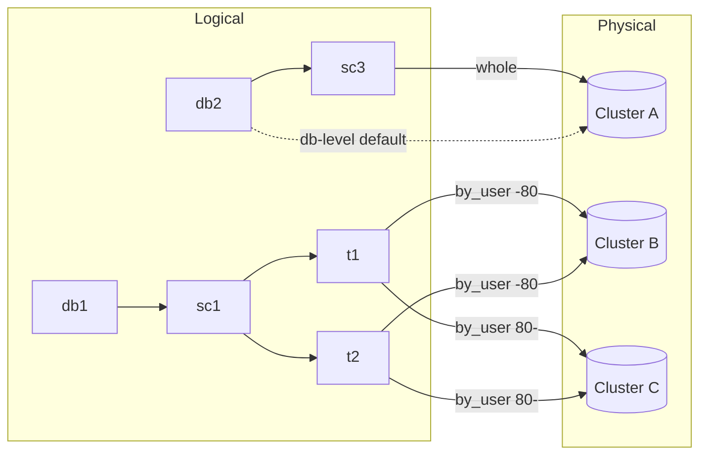
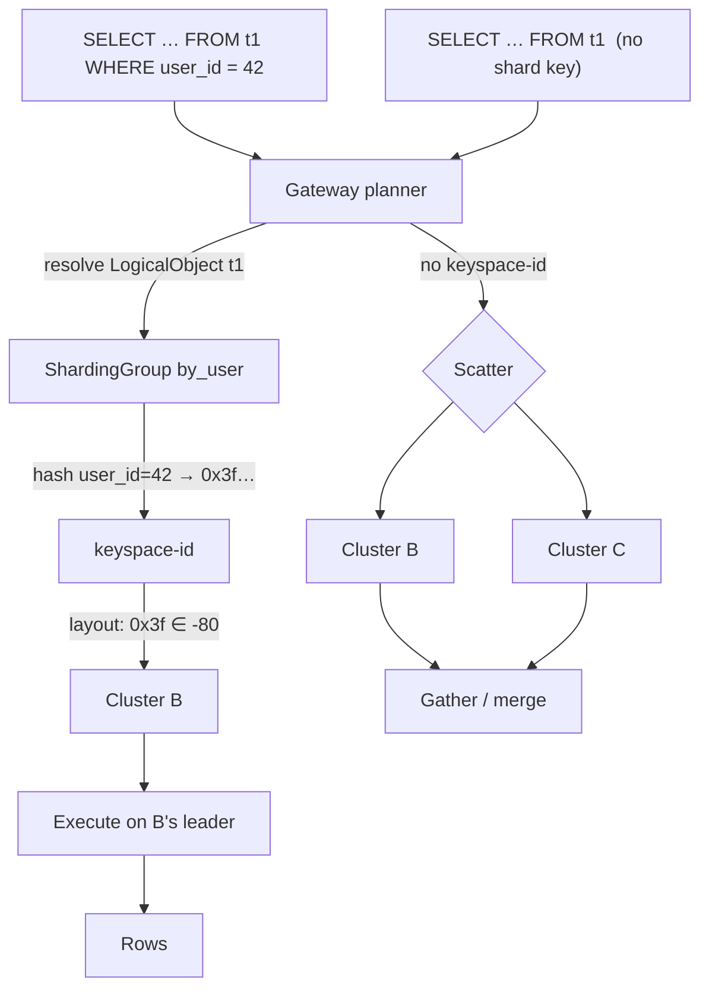

# Sharding: Logical view, physical representation, and the map between them

**Status: Draft for team discussion.** This proposes the data model for how
Multigres describes where a user's data lives and how it is split. It defines
the vocabulary and proto; it deliberately does _not_ specify DDL syntax, the
resharding execution mechanism, or cross-shard 2PC (see [Out of scope](#out-of-scope)).

## TL;DR

Today `ShardKey{database, table_group, shard}` conflates two different things:
_what the user sees_ and _where it physically lives_. This proposal splits them
into three independent layers:

1. **Logical view** - plain Postgres namespacing the user already knows:
   `database → schema → table`. No sharding concepts leak in.
2. **Physical representation** - named Postgres HA units ("storage clusters").
   Each is one failover domain and can hold fragments of many logical objects.
3. **The map** - attaches any logical object (at database, schema, _or_ table
   granularity) to physical storage, optionally via a **sharding function**
   over named columns.

The representation can express _any_ sharding scheme — unsharded, table-level,
schema-level, database-level, reference/replicated — because placement is just a
mapping, not a fixed hierarchy. Restrictions on what users are _allowed_ to do
are a policy/UI concern layered on top, not baked into the representation.

**Why now:** `ShardKey` does not yet live in many places. Replacing it as the
routing key is cheap today and gets more expensive every week we wait.

## The model

### 1. Logical view

What the user reasons about is ordinary Postgres:

```text
db1
├── sc1
│   ├── t1
│   └── t2
db2
├── sc2
│   └── t3
└── sc3
    └── t4
```

A **`LogicalObject`** names any node in that tree. Emptier fields widen scope:
`{db1}` is the whole database, `{db1, sc1}` the whole schema, `{db1, sc1, t1}` a
single table.

### 2. Physical representation

A **`StorageCluster`** is a named set of Postgres nodes forming one HA/consensus
unit (a cohort of multipoolers over Postgres — exactly today's per-shard pooler
set). One storage cluster is one failover domain, and it can hold fragments of
many different logical objects at once.

> **Open naming decision.** "Cluster" already means the whole Multigres
> deployment (`clustermetadata`, "cluster management"). This doc uses
> **`StorageCluster`** as a placeholder; alternatives worth a vote:
> `StorageCluster`, `PgCluster`, `CellGroup`, `ShardGroup`. Pick one before it
> calcifies.

### 3. The map

The map binds logical objects to storage clusters. It has two forms:

- **Direct placement** — no value-based split. One cluster = unsharded; many
  clusters each holding the _full_ range = replicated (reference data). Applies
  at any granularity.
- **Sharded placement** — the object joins a **ShardingGroup**, which carries a
  **sharding function** and a **layout** (keyspace-id range → cluster).
  A table joins by naming the **columns** the function is evaluated on.

There are therefore **two functions** in play, and keeping them distinct is the
whole point:

| Function                | Owned by                                                            | Answers                                                   |
| ----------------------- | ------------------------------------------------------------------- | --------------------------------------------------------- |
| `value → keyspace-id`   | the ShardingGroup's **sharding function** + the table's **columns** | how a row's shard-key value becomes a point in `[00, FF]` |
| `keyspace-id → cluster` | the ShardingGroup's **layout**                                      | which storage cluster owns that point                     |

### ShardingGroup — syntactic sugar for conformity

The fundamental unit is a **table's own sharding spec**: its shard-key columns,
a sharding function, and a layout. That is everything the router needs, and it
is self-contained.

A **`ShardingGroup`** is **syntactic sugar** on top of that. It defines one
(function + layout) once and lets many tables share it by reference, so a single
edit keeps them all conformant. Because members share the same function and
layout, matching keyspace-ids land on the same cluster — so the tables can be
**joined and transacted locally**. The conformity guarantee is stronger than
"same ranges": the shared _function_ is what makes matching rows co-resident,
not just the shared partition boundaries.

**Denormalization.** A group plus its bindings can be expanded into a per-table spec —
the (function, layout, columns) copied onto each member table
(`TableSharding`) — so _single-table_ resolution (value → keyspace-id →
cluster) is one self-contained lookup.

## Proto

> Draft. Reuses `clustermetadata.KeyRange` (bytes `start`/`end`). Message names
> and packaging are for discussion, not final.

```proto
// LogicalObject names a user-visible object at database, schema, or table
// granularity. Emptier fields widen the scope:
//   {database}                  -> the whole database
//   {database, schema}          -> the whole schema
//   {database, schema, table}   -> a single table
message LogicalObject {
  string database = 1;  // required
  string schema   = 2;  // empty => all schemas in database
  string table    = 3;  // empty => all tables in schema
}

// StorageCluster is one HA/consensus unit (a cohort of multipoolers over
// postgres). It maps onto today's per-shard pooler set. Members and cells live
// in the existing topology; this is just the routing-facing name.
message StorageCluster {
  string name = 1;
}

// ShardingFunction maps a shard-key value to a keyspace-id. It is an interface
// (oneof): each kind is its own message storing only what it needs — hash and
// range need nothing, lookup names a secondary-index table. We add more here as we
// add support for more sharding functions.
message ShardingFunction {
  oneof kind {
    HashFunction   hash   = 1;  // even distribution; point lookups hit one cluster
    RangeFunction  range  = 2;  // order-preserving; range scans stay narrow
    LookupFunction lookup = 3;  // secondary-index table maps value -> keyspace-id
  }
}

message HashFunction {}

message RangeFunction {}

message LookupFunction {
  LogicalObject table = 1;
  string from_column  = 2;
  string to_column    = 3;
}

// Placement assigns a slice of the keyspace-id space to one StorageCluster.
//   Disjoint placements               = a partition (real sharding).
//   Overlapping/full-range placements = replication (reference data).
message Placement {
  clustermetadata.KeyRange key_range = 1;  // bytes start (incl) / end (excl)
  string cluster = 2;                      // StorageCluster.name
}

// ShardingGroup is syntactic sugar: one sharding function plus one keyspace-id
// -> cluster layout, defined once and shared by many tables so a single edit
// keeps them conformant. Members shard the same way, so matching keyspace-ids
// co-locate and the tables can be joined and transacted locally. A group + its
// bindings denormalize into a TableSharding per member table (below).
message ShardingGroup {
  string name = 1;
  ShardingFunction function = 2;
  repeated Placement layout = 3;
}

// TableBinding attaches a table to a ShardingGroup by naming the columns the
// group's function is evaluated on. The columns are the table's contribution;
// the function and layout come from the group. (Authoring form.)
message TableBinding {
  LogicalObject table = 1;
  string sharding_group = 2;
  repeated string columns = 3;  // shard-key columns, in function-defined order
}

// TableSharding is the denormalized sharding spec for one table. The (function,
// layout, columns) make single-table resolution self-contained; sharding_group
// is the co-location key the router compares to push down joins. It is what a
// ShardingGroup + TableBinding expands into for each member table (the
// materialized/read form; ShardingGroup + TableBinding is the authoring form).
message TableSharding {
  LogicalObject table = 1;
  repeated string columns = 2;    // shard-key columns
  ShardingFunction function = 3;  // materialized from the group
  repeated Placement layout = 4;  // materialized from the group

  // sharding_group is the co-location key: two tables can have their join pushed
  // down when they share it (and the join is on their shard-key columns). Not
  // mere provenance — the router reads it. Empty only if authored directly with
  // no group, which opts the table out of group-based co-location.
  string sharding_group = 5;
}

// DirectPlacement pins a logical object (any granularity) to one or more
// clusters with no value-based split.
//   one cluster            = unsharded
//   many clusters (each full-range) = replicated / reference
message DirectPlacement {
  LogicalObject object = 1;
  repeated string clusters = 2;
}

// ShardingSchema is the complete logical->physical map. Precedence when scopes
// overlap: most-specific object wins (a table's sharding overrides a schema/db
// placement).
//
// sharding_groups + table_bindings are the authoring form; table_shardings is
// the denormalized form the router reads on the hot path. The two are kept in
// sync by materializing groups+bindings into table_shardings (see design doc).
message ShardingSchema {
  repeated StorageCluster   clusters          = 1;
  repeated ShardingGroup    sharding_groups   = 2;
  repeated DirectPlacement  direct_placements = 3;
  repeated TableBinding     table_bindings    = 4;
  repeated TableSharding    table_shardings   = 5;
}
```

## Worked examples

Assume storage clusters **A, B, C, D**. Keyranges use Vitess notation: `-80` is
`[0x00, 0x80)`, `80-` is `[0x80, +inf)`.

### Example 1 — Unsharded database

`db2` lives entirely on cluster A.

```text
DirectPlacement{ object: {database: "db2"}, clusters: ["A"] }
```

Every query against any table in `db2` routes to A. Nothing else needed.

### Example 2 — Hash-sharded table

`db1.sc1.t1` split by `hash(user_id)` across B and C.

```text
ShardingGroup{
  name: "by_user",
  function: { hash: {} },
  layout: [ {key_range: -80, cluster: "B"},
            {key_range: 80-, cluster: "C"} ],
}
TableBinding{ table: {db1, sc1, t1}, sharding_group: "by_user", columns: ["user_id"] }
```

- `... WHERE user_id = 42` → `hash(42)` = e.g. `0x3f2a…` → first byte `0x3f` <
  `0x80` → range `-80` → **cluster B only**.
- `... WHERE user_id = 200` → say `0xc1…` → `80-` → **cluster C only**.
- No `user_id` predicate → **scatter to B and C**, gather results.

### Example 3 — Co-located tables + local join

Bind `t2` to the _same_ group on the _same_ logical key:

```text
TableBinding{ table: {db1, sc1, t2}, sharding_group: "by_user", columns: ["user_id"] }
```

Now `t1 JOIN t2 ON t1.user_id = t2.user_id` runs **entirely within each cluster**
— for any `user_id`, both rows share a keyspace-id and therefore the same
cluster. No cross-cluster traffic. This is the payoff of the ShardingGroup
carrying the function, not just the ranges.

### Example 4 — Reference table (replicated)

`db1.sc1.countries` is small and joined everywhere. Replicate it to every
cluster that holds sharded data:

```text
DirectPlacement{ object: {db1, sc1, countries}, clusters: ["A", "B", "C"] }
```

Every cluster holds the full table, so `t1 JOIN countries` is local on B and on
C. **No new "reference table" concept was needed** — it is just a direct
placement across many clusters. That falls out of the model for free.

### Example 5 — Range-sharded (order-preserving)

A time-series table sharded by `RANGE` on `created_at`, so range scans touch few
clusters:

```text
ShardingGroup{
  name: "events_by_time",
  function: { range: {} },
  layout: [ {key_range: -80, cluster: "A"},
            {key_range: 80-, cluster: "D"} ],
}
TableBinding{ table: {db1, sc1, events}, sharding_group: "events_by_time", columns: ["created_at"] }
```

`WHERE created_at BETWEEN … AND …` maps to a contiguous keyspace-id range → hits
only the overlapping clusters. Trade-off worth stating to the team: range
sharding gives cheap range scans but risks write hotspots on the newest range;
hash gives even load but scatters range scans.

### Example 6 — Resharding is a map edit

Split B's `-80` in half: B keeps `-40`, a new cluster D takes `40-80`.

```diff
 ShardingGroup{ name: "by_user", function: {hash: {}}, layout: [
-  {key_range: -80, cluster: "B"},
+  {key_range: -40,   cluster: "B"},
+  {key_range: 40-80, cluster: "D"},
   {key_range: 80-, cluster: "C"},
]}
```

Only the layout changes; **every `TableBinding` is untouched.** Rows with
keyspace-id in `[40, 80)` move B → D. Resharding is a first-class edit of the
map plus a data move — not a separate subsystem. (The _execution_ of that move
— cutover, consistency — is out of scope here.)

### Mixed granularity + precedence

`db2.sc3` sits whole on A while `db2.sc2.t` is sharded:

```text
DirectPlacement{ object: {db2, sc3}, clusters: ["A"] }        # whole schema on A
TableBinding{ table: {db2, sc2, t}, sharding_group: "by_user", columns: ["id"] }
```

If a broader and a narrower rule both match an object, **most-specific wins**: a
table binding overrides a schema- or database-level placement. The
representation permits conflicts; policy/validation decides which are _allowed_.

## Diagrams

### The map



### Query dataflow (the part proto can't show)



## What this replaces

**`ShardKey` as the routing key goes away.** The gateway's routing input becomes
`LogicalObject` + the shard-key column values; it resolves those through the
`ShardingSchema` to a `(StorageCluster, keyspace-id range)` and dispatches.

Two concrete consequences the team should weigh in on:

1. **Poolers stop carrying per-table sharding identity.** Today
   `Multipooler.shard_key` / `Multipooler.key_range` tie a pooler to one logical
   shard. In this model a pooler just belongs to a `StorageCluster`. All
   logical→physical knowledge centralizes in the `ShardingSchema`; poolers get
   simpler.
2. **The physical `query.proto` `Target`** changes from "a `ShardKey`" to "a
   `StorageCluster` + `Mode`" (the `Mode` writability/consistency axis is
   unaffected and stays).

## Where the map lives

The `ShardingSchema` is read on the hot path for every query, so it must be
fast, watchable, and versioned. Two candidates:

- **Postgres "MultiSchema"** (the stated direction in `architecture.md`) —
  sharding metadata stored in Postgres itself.
- **Global topology** — alongside the existing `Database` records.

This is an open decision; it determines the gateway's caching and
invalidation strategy.

## Open questions for the team

1. **Naming** of the physical unit (see callout) — collides with "cluster".
2. **Where the map lives** — MultiSchema vs. global topo.
3. **Precedence** — is "most-specific-wins" the rule, and is a db/schema-level
   placement a hard assertion or an overridable default?
4. **Composite / multi-column** shard keys — the proto allows `repeated columns`;
   confirm the function semantics for >1 column per kind.
5. **How much do we restrict at the UI/policy layer** vs. leave open? The
   representation allows everything; what should users actually be allowed to do
   on day one?

## Out of scope

Deliberately deferred so this stays a data-model discussion:

- DDL / user-facing syntax for declaring sharding.
- Resharding _execution_ (cutover, data movement, consistency).
- Cross-shard transactions (2PC) and cross-shard query planning internals.
- Migration plan for removing `ShardKey` from existing code.
