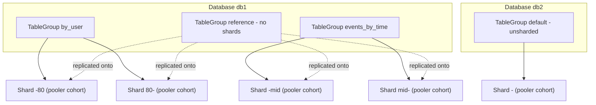

# Sharding: database-owned shards

A database's data is split into **shards**. Each shard belongs to one **table
group**, and each table group belongs to one **database**. A shard is served by
one **pooler cohort** (postgres + its multipoolers). Ownership runs top to
bottom — a table group, its shards, and their poolers all belong to a single
database.

```text
database ─┬─ table group ─┬─ shard ── pooler cohort (postgres + multipoolers)
          │               └─ shard ── pooler cohort
          └─ table group ─── shard ── pooler cohort
```

Placement is structural: a table's physical location is determined by its
position in the `database → table group → shard` tree, and a pooler holds
exactly one database's shard. Each pooler carries its identity as
`{database, table_group, shard}`.

## Terms

**Database** — the top of the hierarchy and the ownership boundary. Its table
groups, shards, and the poolers serving them belong to it alone.

**TableGroup** — a co-location unit within one database: a set of member tables
that share one set of shards (key ranges tiling the keyrange-id space). Tables in
the same group co-locate — they can be joined and transacted locally. The group
defines the shards; each member table brings its own sharding function — keeping
it per-table lets one group host tables keyed differently on the same shards
(e.g. a table and its differently-keyed lookup index).

**Table** — a member of a group, with a sharding function and the shard-key
columns that function is evaluated on. Because the function is per-table, one
group can mix functions over the same shards: a table sharded by
`hash(customer_id)` can sit beside the `hash(invoice_id)` lookup index that
routes lookups against it, both on the same shards and pooler cohorts.

**Shard** — one key-range slice of a table group, served by a pooler cohort
forming one HA/consensus domain. The shard is the logical slice — a unit of
ownership and routing that lives in the catalog; the **pooler cohort** is the
physical processes (postgres + its multipoolers) that serve it. They map
one-to-one, but the shard is metadata while the cohort is the running deployment.
Identified by `(database, table_group,
key_range)`; its name is derived from the range as `hex(start)-hex(end)` — so
`[-, 0x80)` is `"-80"`, `[0x80, -)` is `"80-"`, and the full range is `"-"`.

**ShardingFunction** — how a table's rows are placed:

- **hash** — even distribution; a point lookup on the key hits one shard, a scan
  scatters.
- **range** — order-preserving; a range scan touches only the overlapping
  shards.
- **lookup** — resolves the keyrange-id through a lookup-index table, which
  can itself be a member of the same table group.
- **multicol** — composite key over several columns; each column is mapped by its
  own sub-function and contributes a fixed number of leading bytes to the
  keyrange-id, so a leading-prefix predicate narrows to a subrange (see Examples).
- **reference** — owns no shards; the table is replicated onto every shard in the
  database, so it joins locally from anywhere. Distinct from unsharded (below): an
  unsharded table has one physical copy on its group's single full-range shard,
  whereas a reference table is copied onto every shard of every group.

Unset function ⇒ unsharded: the group has one full-range shard.

## The two functions

Two composable steps map a query to a shard:

| Step                  | Owned by                                           | Answers                                                              |
| --------------------- | -------------------------------------------------- | -------------------------------------------------------------------- |
| `value → keyrange-id` | the **table's** function + the **table's** columns | how a row's shard-key value becomes a point in the keyrange-id space |
| `keyrange-id → shard` | the **table group's** shard key ranges             | which shard owns that point                                          |

A keyrange-id is a variable-length, **most-significant-byte-first** byte string,
not a fixed-width integer. Read it as a base-256 fraction in `[0, 1)`: the byte
string `b₁ b₂ … bₙ` denotes `0.b₁ b₂ … bₙ` in hex. A bound is therefore a
position on the number line, and trailing zero bytes don't change it:

| bound    | reads as | value   |
| -------- | -------- | ------- |
| `0x80`   | `0.80`   | ½       |
| `0x8000` | `0.8000` | ½       |
| `0x01`   | `0.01`   | 1/256   |
| `0x0001` | `0.0001` | 1/65536 |

Because this space is dense, there is no 256-shard cap: between any two bounds
you can always insert another by appending bytes — `[0x00, 0x01)` subdivides
into `[0x00, 0x0001)`, `[0x0001, 0x0002)`, … — so a group can hold arbitrarily
many shards, independent of how many distinct key values exist. `hash`
distributes values uniformly across this space; `range` maps them
order-preservingly, so a day-of-year key (say) lands at an ordered position
regardless of how finely the range is split.

## Proto

```proto
// The complete routing catalog.
message ShardingSchema {
  repeated Database databases = 1;
}

// The ownership boundary. Everything below belongs to this database alone.
message Database {
  string name = 1;
  repeated TableGroup table_groups = 2;
}

// Co-location unit, scoped to one database: member tables + the shards they
// share. The function is per-table (see Table), not on the group. A group whose
// tables are all reference tables has no shards.
message TableGroup {
  string name = 1;
  repeated Table tables = 2;
  repeated Shard shards = 3;   // empty for a reference-only group
}

// A member table: its sharding function and the shard-key columns that function
// is evaluated on. Unset function => unsharded (routes to the group's single
// full-range shard). A reference table sets function=reference and carries no
// columns.
message Table {
  string schema = 1;               // empty => default schema
  string name = 2;
  ShardingFunction function = 3;   // per-table; unset => unsharded
  repeated string columns = 4;     // shard key; empty for reference/unsharded
}

// One physical partition: a key range served by one pooler cohort. Identified
// by (database, table_group, key_range); the name is derived from the range as
// hex(start)-hex(end): "-80", "80-", "-".
message Shard {
  clustermetadata.KeyRange key_range = 1; // start incl / end excl
}

// A table's placement kind. hash/range/lookup map a shard-key value to a
// keyrange-id; multicol composes several columns into one; reference replicates
// the table onto every group's shards.
message ShardingFunction {
  oneof kind {
    HashFunction      hash      = 1;
    RangeFunction     range     = 2;
    LookupFunction    lookup    = 3;
    ReferenceFunction reference = 4;
    MultiColFunction  multicol  = 5;
  }
}
message HashFunction {}
message RangeFunction {}
message ReferenceFunction {}
message LookupFunction {
  string schema = 1;
  string table  = 2;   // lookup-index table in this database (often a group member)
  string from_column = 3;
  string to_column   = 4;
}

// Composite key: each part maps one column (positionally aligned with
// Table.columns) and contributes `bytes` leading bytes to the keyrange-id, the
// parts concatenated in order, most-significant first. A predicate binding a
// leading prefix of the columns yields a keyrange-id prefix — a contiguous
// subrange — rather than a full scatter.
message MultiColFunction {
  repeated ColumnPart parts = 1;
}
message ColumnPart {
  ShardingFunction function = 1;   // per-column mapping (hash/range)
  uint32 bytes = 2;                // leading bytes this column contributes to the keyrange-id
}
```

`Shard.key_range` reuses the existing `clustermetadata.KeyRange`. Resolution
produces `clustermetadata.ShardKey{database, table_group, shard}` — the
identifier every `Multipooler` already advertises (`Multipooler.shard_key`) and
`query.Target` already carries — so a resolved target routes to poolers with no
new wire types.

## Examples

Keyranges are `hex(start)-hex(end)`: `-80` is `[0x00, 0x80)`, `80-` is
`[0x80, +inf)`.

### Unsharded table

One table group, one full-range shard; every query routes there.

```text
Database{ name: "db2", table_groups: [
  TableGroup{ name: "default",
              tables: [{schema:"sc2", name:"t3"}],   // no function => unsharded
              shards: [ {key_range: -} ] }
]}
```

### Hash-sharded table

```text
TableGroup{ name: "by_user",
  tables: [ {schema:"sc1", name:"t1", function:{hash:{}}, columns:["user_id"]} ],
  shards: [ {key_range:-80}, {key_range:80-} ] }
```

`WHERE user_id = 42` → `hash(42)` → one shard. No `user_id` predicate → scatter
to both shards, gather.

### Multi-column shard key

A composite key is its own function (`multicol`).
Each column is mapped independently by its own sub-function, and the first few
bytes of each result are concatenated in column order, most-significant first,
to form the keyrange-id. Each column declares how many bytes it contributes.
Here `orders` keys on `(tenant_id, order_id)`, giving two bytes to each:

```text
TableGroup{ name: "by_tenant_order",
  tables: [ {schema:"sc1", name:"orders",
             function:{multicol:{parts:[{function:{hash:{}}, bytes:2},
                                         {function:{hash:{}}, bytes:2}]}},
             columns:["tenant_id","order_id"]} ],
  shards: [ {key_range:-80}, {key_range:80-} ] }
```

`WHERE tenant_id = 7 AND order_id = 42` fills all four bytes → one shard. Because
`tenant_id` owns the high-order bytes, `WHERE tenant_id = 7` alone resolves a
keyrange-id **prefix** — a contiguous subrange — so it narrows to just the shards
overlapping that prefix rather than scattering to all of them. A predicate on a
non-leading column only (`WHERE order_id = 42`, no `tenant_id`) can't form a
prefix, so it scatters.

### Co-located tables

`t1` and `t2` in the same group on the same key. For any `user_id` both rows
share a keyrange-id, so `t1 JOIN t2 ON user_id` runs within one shard.
Co-location is group membership.

```text
tables: [ {schema:"sc1", name:"t1", function:{hash:{}}, columns:["user_id"]},
          {schema:"sc1", name:"t2", function:{hash:{}}, columns:["user_id"]} ]
```

### Reference table

`countries` is replicated onto every shard in the database, so joins against it
are local anywhere. A reference table owns no shards, so a group holding only
reference tables has none.

```text
Database{ name: "db1", table_groups: [
  TableGroup{ name: "by_user",        shards: [-80, 80-], tables: [ {..t1, function:{hash:{}},  columns:["user_id"]} ] },
  TableGroup{ name: "events_by_time", shards: [-80, 80-], tables: [ {..events, function:{range:{}}, columns:["created_at"]} ] },
  TableGroup{ name: "reference",      shards: [],         tables: [ {..countries, function:{reference:{}}} ] },
]}
```

`countries` lives on all four backing shards; `t1 JOIN countries` and
`events JOIN countries` are both local. A standalone `SELECT * FROM countries`
routes to one copy; a join is co-resident with whichever backing shard the
sharded side lands on. (`reference` could equivalently be a `bool` on `Table` —
an open encoding choice.)

### Range-sharded

```text
TableGroup{ name: "events_by_time",
  tables: [ {schema:"sc1", name:"events", function:{range:{}}, columns:["created_at"]} ],
  shards: [ {key_range:[-,mid)}, {key_range:[mid,-)} ] }
```

`WHERE created_at BETWEEN … AND …` maps to a contiguous keyrange-id range and
hits only the overlapping shards.

### Resharding — a shard-list edit

Split `-80` into `-40` and `40-80`. Only the shard list changes; table
membership, functions, and columns are untouched, and the names are derived from
the ranges.

```diff
 TableGroup{ name: "by_user", shards: [
-  {key_range: -80},
+  {key_range: -40},
+  {key_range: 40-80},
   {key_range: 80-},
]}
```

### Lookup index co-located

A `sales` group holds three tables that route on different columns but share one
set of shards:

```text
TableGroup{ name: "sales", shards: [-80, 80-], tables: [
  {schema:"public", name:"invoice",              function:{hash:{}},                       columns:["customer_id"]},
  {schema:"public", name:"invoice_line",         function:{lookup:{table:"invoice_customer_idx",
                                                                   from_column:"invoice_id",
                                                                   to_column:"keyrange_id"}}, columns:["invoice_id"]},
  {schema:"public", name:"invoice_customer_idx", function:{hash:{}},                       columns:["invoice_id"]},
]}
```

`invoice` is hashed on `customer_id`; `invoice_line` routes through a lookup;
`invoice_customer_idx` — the lookup index backing that lookup — is hashed on
`invoice_id`. All three are members of `sales`, so they share its shards and
pooler cohorts.

## Diagram


```mermaid
flowchart TD
  subgraph db1[Database db1]
    tg1[TableGroup by_user]
    tg2[TableGroup events_by_time]
    tgr[TableGroup reference - no shards]
  end
  tg1 --> s1["Shard -80 (pooler cohort)"]
  tg1 --> s2["Shard 80- (pooler cohort)"]
  tg2 --> s3["Shard -mid (pooler cohort)"]
  tg2 --> s4["Shard mid- (pooler cohort)"]
  tgr -.->|replicated onto| s1
  tgr -.->|replicated onto| s2
  tgr -.->|replicated onto| s3
  tgr -.->|replicated onto| s4
  subgraph db2[Database db2]
    tg3[TableGroup default - unsharded]
  end
  tg3 --> s5["Shard - (pooler cohort)"]
```

## Out of scope

- DDL / user-facing syntax for declaring sharding.
- Resharding execution (cutover, data movement, consistency).
- Cross-shard transactions (2PC) and cross-shard query planning.
- Where the catalog is stored (topology vs postgres), and its committed proto or
  table definitions.
