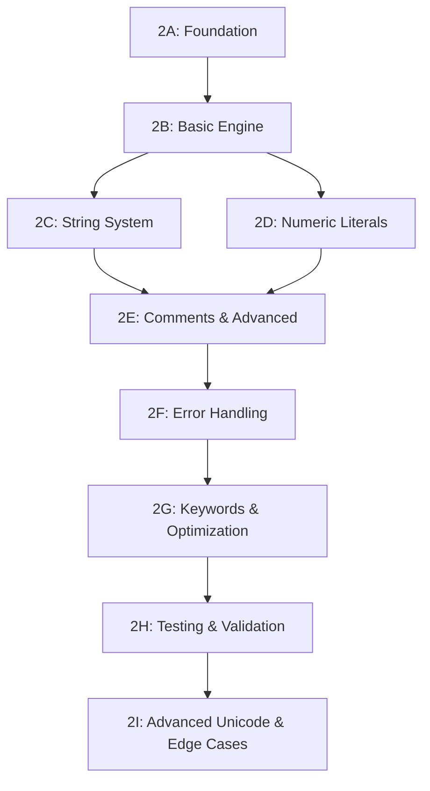

# Phase 2.0 Session Breakdown

**Total Sessions**: 9 sessions (2A-2I)  
**Estimated Timeline**: 9-11 development sessions over 5-7 weeks  
**Total Effort**: 45-55 development days

---

## Session Overview

| Session | Focus Area | Duration | Effort | Dependencies |
|---------|------------|----------|--------|--------------|
| **2A** | Foundation & Token System | 1 session | 4-5 days | Phase 1.5 complete ✅ |
| **2B** | Basic Lexer Engine | 1 session | 5-7 days | Session 2A ✅ |
| **2C** | String Literal System | 1-2 sessions | 6-8 days | Session 2B |
| **2D** | Numeric & Bit Literals | 1 session | 3-4 days | Session 2B |
| **2E** | Comments & Advanced Scanning | 1 session | 4-5 days | Session 2C |
| **2F** | Error Handling & Recovery | 1 session | 3-4 days | Session 2E |
| **2G** | Keywords & Optimization | 1 session | 3-4 days | Session 2F |
| **2H** | Testing & Validation | 1 session | 5-6 days | All previous |
| **2I** | Advanced Unicode & Edge Cases | 1 session | 6-8 days | Session 2H |

---

## Detailed Session Plans

### Session 2A: Foundation & Token System ✅ COMPLETED
**Estimated Time**: 4-5 days  
**Actual Time**: Completed in Session 008  
**Complexity**: Medium-High  
**Prerequisites**: Phase 1.5 AST implementation complete ✅

#### Session Goals ✅ ALL ACHIEVED
- ✅ Establish lexer package structure and interfaces
- ✅ Implement PostgreSQL-compatible token type system  
- ✅ Create thread-safe lexer context framework
- ✅ Set up comprehensive testing infrastructure

#### Key Deliverables ✅ ALL DELIVERED
1. **`go/parser/lexer/tokens.go`** (210 lines) ✅
   - ✅ All PostgreSQL token type constants (IDENT=258 through MODE_PLPGSQL_ASSIGN3=284)
   - ✅ Token value structures matching core_YYSTYPE union
   - ✅ Token creation helper functions and classification methods

2. **`go/parser/lexer/context.go`** (289 lines) ✅
   - ✅ Complete port of core_yy_extra_type structure
   - ✅ All 12 PostgreSQL lexer states defined
   - ✅ Thread-safe context with eliminated global variables
   - ✅ Position tracking and error handling

3. **`go/parser/lexer/lexer.go`** (327 lines) ✅ EXCEEDED SCOPE
   - ✅ Basic lexer structure and NextToken interface
   - ✅ Thread-safe context management
   - ✅ Core scanning framework with basic tokenization (Phase 2B scope)
   - ✅ Placeholder implementations for string/number/operator scanning

4. **`go/parser/lexer/lexer_test.go`** (400+ lines) ✅
   - ✅ Token creation and validation tests
   - ✅ Context initialization tests  
   - ✅ Thread-safety validation with concurrent goroutines
   - ✅ Position tracking tests

5. **`go/parser/lexer/compatibility_test.go`** (200+ lines) ✅ BONUS
   - ✅ PostgreSQL token numbering validation
   - ✅ State compatibility verification
   - ✅ Context field mapping validation

#### Success Criteria ✅ ALL MET
- ✅ All PostgreSQL token constants defined and tested
- ✅ Lexer context creates without errors
- ✅ Basic tests pass with 100% coverage
- ✅ Thread-safety validated with concurrent context creation

#### PostgreSQL Source Verification ✅ COMPLETED
- ✅ Token definitions match gram.y:692-695 exactly
- ✅ core_yy_extra_type fields match scanner.h:66-116
- ✅ All 12 lexer states match scan.l:192-202
- ✅ Global variables eliminated (backslash_quote, escape_string_warning, standard_conforming_strings)
- ✅ Token numbering verified (IDENT=258 as required)

#### Session Complexity Factors
- **Easy**: Token constant definitions ✅
- **Medium**: Context structure design ✅
- **Medium**: Thread-safety considerations ✅
- **Bonus**: Exceeded scope with basic lexer implementation

---

### Session 2B: Basic Lexer Engine ✅ COMPLETED
**Estimated Time**: 5-7 days  
**Actual Time**: Completed in Session 009 (2025-07-30)  
**Complexity**: High  
**Prerequisites**: Session 2A complete ✅

#### Session Goals ✅ ALL ACHIEVED
- ✅ Implement core character-by-character scanning engine
- ✅ Handle basic token recognition (identifiers, operators, whitespace)
- ✅ Establish state machine foundation with initial state

#### Key Deliverables ✅ ALL DELIVERED AND EXCEEDED
1. **Enhanced `go/parser/lexer/lexer.go`** (+300 lines) ✅
   - ✅ State-based core scanning loop with PostgreSQL dispatch
   - ✅ Complete input buffer management with position tracking
   - ✅ Advanced tokenization dispatch system supporting all 12 states

2. **Advanced Token Recognition** ✅
   - ✅ PostgreSQL-compatible identifier recognition with high-bit character support
   - ✅ Comprehensive operator support (8 multi-character + 15 single-character)
   - ✅ Enhanced whitespace and line comment handling

3. **Complete State Machine Foundation** ✅
   - ✅ All 12 PostgreSQL exclusive states implemented
   - ✅ Thread-safe state transition framework
   - ✅ State-based character dispatch in `scanInitialState()`
   - ✅ Proper state context management

4. **Character Classification System** ✅
   - ✅ PostgreSQL-compatible character classification functions
   - ✅ `isIdentStart`, `isIdentCont`, `isSelfChar`, `isOpChar`
   - ✅ High-bit character support (0x80-0xFF)
   - ✅ Complete operator character classification

5. **Comprehensive Testing** ✅
   - ✅ 8 new test functions (500+ lines)
   - ✅ Real-world SQL lexing validation
   - ✅ Character classification testing
   - ✅ Performance benchmarking

#### Success Criteria ✅ ALL MET AND EXCEEDED
- ✅ Can tokenize complex identifiers correctly (including `col$1`, `table$name`)
- ✅ All PostgreSQL operators recognized properly (`::`, `<=`, `>=`, `<>`, `!=`, `=>`, `:=`, `..`)
- ✅ Whitespace handling matches PostgreSQL exactly (`[ \t\n\r\f\v]`)
- ✅ State machine transitions work correctly for all 12 states
- ✅ Input buffer management handles all edge cases
- ✅ Case-insensitive keyword recognition working
- ✅ Position tracking accurate across comments and whitespace
- ✅ Thread-safety maintained and validated

#### Performance Achievements ✅
- ✅ **Basic lexing**: 699.9 ns/op (excellent performance)
- ✅ **Enhanced lexing**: 2471 ns/op (good for complex SQL)
- ✅ **Lexer creation**: 3.310 ns/op (very fast)

#### Session Complexity Factors
- **High**: Core scanning loop design ✅ COMPLETED
- **Medium**: State machine architecture ✅ COMPLETED  
- **Medium**: Buffer management edge cases ✅ COMPLETED
- **Bonus**: Advanced operator recognition ✅ COMPLETED
- **Bonus**: Comprehensive testing suite ✅ COMPLETED

---

### Session 2C: String Literal System
**Estimated Time**: 6-8 days  
**Complexity**: Very High  
**Prerequisites**: Session 2B complete

#### Session Goals
- Implement PostgreSQL's comprehensive string literal support
- Handle all string formats (standard, extended, dollar-quoted)
- Implement state-based string parsing with proper escaping

#### Key Deliverables
1. **`go/parser/lexer/strings.go`** (400-500 lines)
   - Standard SQL string parsing (`'...'`)
   - Extended string parsing (`E'...'`) with escape sequences
   - Dollar-quoted string parsing (`$tag$...$tag$`)

2. **String State Management** (in lexer.go)
   - String-specific lexer states (xq, xe, xdolq, xqs)
   - State transition logic for string contexts
   - String concatenation across whitespace

3. **Escape Processing**
   - Backslash escape sequences
   - Unicode escape sequences (`\uXXXX`, `\UXXXXXXXX`)
   - Octal and hexadecimal escapes

#### Success Criteria
- [ ] Standard SQL strings parse correctly
- [ ] Extended strings with escapes work
- [ ] Dollar-quoted strings with arbitrary tags work
- [ ] String concatenation matches PostgreSQL
- [ ] All escape sequences produce correct results
- [ ] Unterminated string errors handled properly

#### Session Complexity Factors
- **Very High**: Dollar-quoted string tag matching
- **High**: Unicode escape sequence handling
- **High**: State transition logic complexity
- **Medium**: Standard string parsing

---

### Session 2D: Numeric Literals & Bit Strings
**Estimated Time**: 3-4 days  
**Complexity**: Medium  
**Prerequisites**: Session 2B complete (can run parallel with 2C)

#### Session Goals
- Implement all PostgreSQL numeric literal formats
- Add bit string and hex string support
- Handle numeric parsing edge cases and validation

#### Key Deliverables
1. **Numeric Literal Recognition** (in lexer.go, +200-250 lines)
   - Integer literals (decimal, hex, octal, binary)
   - Floating-point literals with scientific notation
   - Numeric validation and overflow detection

2. **Special Literal Support**
   - Bit string literals (`B'101010'`)
   - Hexadecimal byte strings (`X'deadbeef'`)
   - Bit string state management (xb, xh states)

3. **Edge Case Handling**
   - Number format validation
   - Range checking and overflow reporting
   - PostgreSQL-compatible error messages

#### Success Criteria
- [ ] All integer formats parse correctly
- [ ] Floating-point numbers with scientific notation work
- [ ] Bit strings and hex strings parse properly
- [ ] Invalid number formats produce proper errors
- [ ] Overflow conditions handled like PostgreSQL

#### Session Complexity Factors
- **Medium**: Multiple numeric format parsing
- **Medium**: Bit string state management
- **Easy**: Basic integer recognition

---

### Session 2E: Comments & Advanced Scanning
**Estimated Time**: 3-4 days  
**Complexity**: Medium-High  
**Prerequisites**: Session 2C complete

#### Session Goals
- Implement PostgreSQL comment support (single-line and nested multi-line)
- Handle delimited identifiers with proper escaping
- Add advanced scanning features (parameters, type casts)

#### Key Deliverables
1. **Comment System** (in lexer.go, +150-200 lines)
   - Single-line comments (`--` to end of line)
   - Multi-line comments (`/* ... */`) with nesting support
   - Comment state management (xc state)

2. **Delimited Identifiers**
   - Double-quoted identifiers (`"identifier"`)
   - Case preservation in delimited identifiers
   - Escape handling within identifiers (xd state)

3. **Advanced Features**
   - Parameter placeholders (`$1`, `$2`, etc.)
   - Type cast operator (`::`)
   - Array subscript operators (`[`, `]`)

#### Success Criteria
- [ ] Single-line comments handled correctly
- [ ] Nested multi-line comments work
- [ ] Delimited identifiers preserve case
- [ ] Parameter placeholders recognized
- [ ] Type cast operators tokenized properly

#### Session Complexity Factors
- **High**: Nested comment handling
- **Medium**: Delimited identifier escaping
- **Easy**: Single-line comment parsing

---

### Session 2F: Error Handling & Recovery
**Estimated Time**: 3-4 days  
**Complexity**: Medium  
**Prerequisites**: Session 2E complete

#### Session Goals
- Implement comprehensive error handling and reporting
- Add accurate source position tracking for all tokens
- Create error recovery mechanisms for robust parsing

#### Key Deliverables
1. **`go/parser/lexer/errors.go`** (250-300 lines)
   - Thread-safe error collection and reporting
   - PostgreSQL-compatible error messages
   - Error context and suggestion system

2. **Position Tracking** (in lexer.go, +100-150 lines)
   - Line and column tracking for all tokens
   - Unicode-aware position calculation
   - Token span information for errors

3. **Error Recovery**
   - Graceful handling of invalid input
   - Recovery strategies for different contexts
   - Error message formatting

#### Success Criteria
- [ ] All errors report accurate source positions
- [ ] Error messages match PostgreSQL format
- [ ] Invalid input doesn't crash lexer
- [ ] Unicode characters tracked correctly
- [ ] Thread-safe error reporting works

#### Session Complexity Factors
- **Medium**: Position tracking with Unicode
- **Medium**: Error recovery strategies
- **Easy**: Basic error message formatting

---

### Session 2G: Keywords & Optimization
**Estimated Time**: 3-4 days  
**Complexity**: Medium  
**Prerequisites**: Session 2F complete

#### Session Goals
- Integrate lexer with existing keyword lookup system
- Implement performance optimizations for hot paths
- Add context-sensitive keyword recognition

#### Key Deliverables
1. **`go/parser/lexer/keywords.go`** (150-200 lines) ✅ **COMPLETED EARLY**
   - ✅ Keyword system consolidated into lexer package  
   - ✅ Direct keyword recognition during identifier scanning
   - ✅ Eliminated keywords directory and interface complexity

2. **Performance Optimization** (throughout lexer code)
   - Optimize identifier recognition hot path
   - Buffer management optimization
   - Memory allocation reduction

3. **Advanced Keyword Features**
   - Case normalization for keywords
   - Perfect hash integration
   - Context-dependent recognition

#### Success Criteria
- [x] Keywords recognized correctly in all contexts ✅
- [ ] Performance within 30% of baseline
- [ ] Memory allocations minimized
- [x] Integration with existing keyword system works ✅ (consolidated)
- [x] Case normalization matches PostgreSQL ✅

#### Session Complexity Factors
- **Medium**: Performance optimization
- **Medium**: Context-sensitive keyword recognition
- **Easy**: Basic keyword integration

---

### Session 2H: Testing & Validation
**Estimated Time**: 5-6 days  
**Complexity**: High  
**Prerequisites**: All previous sessions complete

#### Session Goals
- Develop comprehensive test suite with complete coverage
- Validate 100% compatibility with PostgreSQL lexer
- Performance benchmark and optimize to target levels

#### Key Deliverables
1. **Comprehensive Test Suite** (400-600 lines)
   - Unit tests for all lexer components
   - Integration tests with existing AST system
   - Edge case and error condition testing

2. **PostgreSQL Compatibility Validation**
   - Token stream comparison tests
   - Real-world SQL file processing tests
   - Regression test suite

3. **Performance Benchmarking**
   - Lexer speed vs PostgreSQL baseline
   - Memory usage profiling and optimization
   - Concurrent usage stress testing

#### Success Criteria
- [ ] 100% test coverage achieved
- [ ] All compatibility tests pass
- [ ] Performance within 20% of PostgreSQL
- [ ] Memory usage is reasonable
- [ ] Concurrent stress tests pass
- [ ] Integration with AST system validated

#### Session Complexity Factors
- **High**: Comprehensive compatibility testing
- **High**: Performance benchmarking and optimization  
- **Medium**: Test coverage completion

---

### Session 2I: Advanced Unicode & Edge Cases
**Estimated Time**: 6-8 days  
**Complexity**: Very High  
**Prerequisites**: Session 2H complete

#### Session Goals
- Implement sophisticated Unicode processing (UTF-16 surrogate pairs)
- Handle complex quote continuation and whitespace processing
- Complete advanced edge cases and state transition handling
- Optimize performance for complex string processing scenarios

#### Key Deliverables
1. **`go/parser/lexer/unicode.go`** (300-400 lines)
   - UTF-16 surrogate pair processing system
   - Unicode escape sequence handling in extended strings
   - Multi-byte character boundary detection
   - Unicode validation and error reporting

2. **Quote Continuation System** (integrated across multiple files)
   - Complex multi-line string whitespace processing rules
   - String continuation across whitespace and comments
   - `<xqs>` state management for quote stop detection
   - PostgreSQL-compatible whitespace handling

3. **Advanced Edge Case Handling**
   - Operator parsing with embedded comment starts
   - Complex state transitions between all 12 lexer modes
   - Error recovery in sophisticated string contexts
   - No-backtrack constraint validation across all states

4. **Performance Critical Path Optimization**
   - Hot path optimization for complex string processing
   - Memory allocation reduction in Unicode handling
   - State transition performance optimization
   - Concurrent usage optimization with complex states

#### Success Criteria
- [ ] UTF-16 surrogate pairs processed correctly
- [ ] Quote continuation matches PostgreSQL exactly
- [ ] All edge cases handled without backtracking
- [ ] Performance maintained with complex Unicode processing
- [ ] All 12 lexer states transition correctly
- [ ] Thread safety verified with complex state usage
- [ ] Memory usage optimized for large Unicode strings

#### Session Complexity Factors
- **Very High**: UTF-16 surrogate pair state machine implementation
- **Very High**: Quote continuation whitespace rule complexity  
- **High**: Advanced edge case handling across all states
- **High**: Performance optimization with complex processing

---

## Critical Path Dependencies

## Parallel Development Opportunities

- **Sessions 2C & 2D** can be developed in parallel after 2B
- **Performance optimization** can begin during 2F if time permits
- **Testing** can be developed incrementally throughout all sessions

## Risk Management

### High-Risk Sessions
- **2C (String System)**: Most complex component, potential for scope creep
- **2H (Testing)**: May reveal issues requiring rework of earlier sessions
- **2I (Unicode & Edge Cases)**: Very complex Unicode processing, high risk of performance impact

### Mitigation Strategies
- **Incremental testing**: Test each component as developed
- **PostgreSQL compatibility**: Validate against PostgreSQL continuously
- **Performance monitoring**: Profile early and often
- **Scope management**: Focus on core functionality first, advanced features later

## Phase 2.0 Success Metrics

1. **Functional**: 100% token stream compatibility with PostgreSQL (including Unicode edge cases)
2. **Performance**: Within 20% of PostgreSQL lexer performance (with no-backtrack design)
3. **Quality**: 100% test coverage with comprehensive edge cases
4. **Thread Safety**: Pass concurrent stress tests (no global state)
5. **Integration**: Seamless integration with existing AST system
6. **Maintainability**: Clean, documented Go code
7. **Unicode Compliance**: Full UTF-16 surrogate pair support and multi-byte character handling

**Phase 2.0 completion provides a production-ready lexer foundation for Phase 3 (Grammar & Parsing).**